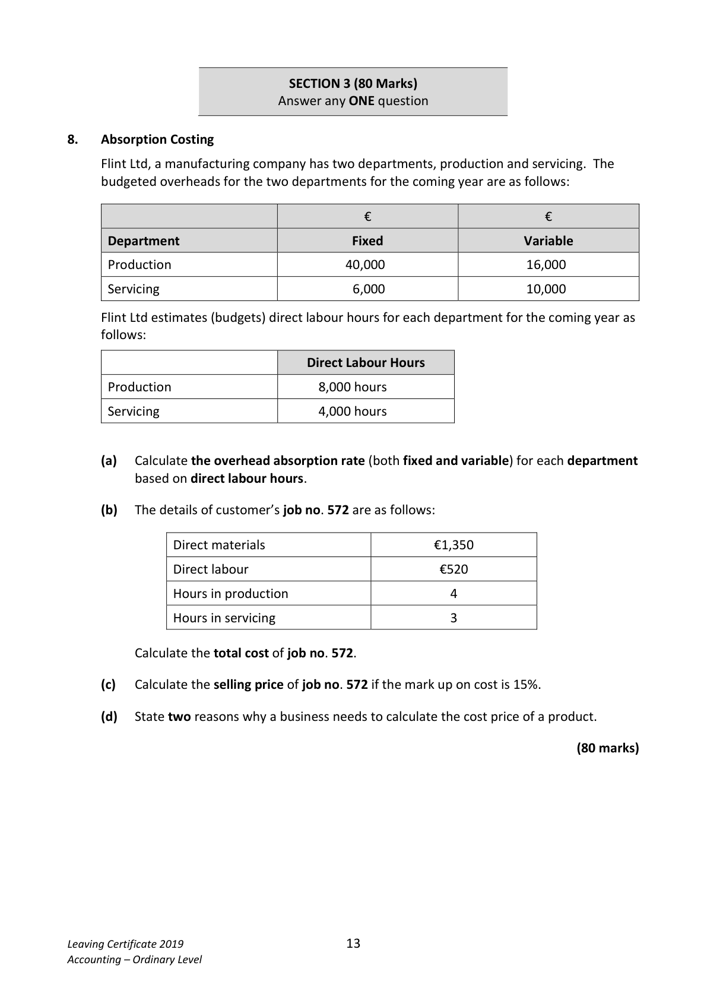
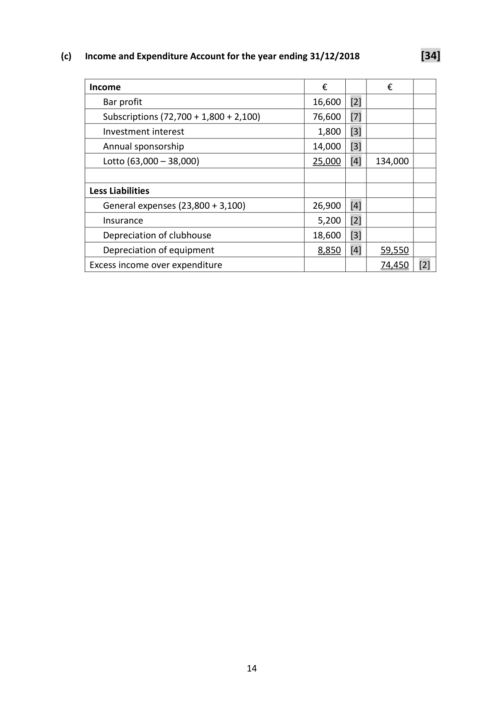
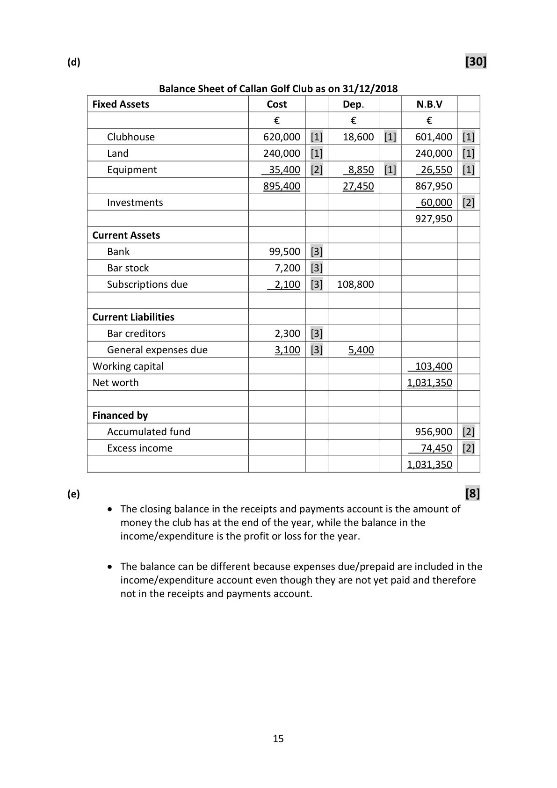
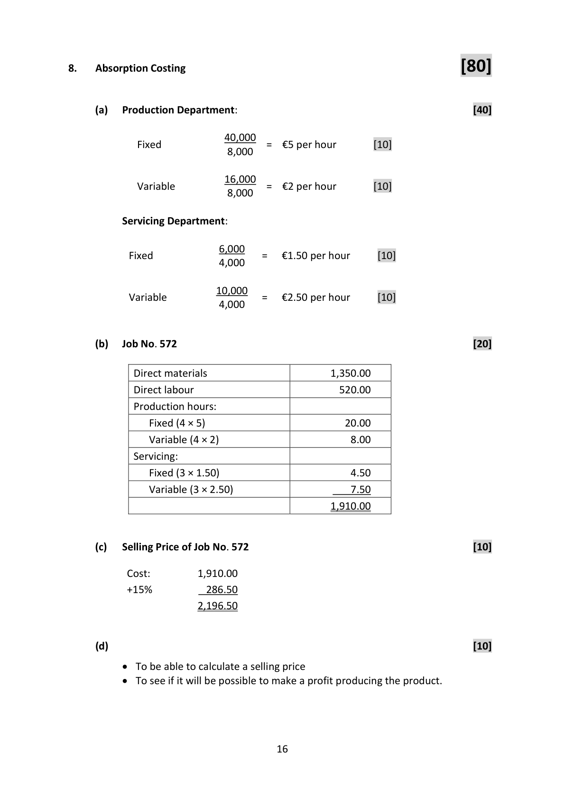

# Question

7.   Club Accounts

     Included in the assets and liabilities of Callan Golf Club on 01/01/2018 were the following:

     Clubhouse €620,000; equipment €32,000; investments €60,000; land €240,000;
     bar stock €7,100; members’ subscriptions prepaid €1,800; bar creditors €3,600;
     cash in hand €3,200.

     Required

       (a)   Prepare a statement showing the club’s accumulated fund 01/01/2018.            (20)

         The following is a summary of the club’s receipts and payments for the year 2018:

                Receipts and Payments Account for the year ended 31/12/2018

         Receipts                     €      Payments                       €

        Cash in hand 01/01/2018        3,200    Club lotto prizes                  38,000

         Investment interest             1,800    Bar purchases                    26,900

         Bar sales                     42,100    General expenses                 23,800

         Club lotto receipts            63,000    Insurance                          5,200

         Subscriptions                 72,700    Purchase of equipment              3,400

        Annual sponsorship           14,000    Cash balance 31/12/2018          99,500

                                    196,800                                   196,800

     The treasurer also supplied the following information as at 31/12/2018:

        (i)   Bar stock was €7,200.

         (ii)   Bar creditors were €2,300.

         (iii)  General expenses due were €3,100.

       (iv)   Subscriptions due were €2,100.

       (v)   Depreciate the clubhouse by 3% of cost.

       (vi)  Equipment held on 31/12/2018 is to be depreciated by 25%.

     Required:

       (b)   Prepare a bar trading account for the year ended 31/12/2018.                        (8)

       (c)   Prepare the club’s income and expenditure account for the year ended
          31/12/2018.                                                                       (34)
      (d)   Prepare the club’s balance sheet as at 31/12/2018.                                (30)

      (e)   Explain the difference between the balance in the income and expenditure account
         and the closing balance in the receipts and payments account.                        (8)

                                                                             (100 marks)

Leaving Certificate 2019                       12
Accounting – Ordinary Level

<!-- PAGE 13 -->
# Page 13

<!-- HAS_VISUAL: true -->
<!-- VISUAL_REASON: page contains vector drawings; page image extracted because text may not fully capture visual content -->

SECTION 3 (80 Marks)
                             Answer any ONE question

# Marking Scheme

7.   Club Accounts                                                        [20]
(a)
                      Accumulated Fund as on 01/01/2018
        Assets                                        €            €
          Clubhouse                                  620,000  [2]
          Land                                       240,000  [2]
         Equipment                                   32,000  [2]
          Investments                                  60,000  [2]
          Bar stock                                       7,100  [2]
          Cash in hand                                    3,200  [2]   962,300

        Less Liabilities
          Bar creditors                                   3,600  [2]
           Subscriptions prepaid                           1,800  [3]     5,400
       Accumulated fund 01/01/2018                                 956,900   [3]

                                                                                 [8]
(b)
                 Bar Trading Account for the year ended 31/12/2018
                                     €             €             €
       Bar sales                                                       42,100   [2]

        Less: Cost of sales
            Opening stock                              7,100      [1]
             Purchases                  26,900   [1]
           Add creditors 31/12/2018     2,300   [1]
                                       29,200
              Less creditors 01/01/2018    3,600   [1]    25,600
                                                     32,700
              Closing stock                               7,200      [1]
       Cost of sales                                                   25,500
       Bar profit                                                      16,600   [1]

                                    13

<!-- PAGE 14 -->
# Page 14

<!-- HAS_VISUAL: true -->
<!-- VISUAL_REASON: page contains vector drawings; page image extracted because text may not fully capture visual content -->

(c)   Income and Expenditure Account for the year ending 31/12/2018            [34]

     Income                                       €            €
         Bar profit                                    16,600  [2]
          Subscriptions (72,700 + 1,800 + 2,100)           76,600  [7]
         Investment interest                             1,800  [3]
         Annual sponsorship                           14,000  [3]
          Lotto (63,000 – 38,000)                        25,000  [4]   134,000

       Less Liabilities
         General expenses (23,800 + 3,100)              26,900  [4]
         Insurance                                      5,200  [2]
         Depreciation of clubhouse                     18,600  [3]
         Depreciation of equipment                      8,850  [4]    59,550
      Excess income over expenditure                                  74,450   [2]

                                    14

<!-- PAGE 15 -->
# Page 15

<!-- HAS_VISUAL: true -->
<!-- VISUAL_REASON: page contains vector drawings; page image extracted because text may not fully capture visual content -->

(d)                                                                       [30]

                  Balance Sheet of Callan Golf Club as on 31/12/2018
     Fixed Assets                       Cost          Dep.          N.B.V
                                    €            €            €
       Clubhouse                     620,000  [1]    18,600  [1]    601,400  [1]
       Land                         240,000  [1]                  240,000  [1]
       Equipment                     35,400  [2]     8,850  [1]     26,550  [1]
                                     895,400        27,450        867,950
        Investments                                                 60,000  [2]
                                                                  927,950
     Current Assets
       Bank                           99,500  [3]
        Bar stock                         7,200  [3]
        Subscriptions due                 2,100  [3]   108,800

     Current Liabilities
        Bar creditors                     2,300  [3]
        General expenses due             3,100  [3]     5,400
     Working capital                                                103,400
     Net worth                                                     1,031,350

     Financed by
       Accumulated fund                                           956,900  [2]
        Excess income                                                74,450  [2]
                                                                   1,031,350

(e)                                                                            [8]
         The closing balance in the receipts and payments account is the amount of
        money the club has at the end of the year, while the balance in the
          income/expenditure is the profit or loss for the year.

         The balance can be different because expenses due/prepaid are included in the
          income/expenditure account even though they are not yet paid and therefore
          not in the receipts and payments account.

                                    15

<!-- PAGE 16 -->
# Page 16

<!-- HAS_VISUAL: true -->
<!-- VISUAL_REASON: page contains vector drawings; page image extracted because text may not fully capture visual content -->

# Source References

Exam paper:
- file: intermediate_markdown/exam_papers/ordinary/accounting_ordinary_2019_paper_1_exam.md
- pages: [13]

Marking scheme:
- file: intermediate_markdown/marking_schemes/ordinary/accounting_ordinary_2019_paper_1_marking_scheme.md
- pages: [14, 15, 16]

# Notes

