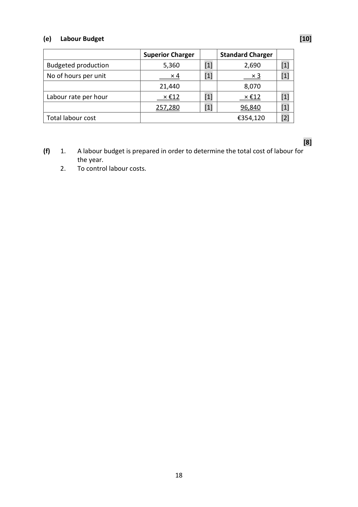

# Question

9.   Product Budgeting

     Doherty Ltd manufactures two types of chargers called ‘Superior Charger’ and ‘Standard
      Charger’. The sales of each type of charger and other relevant information for the coming
     year are budgeted below:

                                          Superior Charger      Standard Charger
      Budgeted sales                     5,400 units             2,800 units
      Expected selling price             €30                 €20

      Expected Stock – Finished Goods     Superior Charger      Standard Charger
      Opening stock                    610                 530
       Closing stock                     570                 420

      Material Content and Costs          Material A             Material B
       Superior charger                  5 grams             4 grams
      Standard charger                 3 grams             2 grams
      Expected purchase price per gram    €6                  €4

      Expected Stock ‐ Raw Materials      Material A             Material B
      Opening stock                    260 grams           370 grams
       Closing stock                     280 grams           320 grams

       Direct Labour time in hours
       Superior charger                  4 hours
      Standard charger                 3 hours

       Direct Labour Rate per hour        €12

     Required:

      (a)   Prepare a sales budget in units and in €.

      (b)   Prepare a production budget in units.

       (c)   Prepare a material usage budget in units.

      (d)   Prepare a material purchases budget in units and €.

      (e)   Prepare a labour (wages) budget.

        (f)  Why would Doherty Ltd prepare a labour budget?                        (80 marks)

Leaving Certificate 2019                       14
Accounting – Ordinary Level

<!-- PAGE 15 -->
# Page 15

<!-- HAS_VISUAL: true -->
<!-- VISUAL_REASON: page contains vector drawings; text extraction is sparse relative to visible page content; page image extracted because text may not fully capture visual content -->

<!-- EXTRACTION_ISSUE: very sparse extracted text -->

Blank Page

<!-- PAGE 16 -->
# Page 16

<!-- HAS_VISUAL: true -->
<!-- VISUAL_REASON: page contains embedded images; page contains vector drawings; text extraction is sparse relative to visible page content; page image extracted because text may not fully capture visual content -->

<!-- EXTRACTION_ISSUE: very sparse extracted text -->

Blank Page

# Marking Scheme

9.   Product Budgeting                                   [80]

(a)   Sales Budget                                                                   [14]

                               Superior Charger       Standard Charger
 Budgeted sales                         5,400      [3]          2,800              [3]
 Budgeted selling price                 × €30      [3]         × €20              [3]
                                  €162,000      [1]        €56,000              [1]
                                  Total sales = €218,000

(b)   Production Budget                                                             [16]

                               Superior Charger       Standard Charger
 Budgeted sales                      5,400         [2]          2,800              [2]
 Add budgeted closing stock           570         [2]          420              [2]
                                     5,970                    3,220
 Less budgeted opening stock          610         [2]          530              [2]
 Budgeted production in units         5,360         [2]          2,690              [2]

(c)   Material Usage Budget                                                         [16]

                                   Material A                 Material B
 Superior Charger (5,360 × 5)      26,800       [3]   (5,360 × 4)      21,440       [3]
 Standard Charger (2,690 × 3)      8,070       [3]   (2,690 × 2)        5,380       [3]
                               34,870 kg    [2]                   26,820 kg    [2]

(d)   Materials Purchases Budget                                                    [16]

                                      Material A          Material B
 Budgeted usage                         34,870      [1]      26,820     [1]
 Add budgeted closing stock                280      [2]        320     [2]
                                        35,150             27,140
 Less budgeted opening stock               260      [2]        370     [2]
 Budgeted production in units             34,890      [1]      26,770     [1]
 Budgeted purchase price                  × €6      [1]       × €4     [1]
                                      209,340      [1]     107,080     [1]

                                    17

<!-- PAGE 18 -->
# Page 18

<!-- HAS_VISUAL: true -->
<!-- VISUAL_REASON: page contains vector drawings; page image extracted because text may not fully capture visual content -->

(e)   Labour Budget                                                                 [10]

                               Superior Charger        Standard Charger
 Budgeted production                 5,360         [1]          2,690        [1]
 No of hours per unit                  × 4         [1]           × 3        [1]
                                   21,440                    8,070
 Labour rate per hour               × €12         [1]         × €12        [1]
                                 257,280         [1]        96,840        [1]
 Total labour cost                                         €354,120      [2]

                                                                                              [8]
(f)    1.   A labour budget is prepared in order to determine the total cost of labour for
          the year.
      2.   To control labour costs.

                                    18

<!-- PAGE 19 -->
# Page 19

<!-- HAS_VISUAL: true -->
<!-- VISUAL_REASON: page contains vector drawings; text extraction is sparse relative to visible page content; page image extracted because text may not fully capture visual content -->

<!-- EXTRACTION_ISSUE: very sparse extracted text -->

Blank Page

<!-- PAGE 20 -->
# Page 20

<!-- HAS_VISUAL: true -->
<!-- VISUAL_REASON: page contains vector drawings; text extraction is sparse relative to visible page content; page image extracted because text may not fully capture visual content -->

<!-- EXTRACTION_ISSUE: no extractable text found -->

[No extractable text found]

# Source References

Exam paper:
- file: intermediate_markdown/exam_papers/ordinary/accounting_ordinary_2019_paper_1_exam.md
- pages: [15, 16]

Marking scheme:
- file: intermediate_markdown/marking_schemes/ordinary/accounting_ordinary_2019_paper_1_marking_scheme.md
- pages: [18, 19, 20]

# Notes

