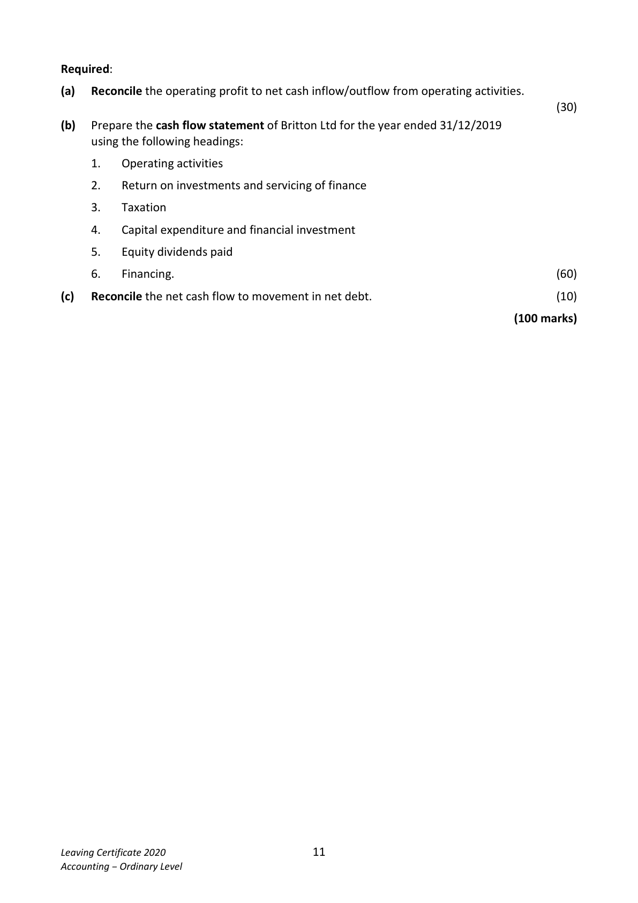
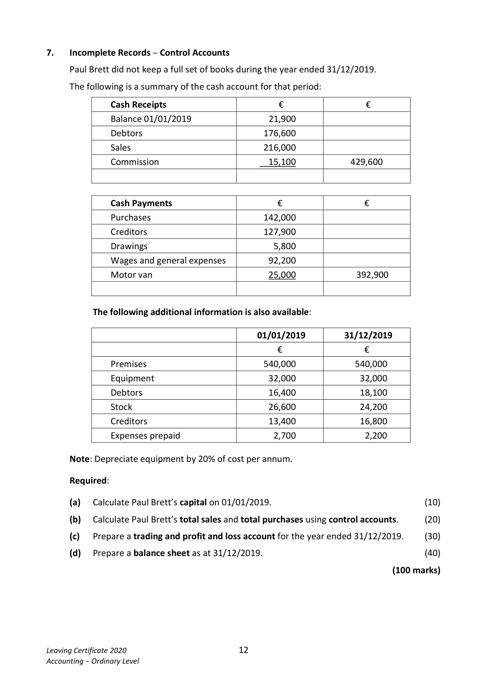
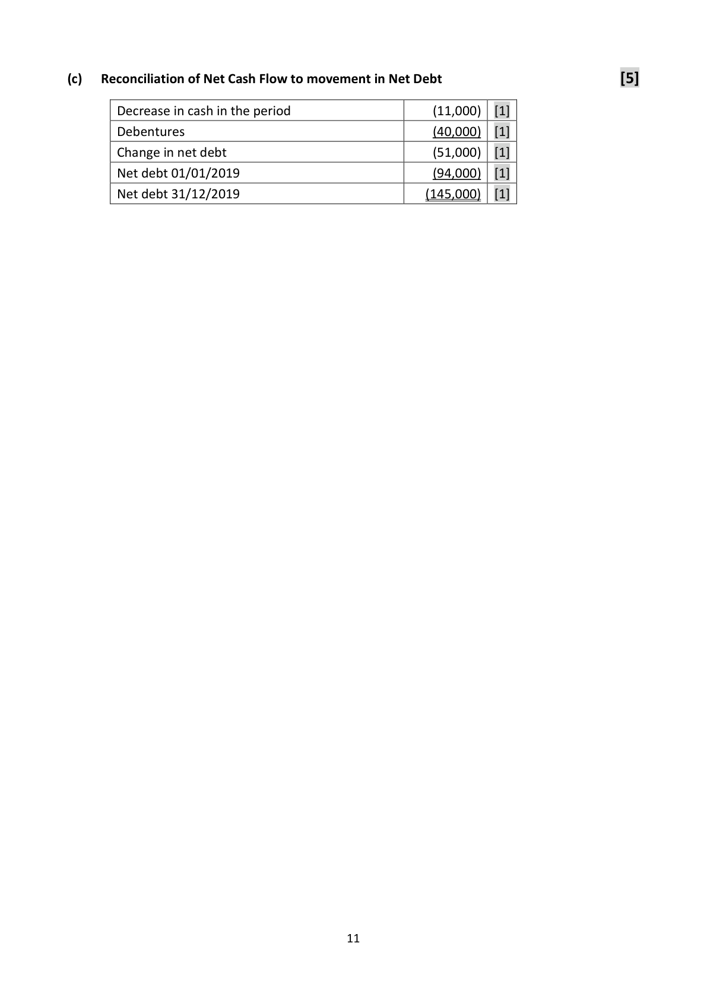
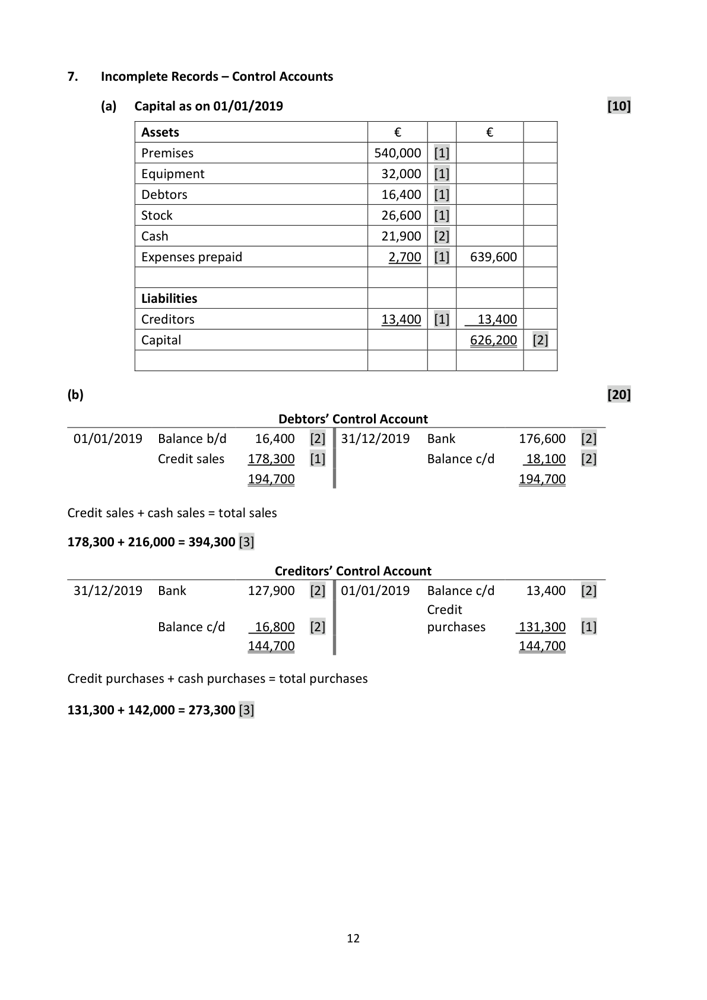

# Question

6.   Cash Flow Statement

     The following information has been extracted from the books of Britton Ltd:

       Profit and loss (extract) for year ended 31/12/2019                  €
      Operating profit                                               124,000
       Interest paid                                                        (11,000)
                                                                   113,000
      Taxation                                                            (14,000)
                                                                     99,000
      Dividends paid                                                      (12,000)
      Retained profit                                                  87,000
        Profit and loss balance 01/01/2019                                48,000
        Profit and loss balance 31/12/2019                               135,000

      Balance Sheets as at                          31/12/2019          31/12/2018
                                                €        €        €        €
      Fixed Assets
           Land and buildings                     690,000              450,000
             Less depreciation provision              (125,000)   565,000   (84,000)  366,000
      Current Assets
            Stock                                  63,000               75,000
           Debtors                                24,000               27,000
           Bank                                  15,000               26,000
                                                102,000             128,000
       Less Creditors: amounts falling due within 1 year
             Creditors                                 (16,000)               (24,000)
            Taxation                                 (14,000)               (10,000)
                                                      (30,000)               (34,000)
      Net Current Assets                                      72,000             94,000
       Total Net Assets                                       637,000            460,000

      Financed by
       Creditors: amounts falling due after 1 year
         7% Debentures                                  160,000             120,000
       Capital and Reserves
            Ordinary share capital issued                       310,000             270,000
            Share premium                                    32,000              22,000
              Profit and loss account                            135,000              48,000
                                                           637,000             460,000

Leaving Certificate 2020                       10
Accounting – Ordinary Level

<!-- PAGE 11 -->
# Page 11

Required:

(a)   Reconcile the operating profit to net cash inflow/outflow from operating activities.
                                                                                               (30)
(b)   Prepare the cash flow statement of Britton Ltd for the year ended 31/12/2019
      using the following headings:

      1.    Operating activities

      2.   Return on investments and servicing of finance

      3.    Taxation

      4.    Capital expenditure and financial investment

      5.    Equity dividends paid

      6.    Financing.                                                                         (60)

(c)   Reconcile the net cash flow to movement in net debt.                                   (10)

                                                                             (100 marks)

Leaving Certificate 2020                       11
Accounting – Ordinary Level

<!-- PAGE 12 -->
# Page 12

<!-- HAS_VISUAL: true -->
<!-- VISUAL_REASON: page contains vector drawings; page image extracted because text may not fully capture visual content -->

# Marking Scheme

6.   Cash Flow Statement
(a)   Reconciliation of Operating Profit to Net Cash Inflow from Operating Activities       [30]

                                                     €
        Operating profit                                 124,000  [3]
      Add depreciation                                  41,000  [6]
       Decrease in stock                                 12,000  [6]
       Decrease in debtors                                 3,000  [6]
       Decrease in creditors                                  (8,000)  [6]
       Net cash inflow from operating activities            172,000  [3]

(b)  Cash Flow Statement of Britton Ltd. For the year ended 31/12/2019                [65]

                                                    €
 Operating Activities [2]
 Net cash inflow from operating activities                   172,000  [4]

 Return on Investment and Servicing of Finance [2]
 Interest paid                                               (11,000)  [8]

 Taxation [2]
 Tax paid                                                    (10,000)  [6]

 Capital Expenditure and Financial Investment [2]
 Purchase of land/buildings                                (240,000)  [6]

 Equity Dividend paid [2]
 Dividends paid                                             (12,000)  [8]
 Net cash inflow before liquid resources and financing       (101,000)

 Financing
 Issue of ordinary share capital            40,000    [6]
 Share premium                        10,000    [6]
                                       50,000
 Debentures                            40,000    [6]      90,000
 Decrease in cash                                           (11,000)  [5]

                                          10

<!-- PAGE 12 -->
# Page 12

<!-- HAS_VISUAL: true -->
<!-- VISUAL_REASON: page contains vector drawings; page image extracted because text may not fully capture visual content -->

(c)   Reconciliation of Net Cash Flow to movement in Net Debt                            [5]

       Decrease in cash in the period                       (11,000)  [1]
       Debentures                                         (40,000)  [1]
       Change in net debt                                  (51,000)  [1]
       Net debt 01/01/2019                                (94,000)  [1]
       Net debt 31/12/2019                              (145,000)  [1]

                                          11

<!-- PAGE 13 -->
# Page 13

<!-- HAS_VISUAL: true -->
<!-- VISUAL_REASON: page contains vector drawings; page image extracted because text may not fully capture visual content -->

# Source References

Exam paper:
- file: intermediate_markdown/exam_papers/ordinary/accounting_ordinary_2020_paper_1_exam.md
- pages: [11, 12]

Marking scheme:
- file: intermediate_markdown/marking_schemes/ordinary/accounting_ordinary_2020_paper_1_marking_scheme.md
- pages: [12, 13]

# Notes

