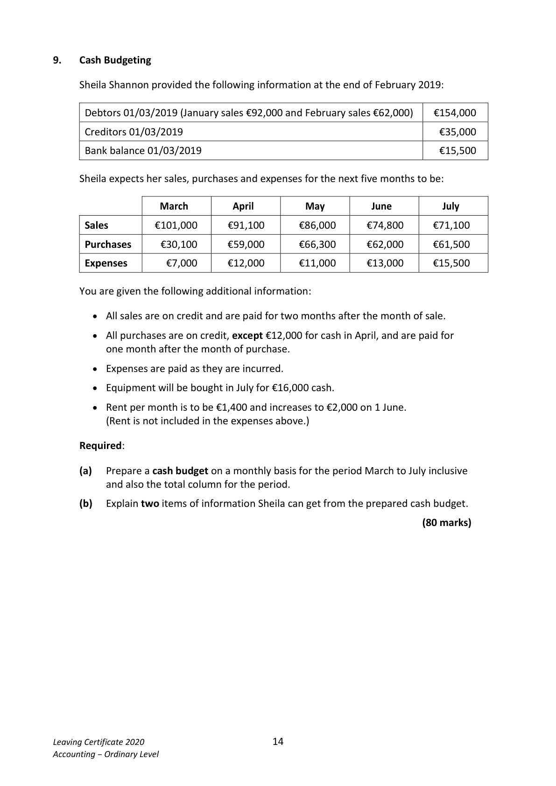

# Question

8.   Marginal Costing

McBreen Ltd manufactures a single product. The following is the proposed annual budget for the
coming year:

                                           €               €
                    Sales (50,000 units)                         750,000
                   Variable costs              475,000
                   Fixed costs                  81,000         (556,000)
                Net profit                                  194,000

Required:

(a)   Calculate the selling price per unit.

(b)   Calculate the variable cost per unit.

(c)   Calculate the contribution per unit sold.

(d)   Calculate the break‐even point in volume (units) and sales value (€).

(e)   Calculate the margin of safety in volume (units) and sales value (€), if the budgeted sales for
     the period are 50,000 units.

(f)   Prepare a marginal costing statement which includes the following:

                  Reduction in the selling price of €1.50

                  Increase in sales volume of 10%

                   All other costs to remain the same

(g)   Explain the term ‘fixed cost’ in relation to McBreen Ltd.

     Give two examples of ‘fixed costs’ that McBreen Ltd might incur.

                                                                           (80 marks)

Leaving Certificate 2020                       13
Accounting – Ordinary Level

<!-- PAGE 14 -->
# Page 14

<!-- HAS_VISUAL: true -->
<!-- VISUAL_REASON: page contains vector drawings; page image extracted because text may not fully capture visual content -->

# Marking Scheme

[No matching marking scheme section detected.]

# Source References

Exam paper:
- file: intermediate_markdown/exam_papers/ordinary/accounting_ordinary_2020_paper_1_exam.md
- pages: [14]

Marking scheme:
- file: 
- pages: []

# Notes

