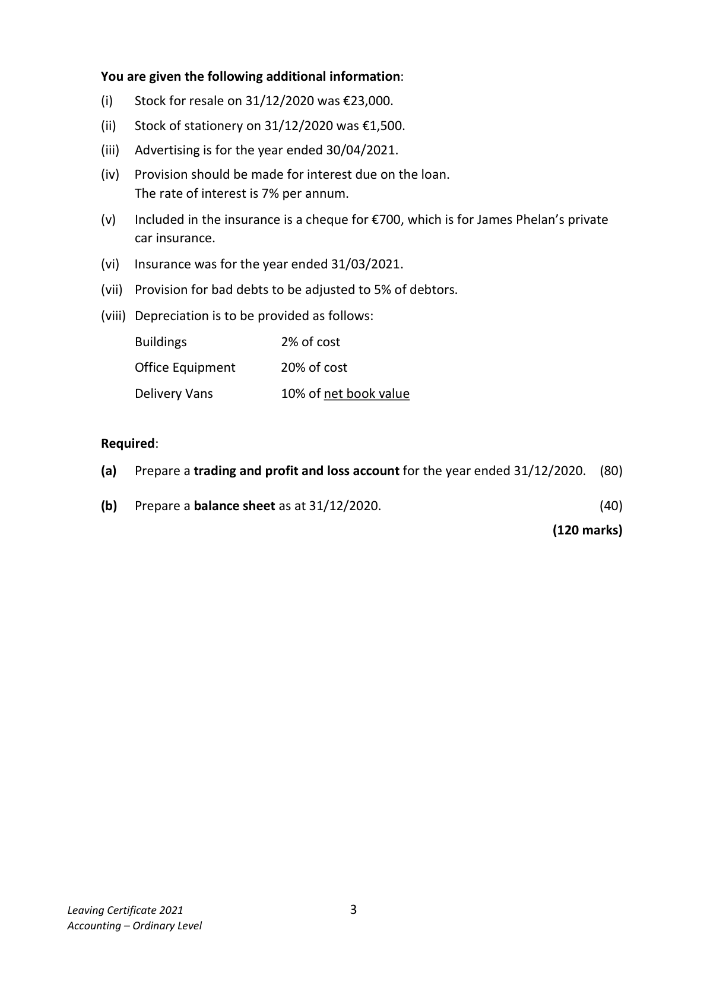
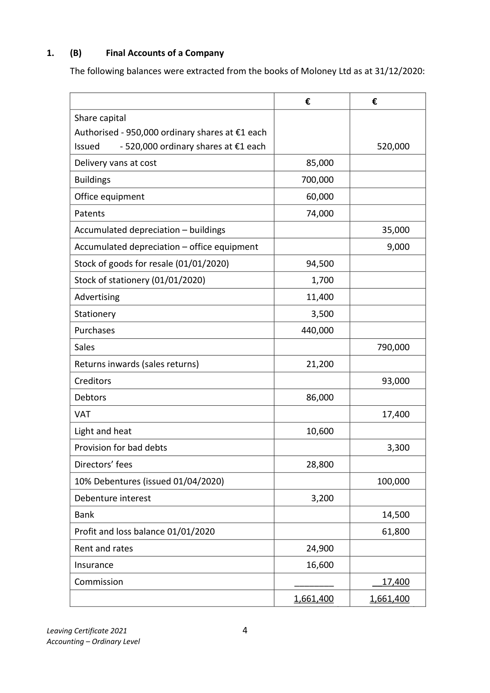
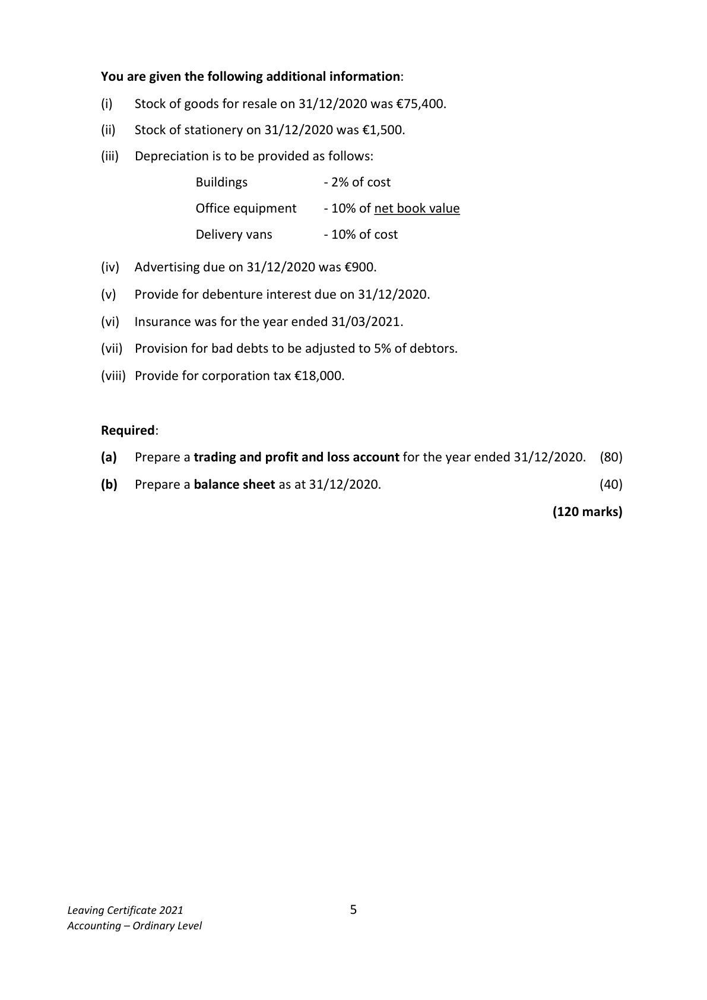
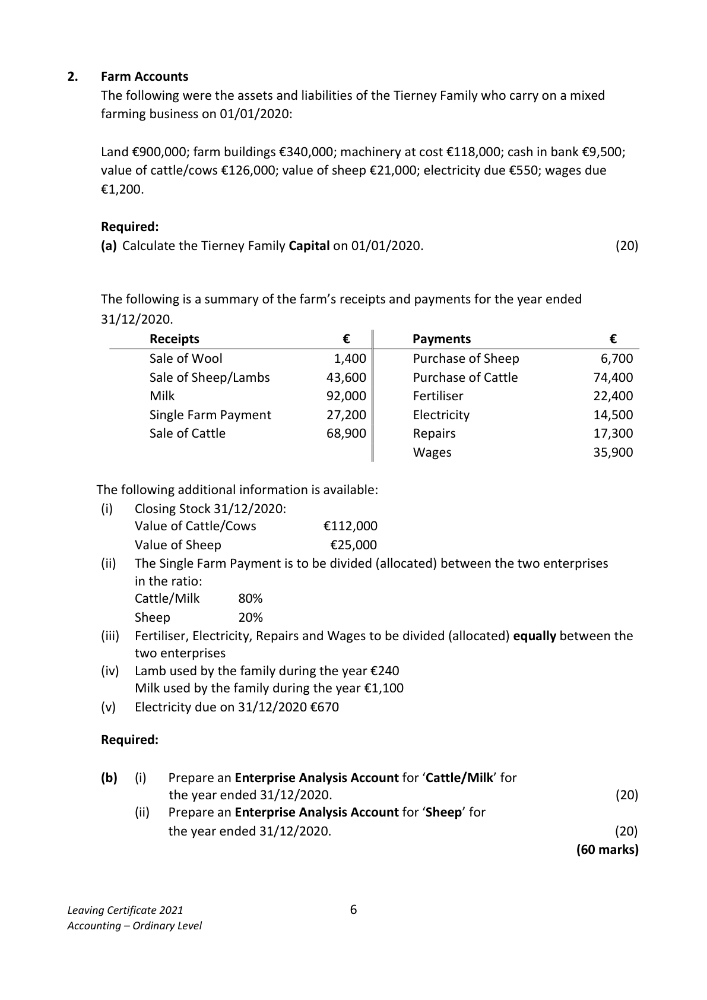
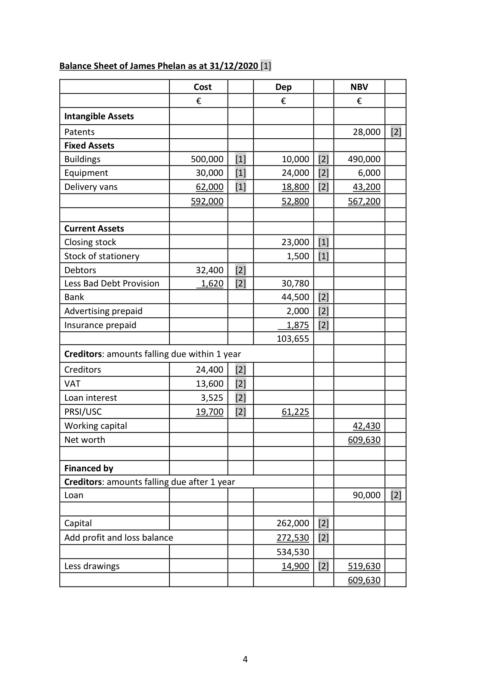
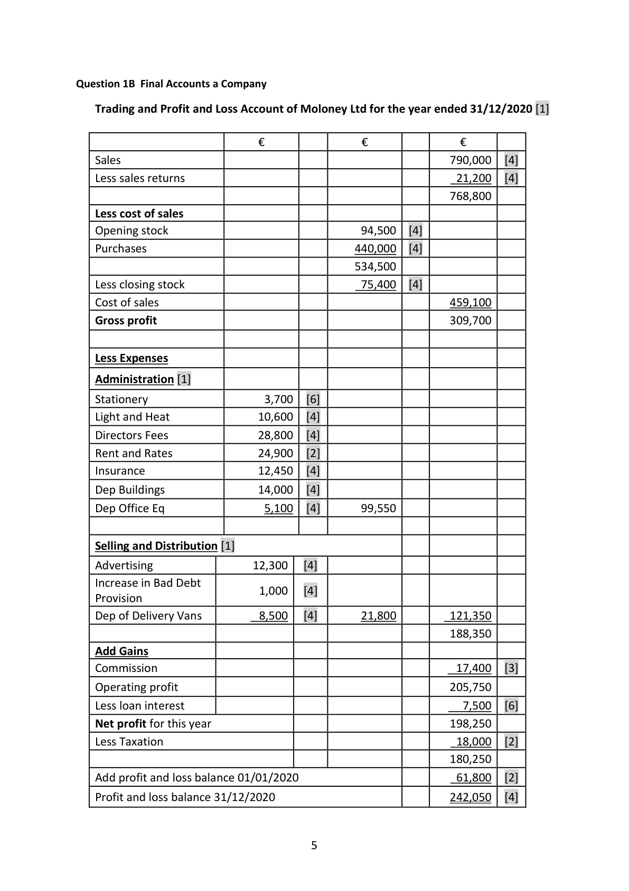
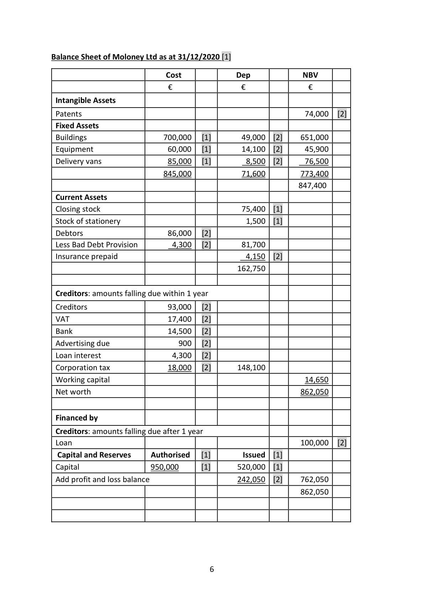
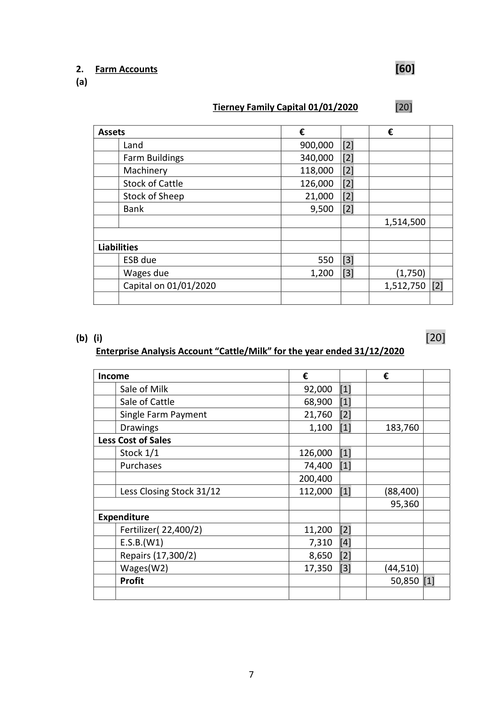

# Question

1.    (A)      Final Accounts of a Sole Trader
     The following balances were extracted from the books of James Phelan, a sole trader as at
     31/12/2020:

                                                           €                  €

      Delivery vans at cost                               62,000

     Accumulated depreciation – delivery vans                             14,000

      Buildings                                        500,000

       Office equipment (cost €30,000)                     12,000

      Patents                                           28,000

      Drawings                                         14,200

       Capital 01/01/2020                                               262,000

      Creditors                                                         24,400

      Debtors                                          32,400

      Sales                                                           595,000

      Purchases                                       196,000

      Returns outwards (purchases returns)                                  8,100

      Returns inwards (sales returns)                      18,000

      Stock 01/01/2020                                  32,000

      Stationery                                          3,600

      Discount received                                                    1,600

      General expenses                                  12,500

     Wages and salaries                               112,000

      Advertising                                         6,000

      Insurance                                           8,200

     Term loan (received 01/04/2020)                                     90,000

     Loan interest paid                                   1,200

      Provision for bad debts                                               2,700

     VAT                                                              13,600

      PRSI / USC                                                        19,700

     Bank                                             44,500

       Profit and loss balance 01/01/2020                _______        __51,500

                                                      1,082,600        1,082,600

Leaving Certificate 2021                       2
Accounting – Ordinary Level

<!-- PAGE 3 -->
# Page 3

<!-- HAS_VISUAL: true -->
<!-- VISUAL_REASON: page contains vector drawings; page image extracted because text may not fully capture visual content -->

You are given the following additional information:

        (i)   Stock for resale on 31/12/2020 was €23,000.

         (ii)   Stock of stationery on 31/12/2020 was €1,500.

         (iii)   Advertising is for the year ended 30/04/2021.

       (iv)   Provision should be made for interest due on the loan.
         The rate of interest is 7% per annum.

       (v)   Included in the insurance is a cheque for €700, which is for James Phelan’s private
           car insurance.

       (vi)  Insurance was for the year ended 31/03/2021.

        (vii)  Provision for bad debts to be adjusted to 5% of debtors.

        (viii) Depreciation is to be provided as follows:

            Buildings           2% of cost

            Office Equipment      20% of cost

           Delivery Vans        10% of net book value

     Required:

      (a)   Prepare a trading and profit and loss account for the year ended 31/12/2020.  (80)

      (b)   Prepare a balance sheet as at 31/12/2020.                                      (40)

                                                                          (120 marks)

Leaving Certificate 2021                       3
Accounting – Ordinary Level

<!-- PAGE 4 -->
# Page 4

<!-- HAS_VISUAL: true -->
<!-- VISUAL_REASON: page contains vector drawings; page image extracted because text may not fully capture visual content -->

1.    (B)      Final Accounts of a Company

     The following balances were extracted from the books of Moloney Ltd as at 31/12/2020:

                                                    €            €

      Share capital
      Authorised ‐ 950,000 ordinary shares at €1 each
       Issued       ‐ 520,000 ordinary shares at €1 each                        520,000

       Delivery vans at cost                                 85,000

       Buildings                                         700,000

       Office equipment                                   60,000

      Patents                                            74,000

      Accumulated depreciation – buildings                                  35,000

      Accumulated depreciation – office equipment                             9,000

      Stock of goods for resale (01/01/2020)                 94,500

      Stock of stationery (01/01/2020)                        1,700

       Advertising                                         11,400

       Stationery                                            3,500

      Purchases                                        440,000

       Sales                                                             790,000

      Returns inwards (sales returns)                       21,200

       Creditors                                                           93,000

      Debtors                                            86,000

     VAT                                                                17,400

       Light and heat                                      10,600

       Provision for bad debts                                                 3,300

       Directors’ fees                                      28,800

     10% Debentures (issued 01/04/2020)                                 100,000

      Debenture interest                                    3,200

      Bank                                                               14,500

       Profit and loss balance 01/01/2020                                    61,800

      Rent and rates                                      24,900

      Insurance                                          16,600

      Commission                                   ________        __17,400

                                                        1,661,400        1,661,400

Leaving Certificate 2021                       4
Accounting – Ordinary Level

<!-- PAGE 5 -->
# Page 5

<!-- HAS_VISUAL: true -->
<!-- VISUAL_REASON: page contains vector drawings; page image extracted because text may not fully capture visual content -->

You are given the following additional information:

         (i)    Stock of goods for resale on 31/12/2020 was €75,400.

         (ii)   Stock of stationery on 31/12/2020 was €1,500.

         (iii)   Depreciation is to be provided as follows:

                      Buildings                 ‐ 2% of cost

                      Office equipment      ‐ 10% of net book value

                      Delivery vans            ‐ 10% of cost

       (iv)   Advertising due on 31/12/2020 was €900.

       (v)   Provide for debenture interest due on 31/12/2020.

       (vi)  Insurance was for the year ended 31/03/2021.

        (vii)  Provision for bad debts to be adjusted to 5% of debtors.

        (viii) Provide for corporation tax €18,000.

     Required:

      (a)   Prepare a trading and profit and loss account for the year ended 31/12/2020.  (80)

      (b)   Prepare a balance sheet as at 31/12/2020.                                      (40)

                                                                          (120 marks)

Leaving Certificate 2021                       5
Accounting – Ordinary Level

<!-- PAGE 6 -->
# Page 6

<!-- HAS_VISUAL: true -->
<!-- VISUAL_REASON: page contains vector drawings; page image extracted because text may not fully capture visual content -->

# Marking Scheme

Question 1 ‐ Final Accounts Sole Trader

   Trading and Profit and Loss Account of James Phelan for the year ended 31/12/2020 [1]

                            €               €              €
    Sales                                                       595,000   [4]
    Less sales returns                                              18,000   [4]
                                                               577,000
   Less cost of sales
   Opening stock                                 32,000  [3]
   Purchases                  196,000   [3]
    Less purchases returns         8,100   [3]      187,900
                                               219,900
    Less closing stock                              23,000  [3]
   Cost of sales                                                 196,900
   Gross profit                                                 380,100

   Less Expenses

   Administration [1]

   Wages and salaries          112,000   [4]
   General expenses            12,500   [4]
    Stationery                    2,100   [6]
   Insurance                     5,625   [6]
   Dep Buildings                10,000   [4]
   Dep Office Eq                 6,000   [4]      148,225

    Selling and Distribution [1]

    Advertising                   4,000   [6]
   Dep of Delivery Vans           4,800   [4]        8,800         157,025
                                                               223,075

   Add Gains

   Discount received                                                1,600   [3]
   Decrease in Bad Debt Provision                                    1,080   [4]
   Operating profit                                              225,755
    Less loan interest                                                4,725   [6]
   Net profit for this year                                        221,030
   Add profit and loss balance 01/01/2020                           51,500   [2]

    Profit and loss balance 31/12/20120                            272,530   [4]

                                     3

<!-- PAGE 4 -->
# Page 4

<!-- HAS_VISUAL: true -->
<!-- VISUAL_REASON: page contains vector drawings; page image extracted because text may not fully capture visual content -->

Balance Sheet of James Phelan as at 31/12/2020 [1]

                              Cost            Dep          NBV
                           €                €              €

 Intangible Assets

 Patents                                                        28,000   [2]
 Fixed Assets
 Buildings                   500,000   [1]        10,000  [2]    490,000
 Equipment                   30,000   [1]        24,000  [2]      6,000
 Delivery vans                 62,000   [1]        18,800  [2]     43,200
                            592,000             52,800        567,200

 Current Assets
 Closing stock                                    23,000  [1]
 Stock of stationery                                 1,500  [1]
 Debtors                      32,400   [2]
 Less Bad Debt Provision         1,620   [2]        30,780
 Bank                                           44,500  [2]
 Advertising prepaid                                2,000  [2]
 Insurance prepaid                                 1,875  [2]
                                               103,655

 Creditors: amounts falling due within 1 year

 Creditors                     24,400   [2]
 VAT                         13,600   [2]
 Loan interest                   3,525   [2]
 PRSI/USC                    19,700   [2]        61,225
 Working capital                                                 42,430
 Net worth                                                    609,630

 Financed by
 Creditors: amounts falling due after 1 year
 Loan                                                           90,000   [2]

 Capital                                        262,000  [2]
 Add profit and loss balance                      272,530  [2]
                                               534,530
 Less drawings                                   14,900  [2]    519,630
                                                              609,630

                                     4

<!-- PAGE 5 -->
# Page 5

<!-- HAS_VISUAL: true -->
<!-- VISUAL_REASON: page contains vector drawings; page image extracted because text may not fully capture visual content -->

Question 1B Final Accounts a Company

   Trading and Profit and Loss Account of Moloney Ltd for the year ended 31/12/2020 [1]

                            €               €              €
    Sales                                                       790,000   [4]
    Less sales returns                                              21,200   [4]
                                                               768,800
   Less cost of sales
   Opening stock                                 94,500   [4]
   Purchases                                   440,000   [4]
                                               534,500
    Less closing stock                              75,400   [4]
   Cost of sales                                                 459,100
   Gross profit                                                 309,700

   Less Expenses

   Administration [1]

    Stationery                    3,700   [6]
    Light and Heat               10,600   [4]
    Directors Fees               28,800   [4]
   Rent and Rates              24,900   [2]
   Insurance                   12,450   [4]
   Dep Buildings                14,000   [4]
   Dep Office Eq                 5,100   [4]       99,550

    Selling and Distribution [1]

    Advertising                 12,300   [4]
   Increase in Bad Debt
                                1,000   [4]
    Provision
   Dep of Delivery Vans          8,500   [4]       21,800         121,350
                                                               188,350
   Add Gains
   Commission                                                   17,400   [3]
   Operating profit                                              205,750
    Less loan interest                                                7,500   [6]
   Net profit for this year                                        198,250
    Less Taxation                                                  18,000   [2]
                                                               180,250
   Add profit and loss balance 01/01/2020                           61,800   [2]

    Profit and loss balance 31/12/2020                             242,050   [4]

                                     5

<!-- PAGE 6 -->
# Page 6

<!-- HAS_VISUAL: true -->
<!-- VISUAL_REASON: page contains vector drawings; page image extracted because text may not fully capture visual content -->

Balance Sheet of Moloney Ltd as at 31/12/2020 [1]

                              Cost            Dep          NBV
                           €                €              €

 Intangible Assets

 Patents                                                        74,000   [2]
 Fixed Assets
 Buildings                   700,000   [1]        49,000  [2]    651,000
 Equipment                   60,000   [1]        14,100  [2]      45,900
 Delivery vans                 85,000   [1]         8,500  [2]      76,500
                            845,000             71,600         773,400
                                                              847,400
 Current Assets
 Closing stock                                    75,400  [1]
 Stock of stationery                                1,500  [1]
 Debtors                     86,000   [2]
 Less Bad Debt Provision         4,300   [2]        81,700
 Insurance prepaid                                 4,150  [2]
                                              162,750

 Creditors: amounts falling due within 1 year

 Creditors                    93,000   [2]
 VAT                         17,400   [2]
 Bank                        14,500   [2]
 Advertising due                900   [2]
 Loan interest                  4,300   [2]
 Corporation tax               18,000   [2]       148,100
 Working capital                                                 14,650
 Net worth                                                    862,050

 Financed by

 Creditors: amounts falling due after 1 year
 Loan                                                         100,000   [2]
  Capital and Reserves     Authorised   [1]         Issued  [1]
 Capital                  950,000       [1]       520,000  [1]
 Add profit and loss balance                      242,050  [2]    762,050
                                                              862,050

                                     6

<!-- PAGE 7 -->
# Page 7

<!-- HAS_VISUAL: true -->
<!-- VISUAL_REASON: page contains vector drawings; page image extracted because text may not fully capture visual content -->

# Source References

Exam paper:
- file: intermediate_markdown/exam_papers/ordinary/accounting_ordinary_2021_paper_1_exam.md
- pages: [3, 4, 5, 6]

Marking scheme:
- file: intermediate_markdown/marking_schemes/ordinary/accounting_ordinary_2021_paper_1_marking_scheme.md
- pages: [4, 5, 6, 7]

# Notes

