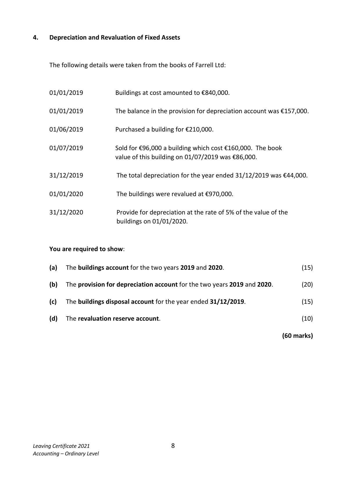
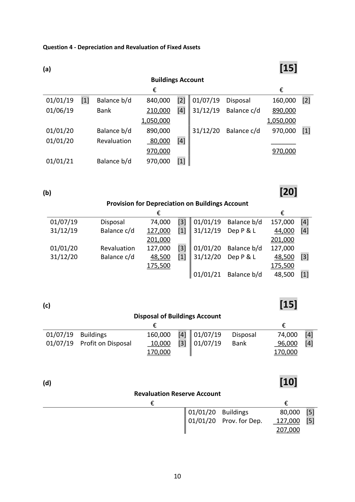

# Question

3.    Correction of Errors and Suspense Account

     The Trial Balance of Donal Power failed to agree on 31/12/2020 and the difference was
     entered in a suspense account. On examination of the books, the following errors were
      revealed:

          (i)   The total of the purchases book €12,100 had been posted to the purchases account
            as €11,200.

           (ii)  Goods purchased on credit from Sean Keane €990 had been entered in Shane
           Keane’s account.

           (iii)  The sales returns book had been under totted by €850.

         (iv)  Interest received €400 by cheque, had not been entered in the books.

        (v)  Goods for resale, taken by Donal Power for private use, €650 had not been entered
             in the books.

     Required:

      (a)   Journalise the necessary corrections.                                              (35)

      (b)   Prepare a Statement of Corrected Net Profit if the net profit as per accounts is
           €21,250.                                                                          (25)

                                                                                 (60 marks)

Leaving Certificate 2021                       7
Accounting – Ordinary Level

<!-- PAGE 8 -->
# Page 8

# Marking Scheme

Question 3 Correction of Errors and Suspense Account

(a)     Journal Entries                                                                  [35]

                                                       Dr             Cr
   (i) Purchases                                     Dr      900       [3]
     To Suspense                                           Cr                   900     [3]
 Being correction of an error of incorrect posting of
                                                                                          [1]
 purchases book figure.

   (ii) Shane Keane                                  Dr      990       [3]

      To Sean Keane                                       Cr                   990     [3]
 Being correction of an error of entering goods                                                                                          [1]
 purchased on credit in Shane Keane’s account
 instead of Sean Keane’s account.

    (iii) Sales returns                                  Dr      850       [3]
      To Suspense                                         Cr                   850     [3]
 Being correction of error of under totting the total in
 the sales returns                                                               [1]

   (iv) Bank                                          Dr      400       [3]
     To interest received                                   Cr                   400     [3]
 Being correction of an error omission of interest                                                                                          [1]
 received.

   (v) Drawings                                      Dr      650       [3]
      To purchases                                        Cr                   650     [3]
 Being correction of an error of omitting goods by                                                                                          [1]
 Donal Power for his own use.

(b)                                                                                 [25]

                         Statement of Corrected Net Profit
 Original Net Profit                                                             21,250 [4]
Add: Purchases                                         650      [4]
      Interest received                                   400      [4]      1,050
                                                                               22,300

 Less:  Sales returns                                    850                      [4]
      Purchases                                      900            (1,750) [4]

 Corrected net profit                                                        20,550 [5]

                                     9

<!-- PAGE 10 -->
# Page 10

<!-- HAS_VISUAL: true -->
<!-- VISUAL_REASON: page contains vector drawings; page image extracted because text may not fully capture visual content -->

# Source References

Exam paper:
- file: intermediate_markdown/exam_papers/ordinary/accounting_ordinary_2021_paper_1_exam.md
- pages: [8]

Marking scheme:
- file: intermediate_markdown/marking_schemes/ordinary/accounting_ordinary_2021_paper_1_marking_scheme.md
- pages: [10]

# Notes

