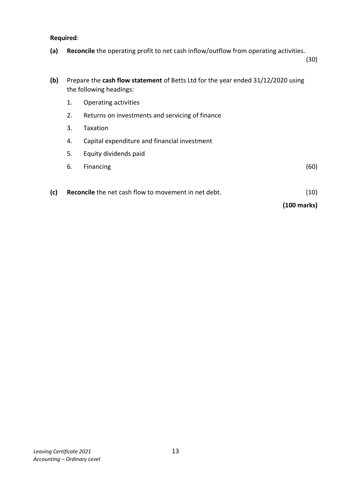
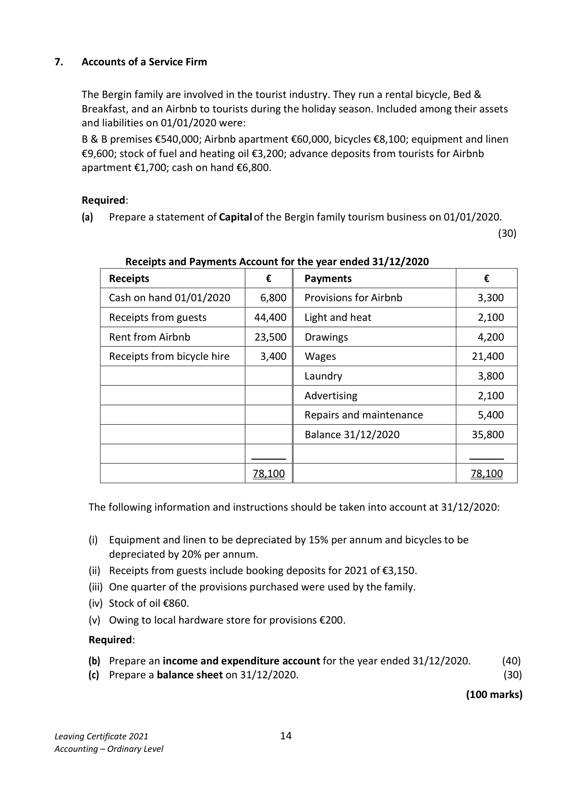
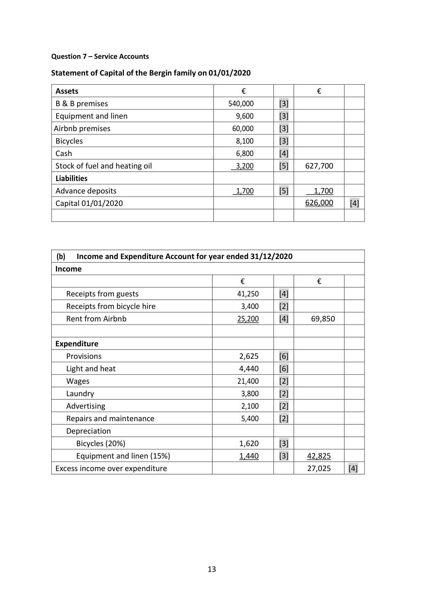

# Question

6.   Cash Flow Statement
     The following information has been extracted from the books of Betts Ltd:

       Profit and Loss (extract) for year ended 31/12/2020              €

      Operating profit                                            152,000
       Interest paid                                                    (24,000)
                                                                128,000
      Taxation                                                        (38,000)
                                                                 90,000
      Dividends paid                                                  (42,000)
      Retained profit                                              48,000
       Profit and loss balance 01/01/2020                            33,000
       Profit and loss balance 31/12/2020                            81,000

      Balance Sheets as at                        31/12/2020          31/12/2019
                                             €         €        €        €

       Fixed Assets
      Land and buildings                        890,000             710,000
       Less depreciation provision                 (140,000)   750,000   (98,000)   612,000
      Current Assets
       Stock                                     89,000               75,000
      Debtors                                   49,000               57,000
      Bank                                      26,000               17,000
                                               164,000             149,000
       Less Creditors: amounts falling due within 1 year
       Creditors                                  55,000               52,000
       Taxation                                   38,000              46,000
                                                    (93,000)               (98,000)
      Net Current Assets                                    71,000               51,000
       Total Net Assets                                    821,000             663,000

      Financed by
       Creditors: amounts falling due after 1 year
     7% Debentures                                     190,000             160,000
       Capital and Reserves
       Ordinary share capital issued                          540,000             470,000
      Share premium                                       10,000
        Profit and loss account                                81,000               33,000
                                                         821,000             663,000

Leaving Certificate 2021                       12
Accounting – Ordinary Level

<!-- PAGE 13 -->
# Page 13

Required:

      (a)   Reconcile the operating profit to net cash inflow/outflow from operating activities.
                                                                                               (30)

      (b)   Prepare the cash flow statement of Betts Ltd for the year ended 31/12/2020 using
          the following headings:

            1.    Operating activities

            2.    Returns on investments and servicing of finance

            3.    Taxation

            4.    Capital expenditure and financial investment

            5.    Equity dividends paid

            6.    Financing                                                                    (60)

       (c)   Reconcile the net cash flow to movement in net debt.                              (10)

                                                                             (100 marks)

Leaving Certificate 2021                       13
Accounting – Ordinary Level

<!-- PAGE 14 -->
# Page 14

<!-- HAS_VISUAL: true -->
<!-- VISUAL_REASON: page contains vector drawings; text contains visual keywords: line; page image extracted because text may not fully capture visual content -->

# Marking Scheme

Question 6 ‐ Cash flow Statement

 Reconciliation of Operating Profit to Net Cash
                                                         €
 Inflow/Outflow from Operating Activities
 Operating profit                                           152,000      [3]
 Add depreciation                                            42,000      [6]
 Increase in stock                                                (14,000)      [6]
 Decrease in debtors                                            8,000      [6]
 Increase in creditors                                           3,000      [6]

 Net cash inflow from operating activities                      191,000      [3]

 Cash Flow Statement of Betts Ltd for the year ended 31/12/2020       €
 Operating Activities [2]
 Net cash inflow from operating activities                           191,000   [4]

 Return on Investment and Servicing of Finance [2]

 Interest paid                                                         (24,000)   [6]

 Taxation [2]
 Tax paid                                                             (46,000)   [8]

 Capital Expenditure and Financial Investment [2]
 Purchase of land/buildings                                         (180,000)   [6]

 Equity Dividend paid [2]
 Dividends paid                                                       (42,000)   [6]
 Net cash outflow before liquid resources and financing               (101,000)

 Financing
 Issue of ordinary share capital                       70,000  [5]
 Share premium                                   10,000   [5]
 Issue of Debentures                                30,000  [5]
                                                               110,000
  Increase in cash                                                   9,000  [5]

 (c) Reconcile the net cash flow to movement in net debt
                                               €
 Increase in cash in the period                         9,000         [2]
 Debentures                                         (30,000)         [2]
 Change in net debt                                  (21,000)         [2]
 Net debt 01/01/2020                              (143,000)         [2]
 Net debt 31/12/2020                              (164,000)         [2]

                                    12

<!-- PAGE 13 -->
# Page 13

<!-- HAS_VISUAL: true -->
<!-- VISUAL_REASON: page contains vector drawings; text contains visual keywords: line; page image extracted because text may not fully capture visual content -->

# Source References

Exam paper:
- file: intermediate_markdown/exam_papers/ordinary/accounting_ordinary_2021_paper_1_exam.md
- pages: [13, 14]

Marking scheme:
- file: intermediate_markdown/marking_schemes/ordinary/accounting_ordinary_2021_paper_1_marking_scheme.md
- pages: [13]

# Notes

