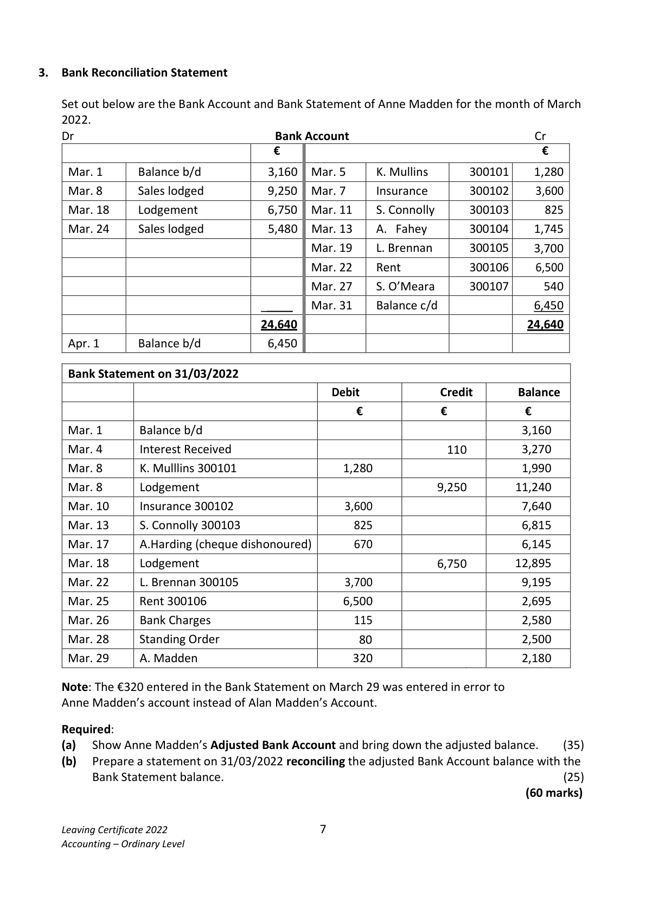

# Question

2. Incomplete Records – Net Worth

   D. Coleman, a sole trader, has not been keeping a full set of accounts. The following
   figures relating to the business were supplied on 01/01/2021:

                                                                  €

   Premises                                                        580,000

    Furniture and equipment at cost                                      68,000

   Motor vehicles at book value                                         48,000

   Accumulated depreciation on furniture and equipment                    6,200

   Stock                                                             55,000

   Insurance prepaid                                                     1,600

    Creditors                                                          20,000

   Expenses due                                                        3,200

   Bank                                                                6,400

   Debtors                                                           20,800

 Required:

  (a) Prepare a statement showing Coleman’s net worth/capital on 01/01/2021.              (30)

 Coleman also supplied the following additional information on 31/12/2021:

  (i)  During the year €20,000 was transferred from a personal bank account to the business bank
     account.

  (ii)  During the year, Coleman had paid €8,200 out of business funds for private house repairs
     and had also taken goods to the value of €400 per month for private use.

 Coleman estimated that on 31/12/2021 the business assets and liabilities were €920,000 and
 €86,000 respectively, before allowing for the following:
     Depreciation on furniture and equipment at the rate of 10% of Cost.
     Depreciation on motor vehicles at the rate of 20% of Book Value.
     Expenses due of €640.

  (b)   Prepare a statement showing Coleman’s profit or loss for the year ended 31/12/2021.
                                                                                               (30)

                                                                                 (60 marks)

Leaving Certificate 2022                       6
Accounting – Ordinary Level

<!-- PAGE 7 -->
# Page 7

<!-- HAS_VISUAL: true -->
<!-- VISUAL_REASON: page contains vector drawings; page image extracted because text may not fully capture visual content -->

# Marking Scheme

[No matching marking scheme section detected.]

# Source References

Exam paper:
- file: intermediate_markdown/exam_papers/ordinary/accounting_ordinary_2022_paper_1_exam.md
- pages: [7]

Marking scheme:
- file: 
- pages: []

# Notes

