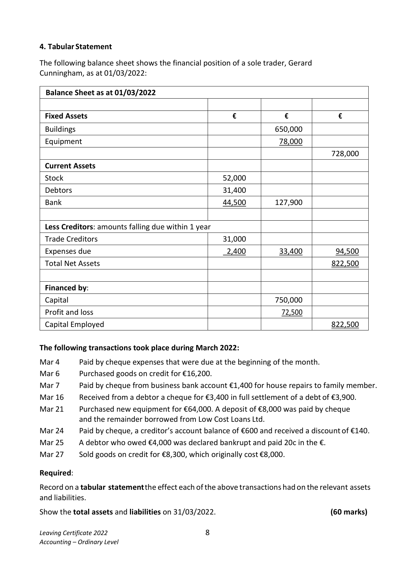

# Question

3.  Bank Reconciliation Statement

    Set out below are the Bank Account and Bank Statement of Anne Madden for the month of March
    2022.
    Dr                              Bank Account                                Cr
                                    €                                         €

     Mar. 1      Balance b/d           3,160  Mar. 5      K. Mullins      300101    1,280
     Mar. 8       Sales lodged           9,250  Mar. 7     Insurance      300102     3,600
     Mar. 18    Lodgement            6,750  Mar. 11     S. Connolly     300103      825
     Mar. 24     Sales lodged           5,480  Mar. 13    A. Fahey      300104    1,745
                                           Mar. 19     L. Brennan      300105    3,700
                                           Mar. 22    Rent          300106     6,500
                                           Mar. 27     S. O’Meara     300107     540
                                   ____   Mar. 31    Balance c/d                6,450
                                     24,640                                      24,640
     Apr. 1      Balance b/d           6,450

    Bank Statement on 31/03/2022
                                                    Debit               Credit       Balance
                                                 €            €            €
     Mar. 1      Balance b/d                                                      3,160
     Mar. 4       Interest Received                                 110         3,270
     Mar. 8       K. Mulllins 300101                  1,280                         1,990
     Mar. 8      Lodgement                                        9,250        11,240
     Mar. 10     Insurance 300102                    3,600                         7,640
     Mar. 13       S. Connolly 300103                  825                         6,815
     Mar. 17     A.Harding (cheque dishonoured)       670                         6,145
     Mar. 18     Lodgement                                        6,750        12,895
     Mar. 22       L. Brennan 300105                   3,700                         9,195
     Mar. 25     Rent 300106                       6,500                         2,695
     Mar. 26     Bank Charges                       115                         2,580
     Mar. 28     Standing Order                     80                         2,500
     Mar. 29      A. Madden                        320                         2,180

    Note: The €320 entered in the Bank Statement on March 29 was entered in error to
   Anne Madden’s account instead of Alan Madden’s Account.

    Required:
     (a)  Show Anne Madden’s Adjusted Bank Account and bring down the adjusted balance.     (35)
     (b)   Prepare a statement on 31/03/2022 reconciling the adjusted Bank Account balance with the
        Bank Statement balance.                                                                (25)
                                                                                     (60 marks)

     Leaving Certificate 2022                       7
     Accounting – Ordinary Level

<!-- PAGE 8 -->
# Page 8

<!-- HAS_VISUAL: true -->
<!-- VISUAL_REASON: page contains vector drawings; page image extracted because text may not fully capture visual content -->

# Marking Scheme

[No matching marking scheme section detected.]

# Source References

Exam paper:
- file: intermediate_markdown/exam_papers/ordinary/accounting_ordinary_2022_paper_1_exam.md
- pages: [8]

Marking scheme:
- file: 
- pages: []

# Notes

