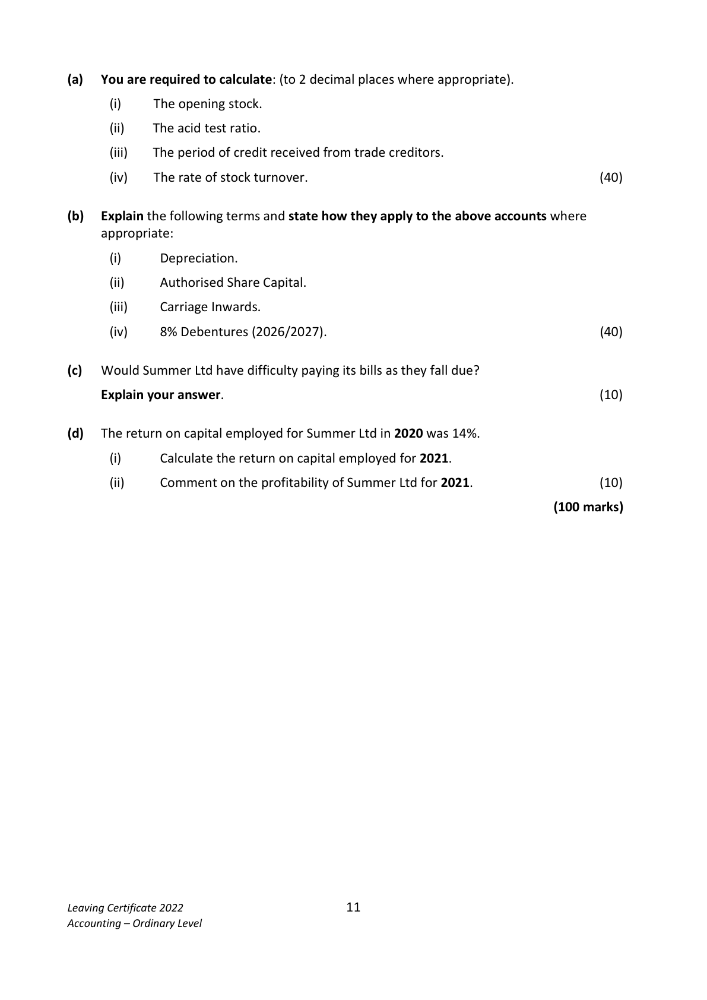
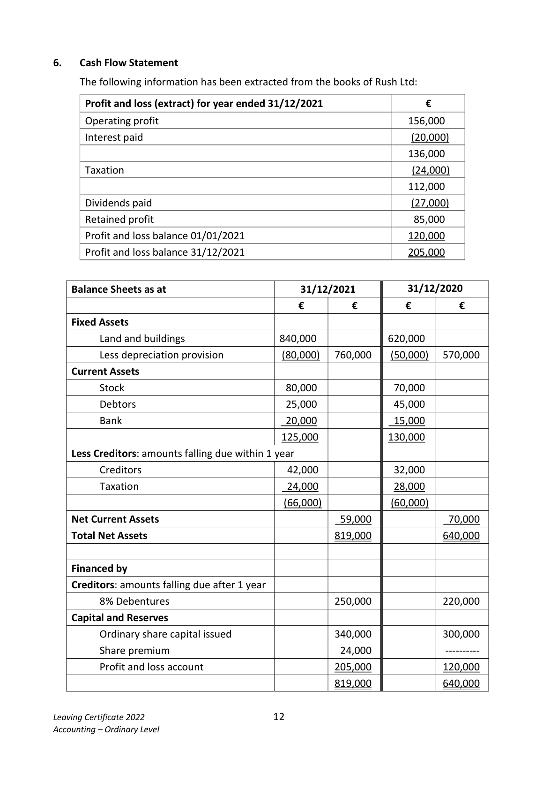

# Question

5. Interpretation of Accounts

    The following information has been taken from the accounts of Summer Ltd for the year ended
    31/12/2021:

             Trading and Profit and Loss Account for the year ended 31/12/2021
                                             €            €           €
    Credit sales                                                           800,000
    Less: Cost of sales
    Stock 01/01/2021                                           ?????
   Add: credit purchases (including Carriage Inwards €5,000)      386,000
                                                               ?????
    Less: stock 31/12/2021                                      40,000
    Cost of sales                                                           ???????
    Gross profit                                                           410,000
    Less: Total expenses (including interest)                                   250,000
   Net profit for year                                                     160,000

                            Balance Sheet as at 31/12/2021
                                             €            €           €
                                                Cost      Depreciation    NBV
    Fixed Assets                                890,000        40,000      850,000

    Current Assets (including trade debtors €38,000)               94,000
    Less Creditors: amounts falling due within 1 year

    Trade creditors                                             44,000
                                                                          50,000
                                                                        900,000
    Financed by:
    Creditors: amounts falling due after more than 1 year
   8% Debentures (2026/2027)                                             200,000
    Capital and Reserves                      Authorised         Issued
    Ordinary shares at €1 each                   800,000       540,000      540,000
    Profit and loss account                                                 160,000
                                                                        900,000

   Leaving Certificate 2022                       10
   Accounting – Ordinary Level

<!-- PAGE 11 -->
# Page 11

(a)  You are required to calculate: (to 2 decimal places where appropriate).

           (i)    The opening stock.

           (ii)    The acid test ratio.

           (iii)   The period of credit received from trade creditors.

         (iv)    The rate of stock turnover.                                                   (40)

(b)   Explain the following terms and state how they apply to the above accounts where
      appropriate:

           (i)      Depreciation.

           (ii)      Authorised Share Capital.

           (iii)     Carriage Inwards.

         (iv)    8% Debentures (2026/2027).                                               (40)

(c)  Would Summer Ltd have difficulty paying its bills as they fall due?

      Explain your answer.                                                                 (10)

(d)  The return on capital employed for Summer Ltd in 2020 was 14%.

           (i)       Calculate the return on capital employed for 2021.

           (ii)    Comment on the profitability of Summer Ltd for 2021.                      (10)

                                                                          (100 marks)

Leaving Certificate 2022                       11
Accounting – Ordinary Level

<!-- PAGE 12 -->
# Page 12

<!-- HAS_VISUAL: true -->
<!-- VISUAL_REASON: page contains vector drawings; page image extracted because text may not fully capture visual content -->

# Marking Scheme

[No matching marking scheme section detected.]

# Source References

Exam paper:
- file: intermediate_markdown/exam_papers/ordinary/accounting_ordinary_2022_paper_1_exam.md
- pages: [11, 12]

Marking scheme:
- file: 
- pages: []

# Notes

