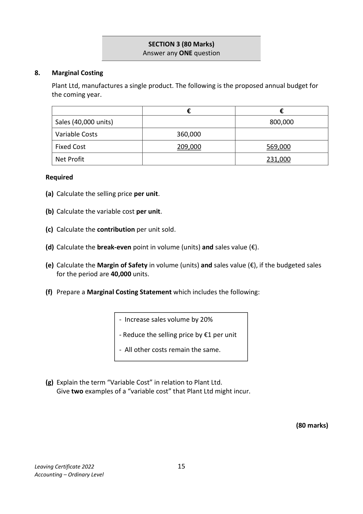

# Question

7.  Club Accounts

   Included in the assets and liabilities of Sea View Boat Club on 01/01/2021 were the following:

   Boathouse €680,000; equipment €36,000; investments €60,000; land €200,000;
   bar stock €10,100; members’ subscriptions prepaid €2,100; bar creditors €4,200;
   cash in hand €3,200.

   Required

     (a)   Prepare a statement showing the club’s accumulated fund 01/01/2021.             (20)

   The following is a summary of the club’s receipts and payments for the year 2021:

                Receipts and Payments Account for the year ended 31/12/2021

     Receipts                     €      Payments                       €

     Cash in hand 01/01/2021        3,200    Club lotto prizes                  25,000

     Investment interest             1,200    Bar purchases                    24,000

     Bar sales                     46,000    General expenses                 26,200

     Club lotto receipts             42,000    Insurance                          4,800

     Subscriptions                 64,200    Purchase of equipment              4,000

     Annual sponsorship           18,000    Cash balance 31/12/2021          90,600

                                174,600                                   174,600

     The treasurer also supplied the following information as at 31/12/2021:

        (i)   Bar stock was €6,400.

         (ii)   Bar creditors were €3,100.

         (iii)  Insurance prepaid was €1,200.

       (iv)   Subscriptions prepaid were €3,600.

       (v)   Depreciate the boathouse by 2% of cost.

       (vi)  Equipment held on 31/12/2021 is to be depreciated by 20%.

     Required:

       (b)   Prepare a bar trading account for the year ended 31/12/2021.                        (8)

       (c)   Prepare the club’s income and expenditure account for the year ended
          31/12/2021.                                                                       (34)
      (d)   Prepare the club’s balance sheet as at 31/12/2021.                                (30)

      (e)   Explain the difference between the balance in the income and expenditure account
         and the closing balance in the receipts and payments account.                        (8)

                                                                             (100 marks)

Leaving Certificate 2022                       14
Accounting – Ordinary Level

<!-- PAGE 15 -->
# Page 15

<!-- HAS_VISUAL: true -->
<!-- VISUAL_REASON: page contains vector drawings; page image extracted because text may not fully capture visual content -->

SECTION 3 (80 Marks)
                             Answer any ONE question

# Marking Scheme

[No matching marking scheme section detected.]

# Source References

Exam paper:
- file: intermediate_markdown/exam_papers/ordinary/accounting_ordinary_2022_paper_1_exam.md
- pages: [15]

Marking scheme:
- file: 
- pages: []

# Notes

