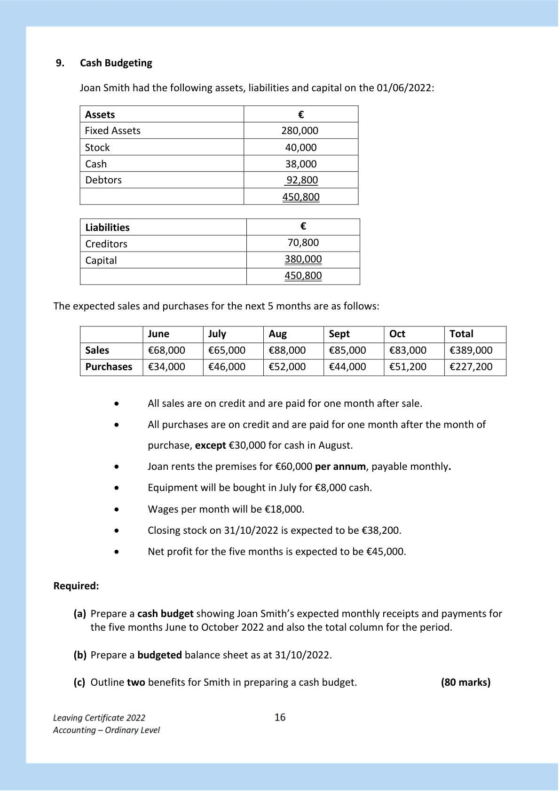

# Question

8.   Marginal Costing

      Plant Ltd, manufactures a single product. The following is the proposed annual budget for
     the coming year.

                                         €                        €
       Sales (40,000 units)                                             800,000

       Variable Costs                       360,000

       Fixed Cost                           209,000                   569,000

      Net Profit                                                     231,000

   Required

    (a) Calculate the selling price per unit.

    (b) Calculate the variable cost per unit.

    (c) Calculate the contribution per unit sold.

    (d) Calculate the break‐even point in volume (units) and sales value (€).

    (e) Calculate the Margin of Safety in volume (units) and sales value (€), if the budgeted sales
        for the period are 40,000 units.

     (f) Prepare a Marginal Costing Statement which includes the following:

                                      ‐ Increase sales volume by 20%

                                      ‐ Reduce the selling price by €1 per unit

                                      ‐ All other costs remain the same.

    (g) Explain the term “Variable Cost” in relation to Plant Ltd.
       Give two examples of a “variable cost” that Plant Ltd might incur.

                                                                                 (80 marks)

Leaving Certificate 2022                       15
Accounting – Ordinary Level

<!-- PAGE 16 -->
# Page 16

<!-- HAS_VISUAL: true -->
<!-- VISUAL_REASON: page contains embedded images; page contains vector drawings; text contains visual keywords: line; page image extracted because text may not fully capture visual content -->

# Marking Scheme

[No matching marking scheme section detected.]

# Source References

Exam paper:
- file: intermediate_markdown/exam_papers/ordinary/accounting_ordinary_2022_paper_1_exam.md
- pages: [16]

Marking scheme:
- file: 
- pages: []

# Notes

