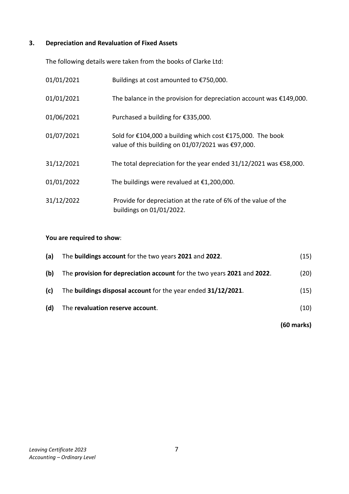
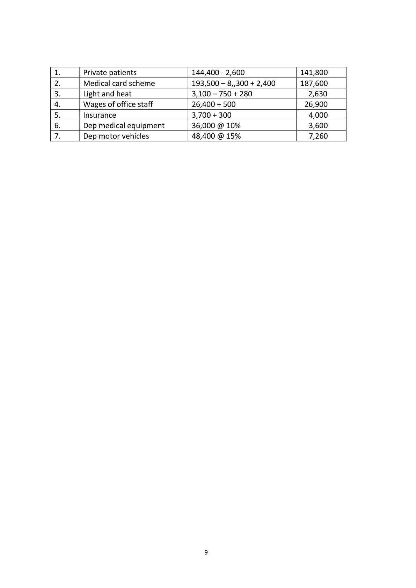

# Question

2.   Accounts of a Service Firm

     The following were the assets and liabilities of Síobhain O’Neill, a doctor on 01/01/2022.

     Premises €450,000, furniture €30,500, motor vehicles €48,400, cash on hand €32,000 ,
     medical equipment at cost €36,000, amounts due from private patients €2,600,
       light and heat due €750, amounts due from medical card schemes €8,300,
      depreciation of medical equipment €3,600, insurance prepaid €300.

     Required:
       (a)   Calculate Dr. O’Neill’s capital on the 01/01/2022.                                    (20)

        The following details were taken from her records on 31/12/2022:

         Receipts                          €      Payments                      €

         Private patients’ fees         144,400    Medical supplies             14,200

        Medical card scheme         193,500    Light and heat                3,100

                                             Telephone & broadband       2,200

                                        Wages of office staff         26,400

                                             Magazines                   350

                                                 Insurance                    3,700

                                                  Repairs and maintenance      5,400

                                          Motor expenses               1,800

                                                    Substitute doctor fees        20,100

      The following information and instructions should be taken into consideration at 31/12/2022:
           (i)   Amounts due from medical card scheme were €2,400.
           (ii)    Light and heat due €280.
            (iii)  Wages of office staff due were €500.
         (iv)   Dr. O’Neill wishes to depreciate the medical equipment by 10% of cost and motor
             vehicles by 15% of cost.

       Required:

         (b)  Prepare Dr. O’Neill’s income and expenditure account for the year ended 31/12/2022.

                                                                                                 (40)

                                                                                  (60 marks)

Leaving Certificate 2023                         6
Accounting – Ordinary Level

<!-- PAGE 7 -->
# Page 7

# Marking Scheme

2.   Drawings                            15,200 +800             16,000

2.      Dep - buildings             720,000 @ 2%                 14,400

Question 2 – Accounts of a Service Firm
                                                   60   Statement of Capital 01/01/22                                     [20]

     Assets                                        €                €
     Premises                                       450,000        [2]
     Furniture                                         30,500        [1]
    Motor vehicles                                   48,400        (2)
     Medical equipment                               36,000        [2]
     Cash                                             32,000        [2]
     Private patients                                    2,600        [2]
     Insurance prepaid                                300        [2]
     Medical card scheme                               8,300        [2]   608,100
       Liabilities
      Light and heat due                               750        [2]
     Depreciation of medical equipment                 3,600        [2]     4,350
      Capital 01/01/22                                              603,750    [1]

    (a) Income and expenditure account year ended 31/12/2022                   [40]

    Income and Expenditure Account 31/12/2022

    Income                                    €                 €
         Private patients fees                      141,800      [4]
        Medical card scheme                   187,600      [6]    329,400

     Expenditure
        Medical supplies                        14,200      [2]
         Light and heat                            2,630      [6]
       Telephone and broadband                    2,200      [2]
      Wages of office staff                        26,900      [3]
       Magazines                             350      [1]
        Insurance                                    4,000      [3]
        Repairs and maintenance                  5,400      [1]
       Motor expenses                          1,800      [2]
         Substitute doctor’s fees                  20,100      [2]
        Depreciation
           -   Medical equipment                    3,600      [3]
           -  Motor vehicles                       7260      [3]     88,440
     Excess income over expenditure                              240,960     [2]
     31/12/2022

                                           8

<!-- PAGE 10 -->
# Page 10

<!-- HAS_VISUAL: true -->
<!-- VISUAL_REASON: page contains vector drawings; page image extracted because text may not fully capture visual content -->

2.      Medical card scheme         193,500 – 8,,300 + 2,400      187,600

2.      Depreciation - buildings       290,000 * 2%                  5,800

# Source References

Exam paper:
- file: intermediate_markdown/exam_papers/ordinary/accounting_ordinary_2023_paper_1_exam.md
- pages: [7]

Marking scheme:
- file: intermediate_markdown/marking_schemes/ordinary/accounting_ordinary_2023_paper_1_marking_scheme.md
- pages: [10]

# Notes

