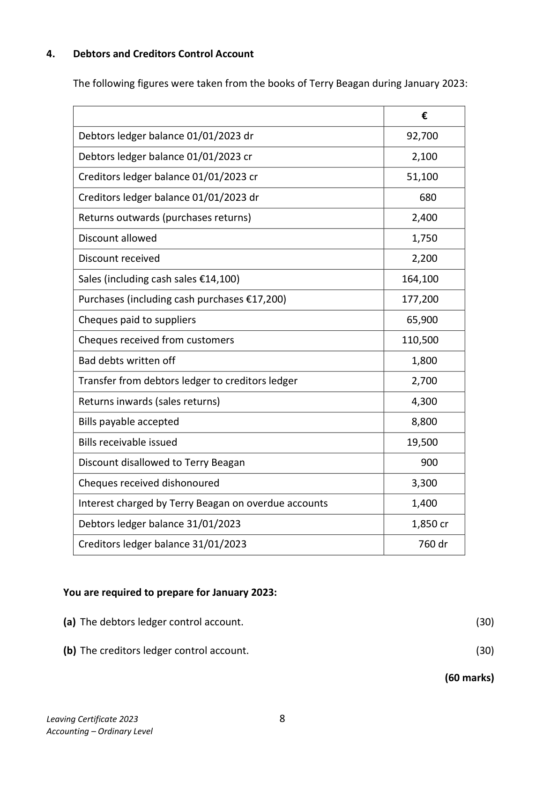
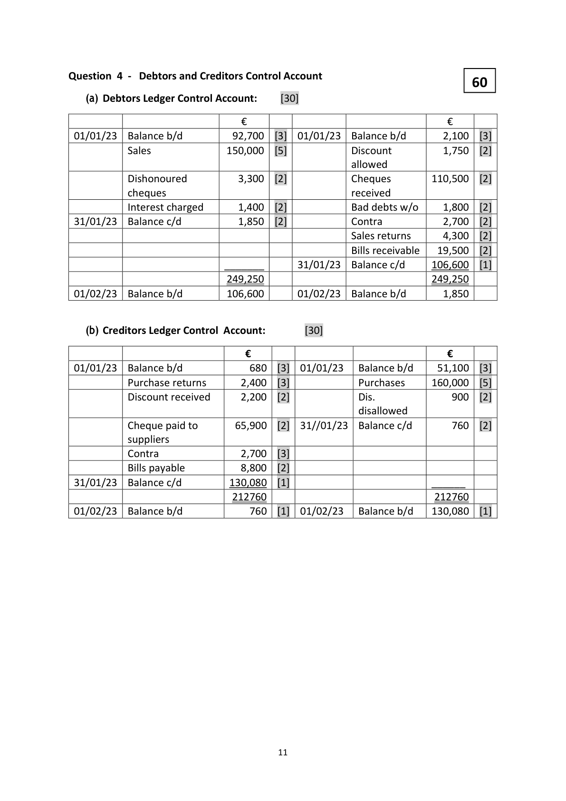

# Question

3.    Depreciation and Revaluation of Fixed Assets

     The following details were taken from the books of Clarke Ltd:

     01/01/2021           Buildings at cost amounted to €750,000.

     01/01/2021         The balance in the provision for depreciation account was €149,000.

     01/06/2021          Purchased a building for €335,000.

     01/07/2021           Sold for €104,000 a building which cost €175,000. The book
                           value of this building on 01/07/2021 was €97,000.

     31/12/2021         The total depreciation for the year ended 31/12/2021 was €58,000.

     01/01/2022         The buildings were revalued at €1,200,000.

     31/12/2022           Provide for depreciation at the rate of 6% of the value of the
                              buildings on 01/01/2022.

    You are required to show:

      (a)  The buildings account for the two years 2021 and 2022.                           (15)

      (b)  The provision for depreciation account for the two years 2021 and 2022.          (20)

       (c)   The buildings disposal account for the year ended 31/12/2021.                    (15)

      (d)  The revaluation reserve account.                                                  (10)

                                                                                 (60 marks)

Leaving Certificate 2023                         7
Accounting – Ordinary Level

<!-- PAGE 8 -->
# Page 8

<!-- HAS_VISUAL: true -->
<!-- VISUAL_REASON: page contains vector drawings; text contains visual keywords: figure; page image extracted because text may not fully capture visual content -->

# Marking Scheme

3.    Advertising                          10,900 + 400            11,300

3.       Acc dep - buildings          45,000 + 14,400               59,400

3.       Light and heat                3,100 – 750 + 280               2,630

Question 3 - Depreciation and Revaluation of Fixed Assets:                                                   60
    a)

                                    Buildings Account [15]

                           €                                   €

01/01/21[1]  Balance b/d     750,000  [2]  01/07/21   Disposal        175,000   [2]
01/06/21    Bank           335,000  [4]  31/12/21   Balance c/d     910,000
                           1,085,000                                1,085,000
01/01/22     Balance b/d     910,000
01/01/22     Revaluation     290,000  [4]  31/12/22   Balance c/d   1,200,000   [1]
                           1,200,000                                1,200,000
01/01/23     Balance b/d   1,200,000  [1]

    b)

                       Provision for Depreciation on Buildings Account  [20]

                               €                                €
 01/07/21  Disposal              78,000  [3]  01/01/21  Balance b/d  149,000  [4]
 31/12/21  Balance c/d         129,000  [1]  31/12/21  Dep P&L      58,000  [4]
                               207,000                            207,000
 01/01/22  Revaluation Reserve  129,000  [3]  01/01/22  Balance b/d  129,000
 31/12/22  Balance c/d           72,000  [1]  31/12/22  Dep P&L      72,000  [3]
                               201,000                            201,000
                                           01/01/23  Balance b/d   72,000  [1]

    c)                     Disposal of Buildings Account   [15]

                             €                                 €
 01/07/21  Buildings         175,000  [4]  01/07/21  Depreciation   78,000  [4]
 01/07/21  Profit on disposal    7,000  [3]  01/07/21  Bank         104,000  [4]
                            182,000                             182,000

    d)                  Revaluation Reserve Account  [10]

                        €                                  €
                                  01/01/22  Buildings         290,000  [5]
 31/12/22  Balance c/d  419,000    01/01/22  Provision for dep  129,000  [5]
                       419,000                               419,000
                                  01/01/23  Balance b/d      419,000

                                            10

<!-- PAGE 12 -->
# Page 12

<!-- HAS_VISUAL: true -->
<!-- VISUAL_REASON: page contains vector drawings; page image extracted because text may not fully capture visual content -->

3.      Depreciation - machinery      85,000 * 10%                  8,500

# Source References

Exam paper:
- file: intermediate_markdown/exam_papers/ordinary/accounting_ordinary_2023_paper_1_exam.md
- pages: [8]

Marking scheme:
- file: intermediate_markdown/marking_schemes/ordinary/accounting_ordinary_2023_paper_1_marking_scheme.md
- pages: [12]

# Notes

