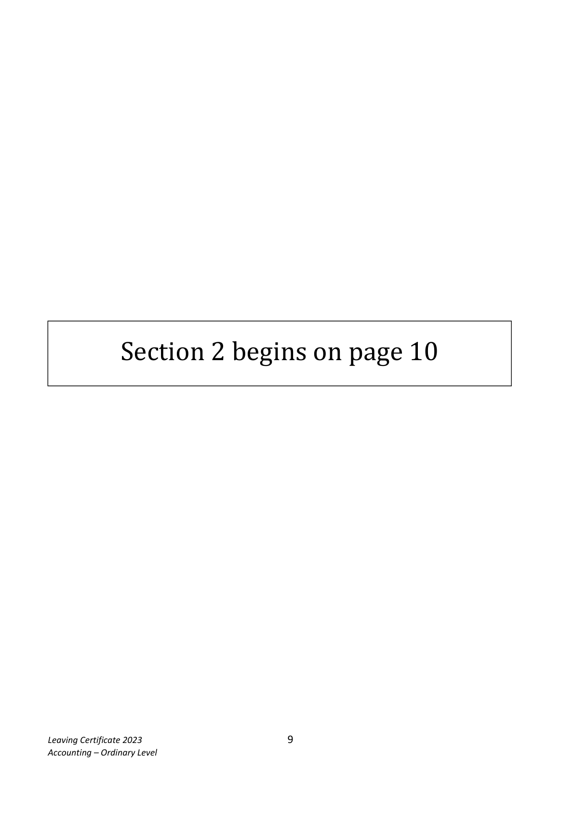
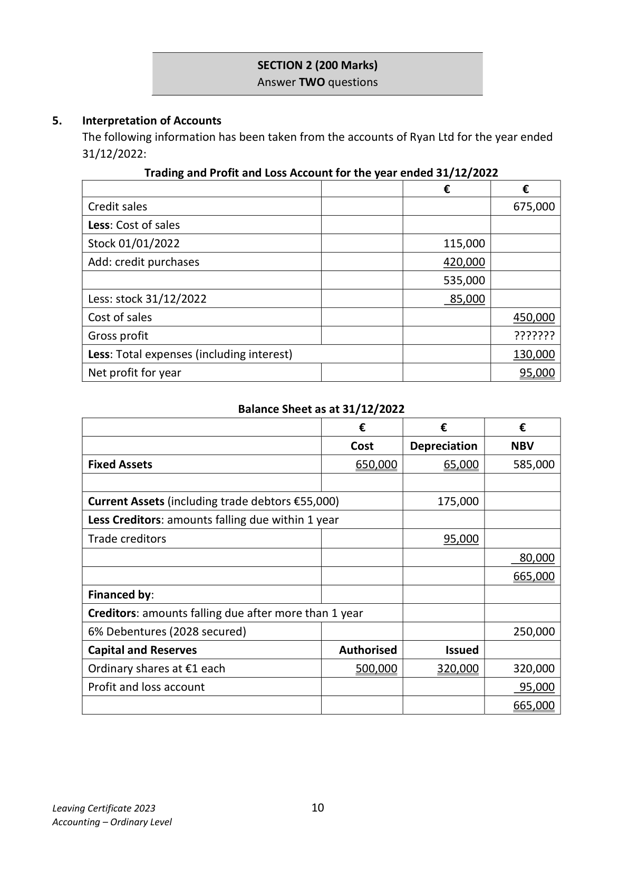
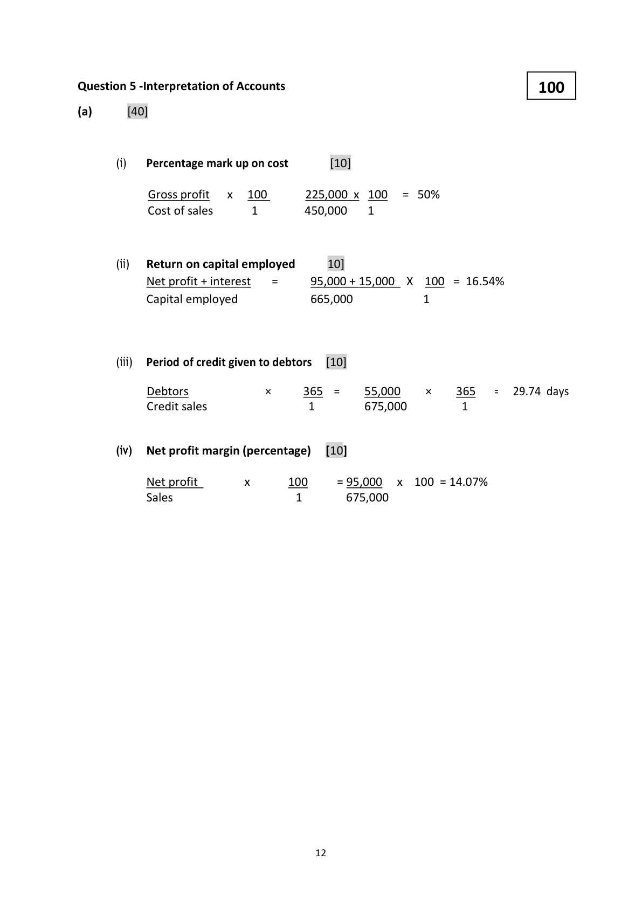
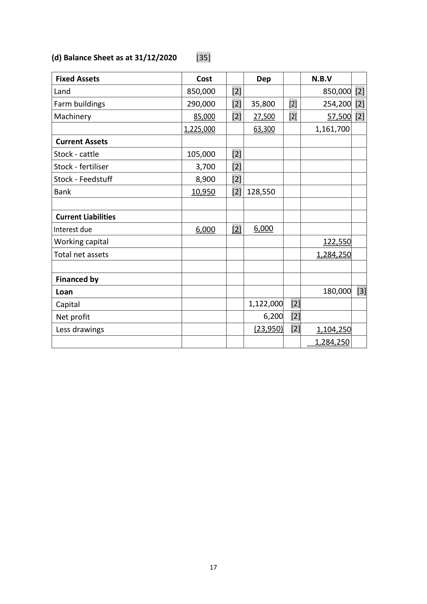
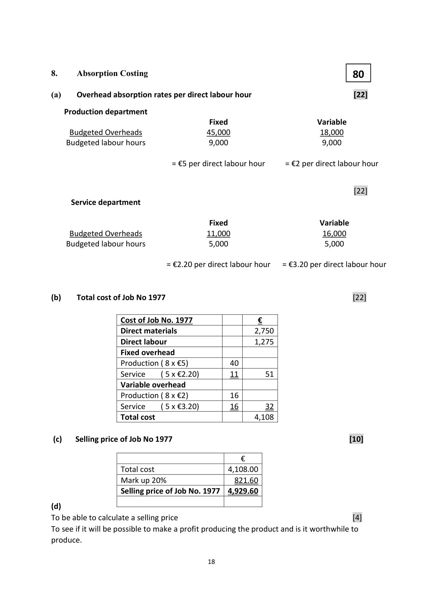

# Question

4.   Debtors and Creditors Control Account

     The following figures were taken from the books of Terry Beagan during January 2023:

                                                                  €

      Debtors ledger balance 01/01/2023 dr                             92,700

      Debtors ledger balance 01/01/2023 cr                               2,100

       Creditors ledger balance 01/01/2023 cr                             51,100

       Creditors ledger balance 01/01/2023 dr                            680

      Returns outwards (purchases returns)                               2,400

      Discount allowed                                                  1,750

      Discount received                                                 2,200

       Sales (including cash sales €14,100)                               164,100

      Purchases (including cash purchases €17,200)                      177,200

      Cheques paid to suppliers                                        65,900

      Cheques received from customers                                110,500

     Bad debts written off                                              1,800

       Transfer from debtors ledger to creditors ledger                      2,700

      Returns inwards (sales returns)                                     4,300

         Bills payable accepted                                             8,800

         Bills receivable issued                                            19,500

      Discount disallowed to Terry Beagan                               900

      Cheques received dishonoured                                      3,300

       Interest charged by Terry Beagan on overdue accounts                1,400

      Debtors ledger balance 31/01/2023                                 1,850 cr

       Creditors ledger balance 31/01/2023                              760 dr

   You are required to prepare for January 2023:

    (a) The debtors ledger control account.                                                   (30)

    (b) The creditors ledger control account.                                                  (30)

                                                                                (60 marks)

Leaving Certificate 2023                         8
Accounting – Ordinary Level

<!-- PAGE 9 -->
# Page 9

<!-- HAS_VISUAL: true -->
<!-- VISUAL_REASON: page contains vector drawings; text extraction is sparse relative to visible page content; page image extracted because text may not fully capture visual content -->

Section 2 begins on page 10

Leaving Certificate 2023                         9
Accounting – Ordinary Level

<!-- PAGE 10 -->
# Page 10

<!-- HAS_VISUAL: true -->
<!-- VISUAL_REASON: page contains vector drawings; page image extracted because text may not fully capture visual content -->

SECTION 2 (200 Marks)
                                Answer TWO questions

# Marking Scheme

4.    Provision for bad debts               36,400 x 5%             1,820

4.      Dep – office equip           (70,000 – 13,000) @ 15%        8,550

4.     Wages of office staff          26,400 + 500                  26,900

Question 4 - Debtors and Creditors Control Account
                                                    60
    (a) Debtors Ledger Control Account:     [30]

                              €                                   €
 01/01/23  Balance b/d         92,700  [3]  01/01/23  Balance b/d       2,100  [3]
             Sales              150,000  [5]             Discount          1,750  [2]
                                                      allowed
           Dishonoured          3,300  [2]           Cheques        110,500  [2]
           cheques                                     received
             Interest charged       1,400  [2]           Bad debts w/o     1,800  [2]
 31/01/23  Balance c/d           1,850  [2]            Contra            2,700  [2]
                                                            Sales returns      4,300  [2]
                                                                            Bills receivable   19,500  [2]
                           _______      31/01/23  Balance c/d     106,600  [1]
                             249,250                               249,250
 01/02/23  Balance b/d        106,600      01/02/23  Balance b/d       1,850

    (b) Creditors Ledger Control Account:        [30]

                               €                                  €
 01/01/23  Balance b/d            680  [3]  01/01/23   Balance b/d    51,100  [3]
           Purchase returns       2,400  [3]             Purchases     160,000  [5]
            Discount received      2,200  [2]                Dis.             900  [2]
                                                          disallowed
          Cheque paid to       65,900  [2]  31//01/23  Balance c/d       760  [2]
             suppliers
           Contra                2,700  [3]
                Bills payable           8,800  [2]
 31/01/23  Balance c/d         130,080  [1]                         ______
                            212760                             212760
 01/02/23  Balance b/d            760  [1]  01/02/23   Balance b/d   130,080  [1]

                                           11

<!-- PAGE 13 -->
# Page 13

<!-- HAS_VISUAL: true -->
<!-- VISUAL_REASON: page contains vector drawings; page image extracted because text may not fully capture visual content -->

4.      Feedstuffs                   29,000 -8,900 +12,800         32,900

                                           16

<!-- PAGE 18 -->
# Page 18

<!-- HAS_VISUAL: true -->
<!-- VISUAL_REASON: page contains vector drawings; page image extracted because text may not fully capture visual content -->

(d) Balance Sheet as at 31/12/2020     [35]

 Fixed Assets                         Cost         Dep          N.B.V
 Land                             850,000     [2]                    850,000 [2]
 Farm buildings                    290,000     [2]  35,800     [2]      254,200 [2]
 Machinery                             85,000     [2]   27,500     [2[        57,500 [2]
                                      1,225,000           63,300          1,161,700
 Current Assets
 Stock - cattle                      105,000     [2]
 Stock - fertiliser                      3,700     [2]
 Stock - Feedstuff                     8,900     [2]
 Bank                              10,950     [2] 128,550

 Current Liabilities
 Interest due                          6,000     [2]   6,000
 Working capital                                                     122,550
 Total net assets                                                      1,284,250

 Financed by
 Loan                                                              180,000  [3]
 Capital                                            1,122,000  [2]
 Net profit                                            6,200  [2]
 Less drawings                                         (23,950)  [2]    1,104,250
                                                                    1,284,250

                                           17

<!-- PAGE 19 -->
# Page 19

<!-- HAS_VISUAL: true -->
<!-- VISUAL_REASON: page contains vector drawings; page image extracted because text may not fully capture visual content -->

# Source References

Exam paper:
- file: intermediate_markdown/exam_papers/ordinary/accounting_ordinary_2023_paper_1_exam.md
- pages: [9, 10]

Marking scheme:
- file: intermediate_markdown/marking_schemes/ordinary/accounting_ordinary_2023_paper_1_marking_scheme.md
- pages: [13, 18, 19]

# Notes

