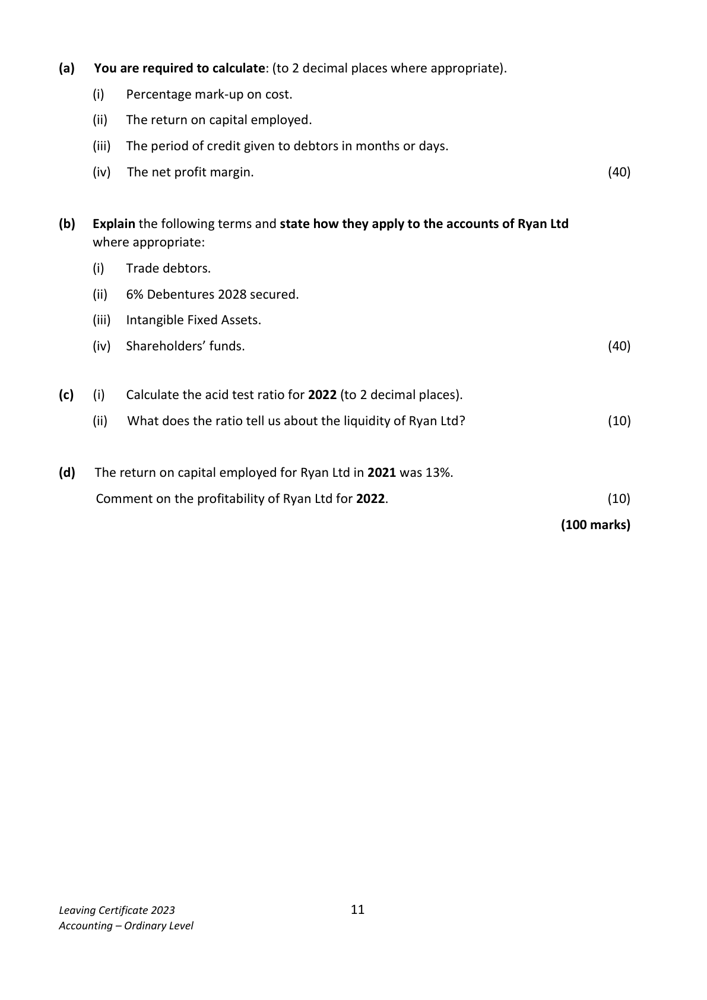
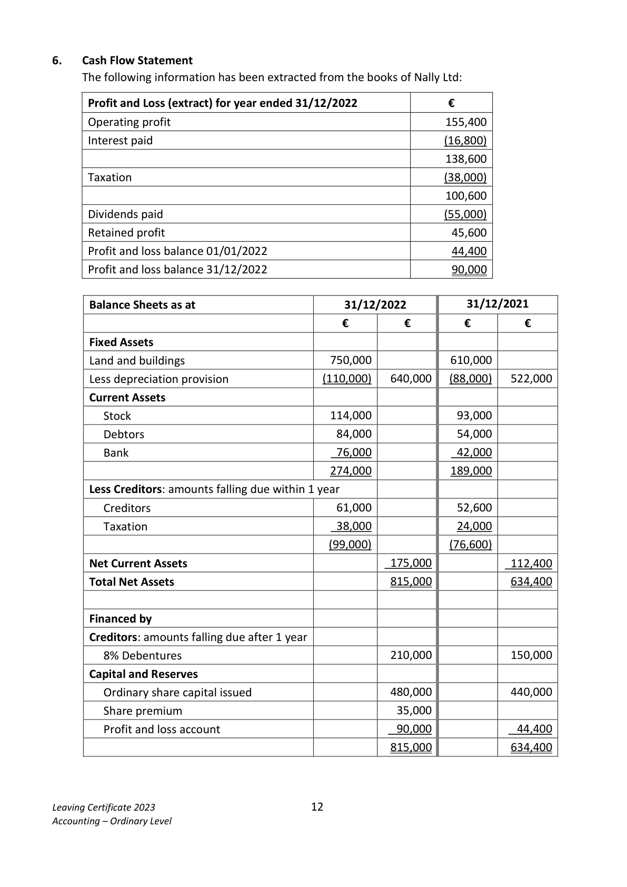
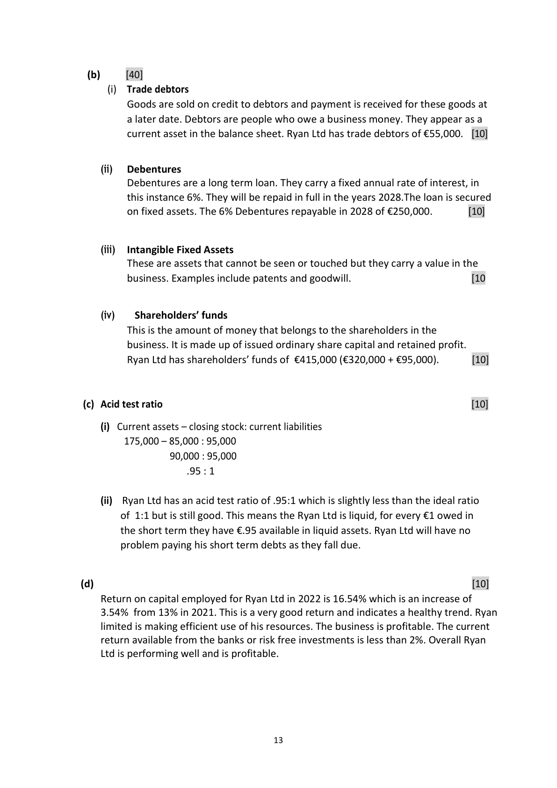
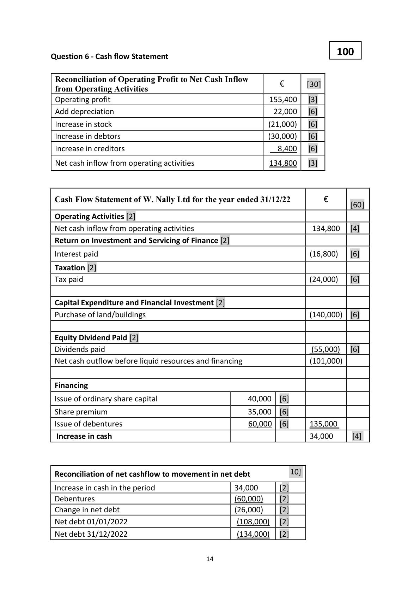
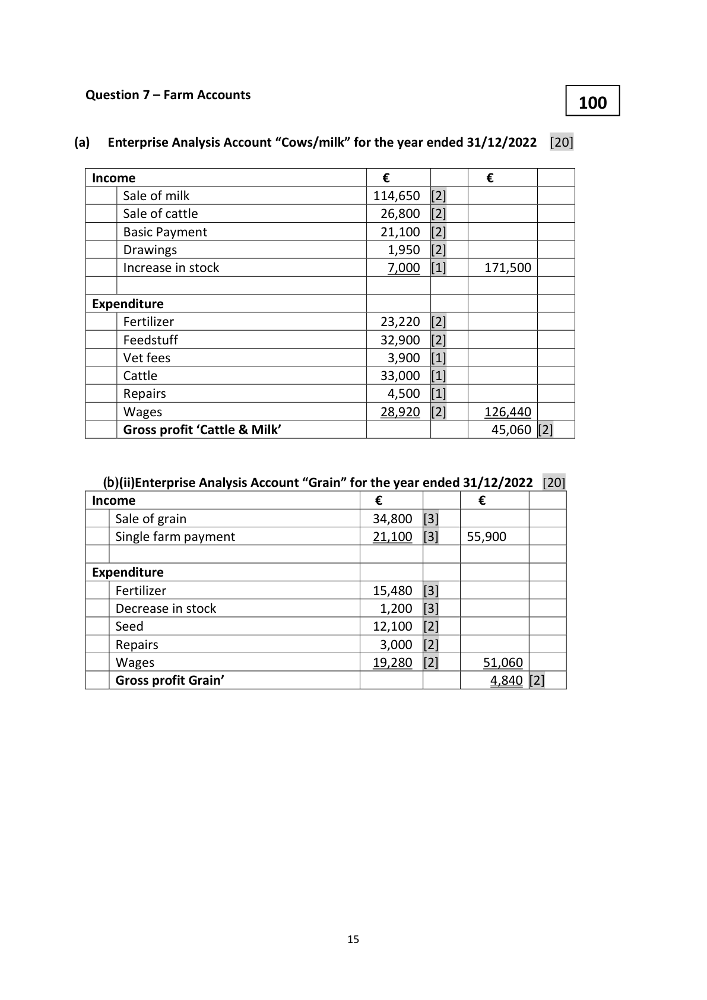

# Question

5.    Interpretation of Accounts
     The following information has been taken from the accounts of Ryan Ltd for the year ended
     31/12/2022:

                Trading and Profit and Loss Account for the year ended 31/12/2022
                                                             €           €
       Credit sales                                                             675,000
       Less: Cost of sales
      Stock 01/01/2022                                            115,000
      Add: credit purchases                                         420,000
                                                                  535,000
       Less: stock 31/12/2022                                         85,000
      Cost of sales                                                             450,000
      Gross profit                                                              ???????
       Less: Total expenses (including interest)                                     130,000
      Net profit for year                                                          95,000

                                Balance Sheet as at 31/12/2022
                                                €            €           €
                                                    Cost      Depreciation    NBV
      Fixed Assets                                  650,000        65,000      585,000

      Current Assets (including trade debtors €55,000)                175,000
       Less Creditors: amounts falling due within 1 year
      Trade creditors                                               95,000

                                                                                80,000
                                                                             665,000
      Financed by:
       Creditors: amounts falling due after more than 1 year
     6% Debentures (2028 secured)                                             250,000
       Capital and Reserves                        Authorised         Issued
      Ordinary shares at €1 each                      500,000       320,000      320,000
       Profit and loss account                                                      95,000
                                                                             665,000

Leaving Certificate 2023                        10
Accounting – Ordinary Level

<!-- PAGE 11 -->
# Page 11

(a)   You are required to calculate: (to 2 decimal places where appropriate).

        (i)   Percentage mark‐up on cost.

         (ii)   The return on capital employed.

         (iii)  The period of credit given to debtors in months or days.

       (iv)  The net profit margin.                                                             (40)

(b)   Explain the following terms and state how they apply to the accounts of Ryan Ltd
     where appropriate:

        (i)   Trade debtors.

         (ii)  6% Debentures 2028 secured.

         (iii)   Intangible Fixed Assets.

       (iv)  Shareholders’ funds.                                                               (40)

(c)     (i)    Calculate the acid test ratio for 2022 (to 2 decimal places).

         (ii)  What does the ratio tell us about the liquidity of Ryan Ltd?                         (10)

(d)   The return on capital employed for Ryan Ltd in 2021 was 13%.

     Comment on the profitability of Ryan Ltd for 2022.                                      (10)

                                                                             (100 marks)

Leaving Certificate 2023                        11
Accounting – Ordinary Level

<!-- PAGE 12 -->
# Page 12

<!-- HAS_VISUAL: true -->
<!-- VISUAL_REASON: page contains vector drawings; page image extracted because text may not fully capture visual content -->

# Marking Scheme

5.   Decrease in bad debts provision        4,200 - 1820             2,380

5.       Acc dep – office equip       13,000 + 8,550                21,550

5.      Insurance                    3,700 + 300                    4,000

Question 5 -Interpretation of Accounts                             100

(a)       [40]

           (i)   Percentage mark up on cost        [10]

            Gross profit   x  100      225,000 x 100  = 50%
            Cost of sales      1        450,000   1

           (ii)   Return on capital employed      10]
           Net profit + interest   =     95,000 + 15,000  X  100 = 16.54%
             Capital employed            665,000           1

           (iii)  Period of credit given to debtors   [10]

            Debtors             ×     365  =    55,000    ×    365   =  29.74 days
             Credit sales                1        675,000         1

         (iv)  Net profit margin (percentage)   [10]

           Net profit        x      100     = 95,000   x  100 = 14.07%
             Sales                   1       675,000

                                           12

<!-- PAGE 14 -->
# Page 14

<!-- HAS_VISUAL: true -->
<!-- VISUAL_REASON: page contains vector drawings; text contains visual keywords: table; page image extracted because text may not fully capture visual content -->

(b)      [40]
         (i)  Trade debtors
        Goods are sold on credit to debtors and payment is received for these goods at
         a later date. Debtors are people who owe a business money. They appear as a
          current asset in the balance sheet. Ryan Ltd has trade debtors of €55,000.  [10]

       (ii)   Debentures
         Debentures are a long term loan. They carry a fixed annual rate of interest, in
           this instance 6%. They will be repaid in full in the years 2028.The loan is secured
        on fixed assets. The 6% Debentures repayable in 2028 of €250,000.        [10]

       (iii)  Intangible Fixed Assets
         These are assets that cannot be seen or touched but they carry a value in the
          business. Examples include patents and goodwill.                          [10

      (iv)    Shareholders’ funds
          This is the amount of money that belongs to the shareholders in the
          business. It is made up of issued ordinary share capital and retained profit.
        Ryan Ltd has shareholders’ funds of €415,000 (€320,000 + €95,000).        [10]

 (c) Acid test ratio                                                                        [10]

      (i)  Current assets – closing stock: current liabilities
         175,000 – 85,000 : 95,000
                  90,000 : 95,000
                      .95 : 1

       (ii)  Ryan Ltd has an acid test ratio of .95:1 which is slightly less than the ideal ratio
         of 1:1 but is still good. This means the Ryan Ltd is liquid, for every €1 owed in
        the short term they have €.95 available in liquid assets. Ryan Ltd will have no
       problem paying his short term debts as they fall due.

(d)                                                                                        [10]
    Return on capital employed for Ryan Ltd in 2022 is 16.54% which is an increase of
    3.54% from 13% in 2021. This is a very good return and indicates a healthy trend. Ryan
    limited is making efficient use of his resources. The business is profitable. The current
    return available from the banks or risk free investments is less than 2%. Overall Ryan
    Ltd is performing well and is profitable.

                                         13

<!-- PAGE 15 -->
# Page 15

<!-- HAS_VISUAL: true -->
<!-- VISUAL_REASON: page contains vector drawings; page image extracted because text may not fully capture visual content -->

100Question 6 - Cash flow Statement

 Reconciliation of Operating Profit to Net Cash Inflow
                                                    €      [30] from Operating Activities
 Operating profit                                        155,400   [3]
 Add depreciation                                         22,000   [6]
 Increase in stock                                            (21,000)    [6]
 Increase in debtors                                         (30,000)    [6]
 Increase in creditors                                        8,400    [6]

 Net cash inflow from operating activities                   134,800    [3]

 Cash Flow Statement of W. Nally Ltd for the year ended 31/12/22       €
                                                                                    [60]
 Operating Activities [2]
 Net cash inflow from operating activities                              134,800   [4]
 Return on Investment and Servicing of Finance [2]

 Interest paid                                                           (16,800)    [6]

 Taxation [2]
 Tax paid                                                               (24,000)    [6]

 Capital Expenditure and Financial Investment [2]
 Purchase of land/buildings                                             (140,000)  [6]

 Equity Dividend Paid [2]
 Dividends paid                                                          (55,000)   [6]
 Net cash outflow before liquid resources and financing                  (101,000)

 Financing

 Issue of ordinary share capital                       40,000   [6]

 Share premium                                    35,000   [6]
 Issue of debentures                                60,000  [6]     135,000
  Increase in cash                                                  34,000      [4]

 Reconciliation of net cashflow to movement in net debt          10]

 Increase in cash in the period                    34,000       [2]
 Debentures                                       (60,000)     [2]
 Change in net debt                                (26,000)     [2]
 Net debt 01/01/2022                              (108,000)   [2]
 Net debt 31/12/2022                              (134,000)   [2]

                                           14

<!-- PAGE 16 -->
# Page 16

<!-- HAS_VISUAL: true -->
<!-- VISUAL_REASON: page contains vector drawings; page image extracted because text may not fully capture visual content -->

# Source References

Exam paper:
- file: intermediate_markdown/exam_papers/ordinary/accounting_ordinary_2023_paper_1_exam.md
- pages: [11, 12]

Marking scheme:
- file: intermediate_markdown/marking_schemes/ordinary/accounting_ordinary_2023_paper_1_marking_scheme.md
- pages: [14, 15, 16]

# Notes

