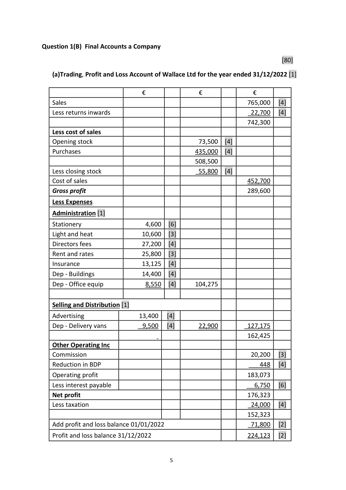
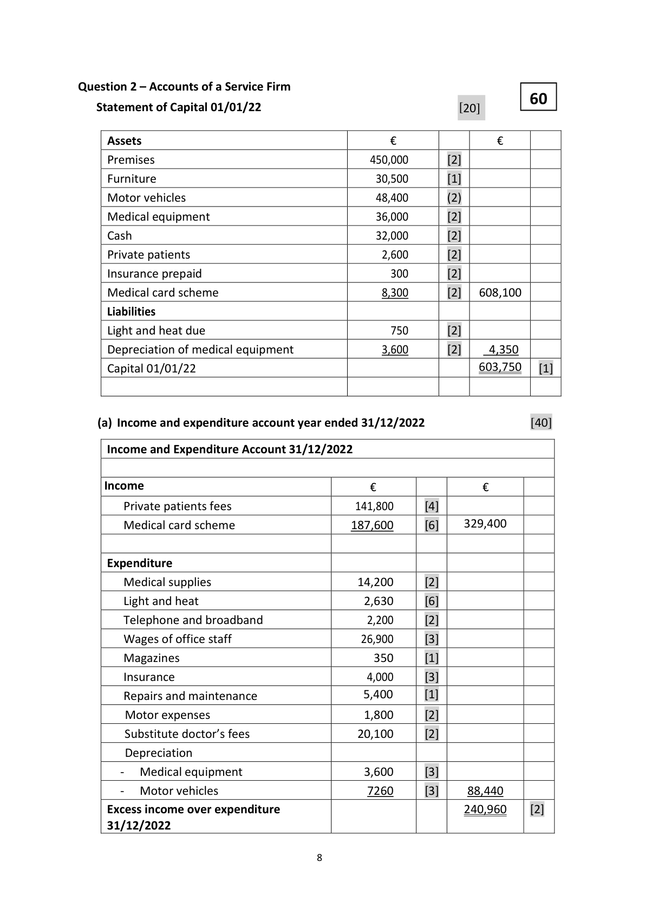

# Question

9.     Product Budgeting

        Solid Sound Ltd manufactures two types of soundbars ‘Bluetooth’ and ‘Wired’. The sales of
      each type of soundbar and other relevant information for the coming year are budgeted below:

                                              Bluetooth             Wired
        Budgeted sales in units                   3,500                 4,100
         Expected selling price                   €75                 €99

        Expected stock – Finished Goods        Bluetooth             Wired
        Opening stock in units                   750                 430
          Closing stock in units                    680                 390

         Material Content and Costs             Material X             Material Y
         Bluetooth                            2 Kg                4 Kg
        Wired                               4 Kg                3 Kg
         Expected purchase price per Kg            €2                  €3

        Expected Stock ‐ Raw Materials         Material X             Material Y
        Opening stock                        170 Kg              240 Kg
          Closing stock                         230 Kg              310 Kg

          Direct Labour time in hours
         Bluetooth                           2 hours
        Wired                              3 hours

          Direct labour rate per hour               €12

     Required:

      (a)   Prepare a sales budget in units and in €.

      (b)   Prepare a production budget in units.

       (c)   Prepare a material usage budget in Kg.

      (d)   Prepare a material purchases budget in Kgs and €.

      (e)   Prepare a labour (wages) budget.

        (f)  Why would Solid Sound Ltd prepare a production budget?

                                                                               (80 marks)

Leaving Certificate 2023                        16
Accounting – Ordinary Level

# Marking Scheme

9.   Acc dep – office equipment            (35,000 – 16,000) + 5,250  24,250
 12.  Dep – Delivery van                    (72,000 – 26,000) @ 10%  4,600
 11.  Acc dep – delivery                    26,000 + 4,600           30,600
 12.  Interest payable                     120,000 x 8% x 9/12      7,200
 13.  Interest due                         7,200 – 1,500            5,700

                                           4

<!-- PAGE 6 -->
# Page 6

<!-- HAS_VISUAL: true -->
<!-- VISUAL_REASON: page contains vector drawings; page image extracted because text may not fully capture visual content -->

9.       Insurance                  17,500 – 4,375                13,125
10.      Provision for bad debts      96,300 @ 4%                   3,852
11.      Reduction in BDP            4,300 – 3,852                  448
12.     Commission                18,700 + 1,500                20,200

                                          7

<!-- PAGE 9 -->
# Page 9

<!-- HAS_VISUAL: true -->
<!-- VISUAL_REASON: page contains vector drawings; page image extracted because text may not fully capture visual content -->

9.     Product Budgeting                                 80

(a)   Sales Budget                                                           [22]

                               Bluetooth       Wired
         Budgeted sales            3,500  [4]    4,100  [4]
         Budgeted selling price     X €75  [3]    X €99  [3]
                                 262,500  [4]  405,900  [4]
          Total Sales = €262,500 + €405,900 = €668,400
(b)   Production Budget                                                       [16]

                                      Bluetooth      Wired
         Budgeted sales                   3,500  [3]   4,100  [3]
        Add closing stock                 680  [1]    390  [1]
           Less opening stock                 (750)  [1]   (430)  [1]
         Budgeted production in units      3,430  [3]   4,060  [3]

(c)   Material Usage Budget                                                  [16]
                            Material X                            Material Y
      Bluetooth (3,430 x 2)       6,860  [3]  Bluetooth (3,430 x 4)     13,720   [3]]
      Wired    (4,060 x 4)     16,240  [2]  Wired    (4,060 x 3)     12,180  [2]
                              23,100  [3]                          25,900  [3]

(d)   Materials Purchases Budget                                              [12]
                                            Material X         Material Y
      Budgeted usage                         23,100  [2]       25,900  [2]
     Add budgeted closing stock                 230  [1]         310  [1]
       Less budgeted opening stock                 (170)  [1]          (240)  [1]
      Budgeted production in units              23,160            25,970
      Budgeted purchase price                      x €2  [1]           x €3  [1]
                                            €46,320  [1]      €77,910  [1]

(e)   Labour Budget                                                           [10]
                                Bluetooth        Wired
      Budgeted production           3,430  [1]     4,060  [1]
     No of hours per unit               x 2  [1]        x 3  [1]
                                     6,860        12,180
      Labour rate per hour             x €12  [1]     x €12  [1]
                                   82,320  [1]   146,160  [1]
       Total labour cost            €228,480  [2]
                                                                                         [4]

(f)  A production budget is prepared in order to determine the total number of
      units the company needs to produce (make) for the coming period. The figure
      calculated is needed to find out what materials need to be purchased for production.

                                           19

<!-- PAGE 21 -->
# Page 21

<!-- EXTRACTION_ISSUE: no extractable text found -->

[No extractable text found]

<!-- PAGE 22 -->
# Page 22

<!-- EXTRACTION_ISSUE: no extractable text found -->

[No extractable text found]

<!-- PAGE 23 -->
# Page 23

<!-- EXTRACTION_ISSUE: no extractable text found -->

[No extractable text found]

<!-- PAGE 24 -->
# Page 24

<!-- HAS_VISUAL: true -->
<!-- VISUAL_REASON: page contains vector drawings; text extraction is sparse relative to visible page content; page image extracted because text may not fully capture visual content -->

<!-- EXTRACTION_ISSUE: no extractable text found -->

[No extractable text found]

# Source References

Exam paper:
- file: intermediate_markdown/exam_papers/ordinary/accounting_ordinary_2023_paper_1_exam.md
- pages: []

Marking scheme:
- file: intermediate_markdown/marking_schemes/ordinary/accounting_ordinary_2023_paper_1_marking_scheme.md
- pages: [6, 9, 21, 22, 23, 24]

# Notes

