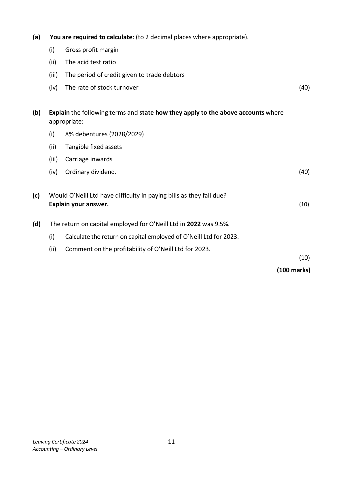
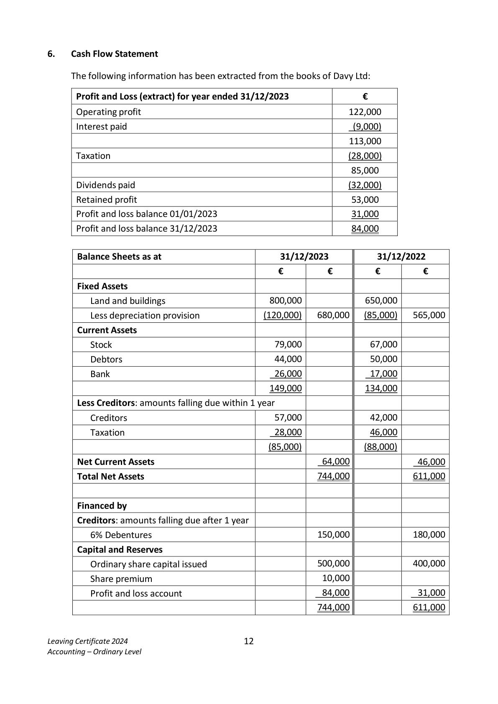
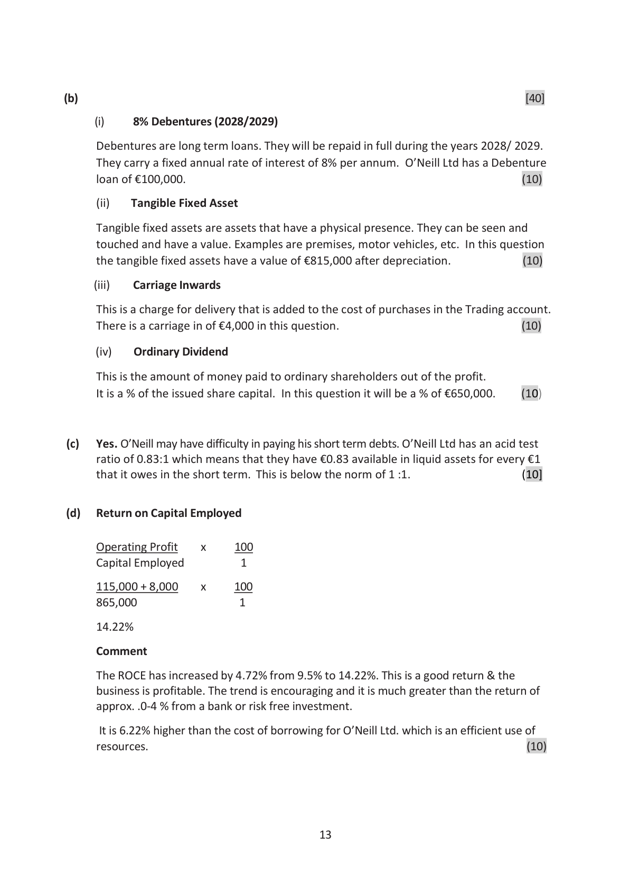
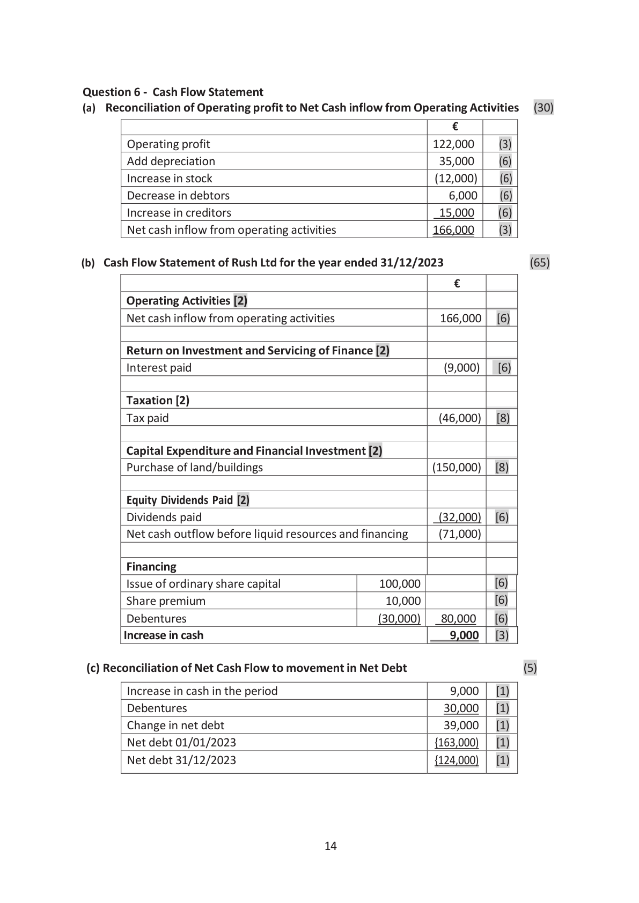

# Question

5.    Interpretation of Accounts

     The following information has been taken from the accounts of O’Neill Ltd for the year
     ended 31/12/2023:

                Trading and Profit and Loss Account for the year ended 31/12/2023
                                                            €           €
       Credit sales                                                             750,000
       Less: Cost of sales
       Stock 01/01/2023                                           57,000
      Add: credit purchases (including carriage inwards €4,000)       473,000
                                                               530,000
       Less: stock 31/12/2023                                        (60,000)
      Cost of sales                                                            470,000
      Gross profit                                                               ??????
       Less: Total expenses (including interest)                                     165,000
      Net profit for year                                                       115,000

                                Balance Sheet as at 31/12/2023
                                                €           €           €
                                                      Cost      Depreciation    NBV
       Fixed Assets                                 895,000       80,000     815,000

      Current Assets (including trade debtors €43,000)               108,000
       Less Creditors: amounts falling due within 1 year

      Trade creditors                                              58,000
                                                                              50,000
                                                                            865,000
      Financed by:
       Creditors: amounts falling due after more than 1 year
     8% Debentures (2028/2029)                                             100,000
       Capital and Reserves                        Authorised        Issued
      Ordinary shares of €1 each                     950,000      650,000     650,000
        Profit and loss account                                                  115,000
                                                                            865,000

Leaving Certificate 2024                       10
Accounting – Ordinary Level

<!-- PAGE 11 -->
# Page 11

(a)   You are required to calculate: (to 2 decimal places where appropriate).

         (i)   Gross profit margin

         (ii)   The acid test ratio

         (iii)  The period of credit given to trade debtors

       (iv)  The rate of stock turnover                                                           (40)

(b)   Explain the following terms and state how they apply to the above accounts where
      appropriate:

         (i)   8% debentures (2028/2029)

         (ii)   Tangible fixed assets

         (iii)   Carriage inwards

       (iv)  Ordinary dividend.                                                                   (40)

(c)  Would O’Neill Ltd have difficulty in paying bills as they fall due?
      Explain your answer.                                                                             (10)

(d)   The return on capital employed for O’Neill Ltd in 2022 was 9.5%.

         (i)    Calculate the return on capital employed of O’Neill Ltd for 2023.

         (ii)  Comment on the profitability of O’Neill Ltd for 2023.
                                                                                                  (10)

                                                                             (100 marks)

Leaving Certificate 2024                       11
Accounting – Ordinary Level

<!-- PAGE 12 -->
# Page 12

<!-- HAS_VISUAL: true -->
<!-- VISUAL_REASON: page contains vector drawings; page image extracted because text may not fully capture visual content -->

# Marking Scheme

Question 5- Interpretation of Accounts                                                    [40]

(a) (i) Gross profit margin

         Gross Profit x   100
            Sales          1

         280,000  x   100
         750,000      1    =    37.33%

                                                                                      {10)

       (ii) Acid test ratio

       Current Assets less Closing Stock : Current Liabilities
                    108,000 – 60,000 : 58,000
                              48,000 : 58000
                                 0.83 : 1                                          (10)

       (iii) Period of credit given to Trade Debtors

        Debtors X    365
         Credit Sales   1

        43,000  x     365
        750,000       1

        20.93 days/.69 months
                                                                                       [10]

     (iv ) Rate of Stock Turnover

        Cost of Sales
       Average Stock
       470,000 = 8.03 times
        58,500

       Average Stock

       Opening Stock + Closing Stock
                2
       57,000 + 60,000 = €58,500                                                                 [ 10]
               2

                                       12

<!-- PAGE 13 -->
# Page 13

<!-- HAS_VISUAL: true -->
<!-- VISUAL_REASON: page contains vector drawings; text contains visual keywords: table; page image extracted because text may not fully capture visual content -->

(b)                                                                                          [40]

         (i)    8% Debentures (2028/2029)

     Debentures are long term loans. They will be repaid in full during the years 2028/ 2029.
     They carry a fixed annual rate of interest of 8% per annum. O’Neill Ltd has a Debenture
      loan of €100,000.                                                                 (10)

          (ii)    Tangible Fixed Asset

      Tangible fixed assets are assets that have a physical presence. They can be seen and
     touched and have a value. Examples are premises, motor vehicles, etc. In this question
      the tangible fixed assets have a value of €815,000 after depreciation.              (10)

         (iii)    Carriage Inwards

      This is a charge for delivery that is added to the cost of purchases in the Trading account.
     There is a carriage in of €4,000 in this question.                                     (10)

        (iv)    Ordinary Dividend

      This is the amount of money paid to ordinary shareholders out of the profit.
         It is a % of the issued share capital. In this question it will be a % of €650,000.     (10)

 (c)   Yes. O’Neill may have difficulty in paying his short term debts. O’Neill Ltd has an acid test
       ratio of 0.83:1 which means that they have €0.83 available in liquid assets for every €1
      that it owes in the short term. This is below the norm of 1 :1.                      (10]

(d)   Return on Capital Employed

      Operating Profit    x     100
      Capital Employed         1

     115,000 + 8,000    x    100
      865,000                1

     14.22%

    Comment

     The ROCE has increased by 4.72% from 9.5% to 14.22%. This is a good return & the
      business is profitable. The trend is encouraging and it is much greater than the return of
      approx. .0-4 % from a bank or risk free investment.

          It is 6.22% higher than the cost of borrowing for O’Neill Ltd. which is an efficient use of
      resources.                                                                           (10)

                                         13

<!-- PAGE 14 -->
# Page 14

<!-- HAS_VISUAL: true -->
<!-- VISUAL_REASON: page contains vector drawings; page image extracted because text may not fully capture visual content -->

# Source References

Exam paper:
- file: intermediate_markdown/exam_papers/ordinary/accounting_ordinary_2024_paper_1_exam.md
- pages: [11, 12]

Marking scheme:
- file: intermediate_markdown/marking_schemes/ordinary/accounting_ordinary_2024_paper_1_marking_scheme.md
- pages: [13, 14]

# Notes

