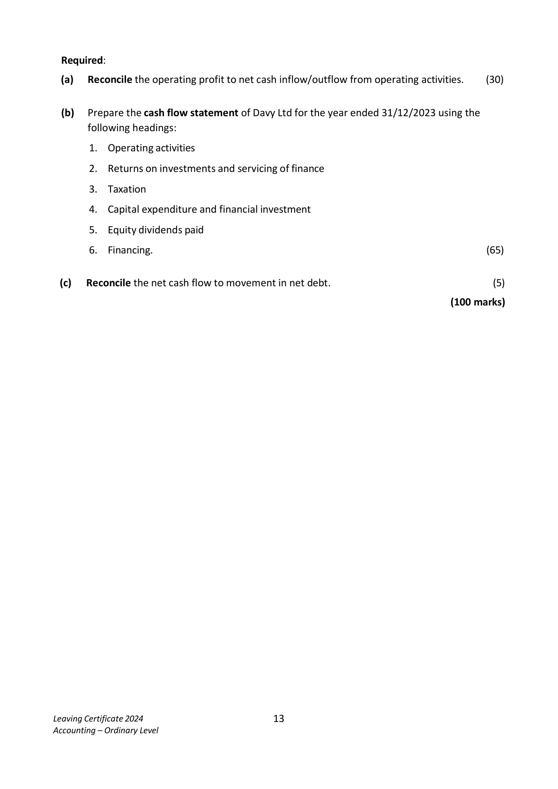
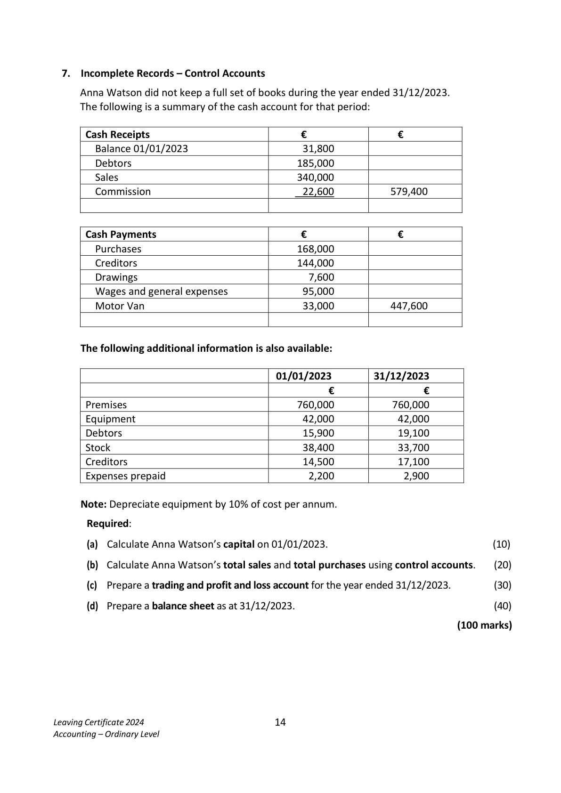
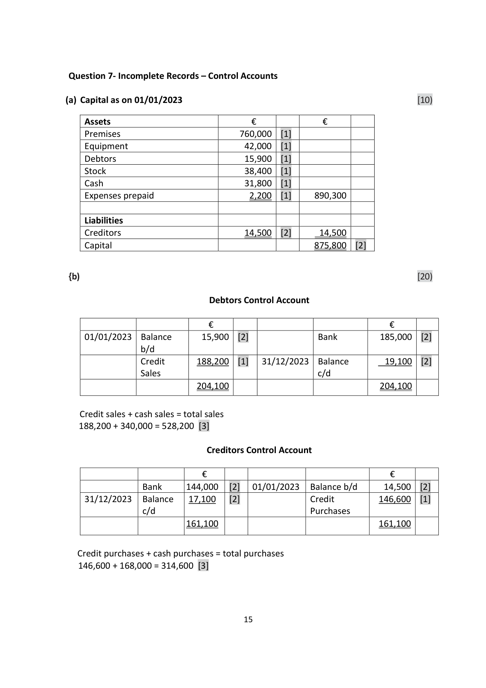

# Question

6.   Cash Flow Statement

     The following information has been extracted from the books of Davy Ltd:

       Profit and Loss (extract) for year ended 31/12/2023              €

      Operating profit                                             122,000
       Interest paid                                                        (9,000)
                                                                 113,000
       Taxation                                                         (28,000)
                                                                  85,000
      Dividends paid                                                   (32,000)
      Retained profit                                               53,000
        Profit and loss balance 01/01/2023                             31,000
        Profit and loss balance 31/12/2023                             84,000

      Balance Sheets as at                        31/12/2023          31/12/2022
                                             €         €        €        €

       Fixed Assets
         Land and buildings                      800,000              650,000
          Less depreciation provision               (120,000)   680,000   (85,000)   565,000
       Current Assets
          Stock                                   79,000               67,000
         Debtors                                 44,000               50,000
         Bank                                    26,000               17,000
                                                149,000              134,000
       Less Creditors: amounts falling due within 1 year
          Creditors                                57,000               42,000
          Taxation                                 28,000               46,000
                                                     (85,000)               (88,000)
      Net Current Assets                                     64,000               46,000
       Total Net Assets                                     744,000              611,000

      Financed by
       Creditors: amounts falling due after 1 year
       6% Debentures                                    150,000              180,000
       Capital and Reserves
          Ordinary share capital issued                        500,000              400,000
         Share premium                                     10,000
           Profit and loss account                              84,000               31,000
                                                          744,000              611,000

Leaving Certificate 2024                       12
Accounting – Ordinary Level

<!-- PAGE 13 -->
# Page 13

Required:

  (a)   Reconcile the operating profit to net cash inflow/outflow from operating activities.     (30)

  (b)   Prepare the cash flow statement of Davy Ltd for the year ended 31/12/2023 using the
       following headings:

        1.  Operating activities

        2.  Returns on investments and servicing of finance

        3.  Taxation

        4.  Capital expenditure and financial investment

        5.  Equity dividends paid

        6.  Financing.                                                                           (65)

  (c)   Reconcile the net cash flow to movement in net debt.                                        (5)

                                                                             (100 marks)

Leaving Certificate 2024                       13
Accounting – Ordinary Level

<!-- PAGE 14 -->
# Page 14

<!-- HAS_VISUAL: true -->
<!-- VISUAL_REASON: page contains vector drawings; page image extracted because text may not fully capture visual content -->

# Marking Scheme

Question 6 - Cash Flow Statement
(a)  Reconciliation of Operating profit to Net Cash inflow from Operating Activities   (30)
                                                                €
        Operating profit                                     122,000      (3)
       Add depreciation                                      35,000      (6)
        Increase in stock                                         (12,000)     (6)
        Decrease in debtors                                      6,000     (6)
        Increase in creditors                                   15,000     (6)
       Net cash inflow from operating activities                166,000      (3)

(b) Cash Flow Statement of Rush Ltd for the year ended 31/12/2023                 (65)

                                                                €
        Operating Activities [2)
       Net cash inflow from operating activities                  166,000   [6)

       Return on Investment and Servicing of Finance [2)
         Interest paid                                                (9,000)    [6)

        Taxation [2)
        Tax paid                                                  (46,000)   [8)

        Capital Expenditure and Financial Investment [2)
        Purchase of land/buildings                               (150,000)   [8)

         Equity Dividends Paid [2)
        Dividends paid                                            (32,000)   [6)
       Net cash outflow before liquid resources and financing      (71,000)

        Financing
         Issue of ordinary share capital                100,000                [6)
        Share premium                              10,000                [6)
       Debentures                                    (30,000)   80,000    [6)
        Increase in cash                                           9,000    [3)

 (c) Reconciliation of Net Cash Flow to movement in Net Debt                         (5)

        Increase in cash in the period                              9,000    [1)
        Debentures                                            30,000    [1)
       Change in net debt                                     39,000    [1)
       Net debt 01/01/2023                                        {163,000)    [1)
       Net debt 31/12/2023                                        {124,000)    [1)

                                      14

<!-- PAGE 15 -->
# Page 15

<!-- HAS_VISUAL: true -->
<!-- VISUAL_REASON: page contains vector drawings; page image extracted because text may not fully capture visual content -->

# Source References

Exam paper:
- file: intermediate_markdown/exam_papers/ordinary/accounting_ordinary_2024_paper_1_exam.md
- pages: [13, 14]

Marking scheme:
- file: intermediate_markdown/marking_schemes/ordinary/accounting_ordinary_2024_paper_1_marking_scheme.md
- pages: [15]

# Notes

