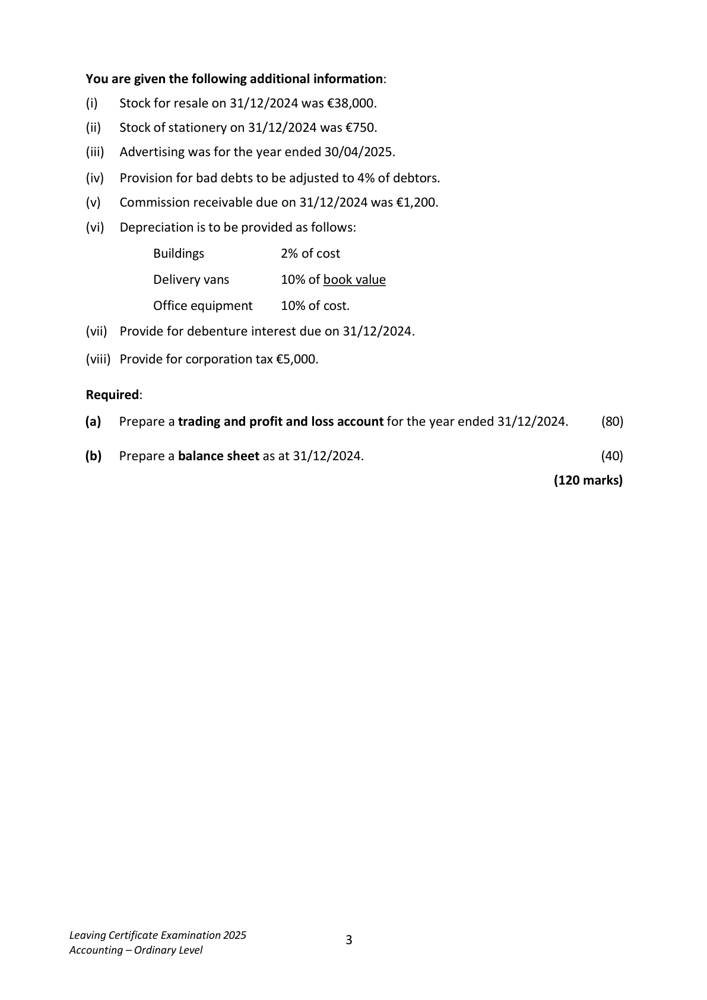
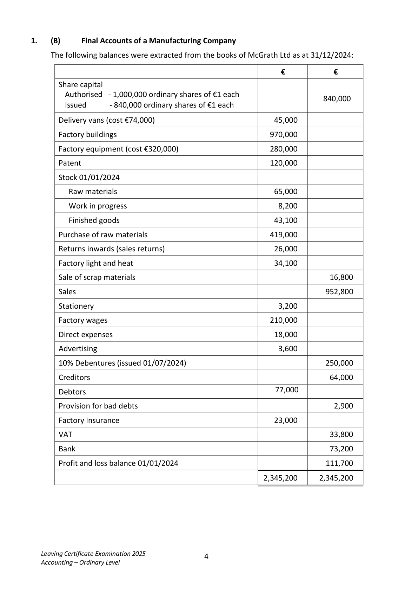
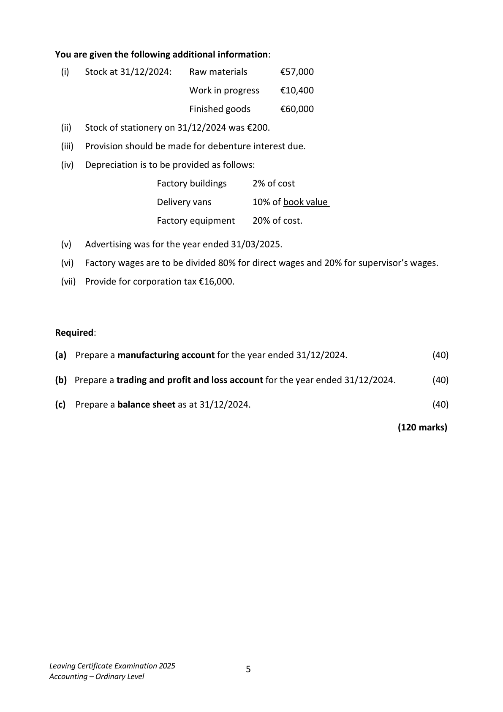
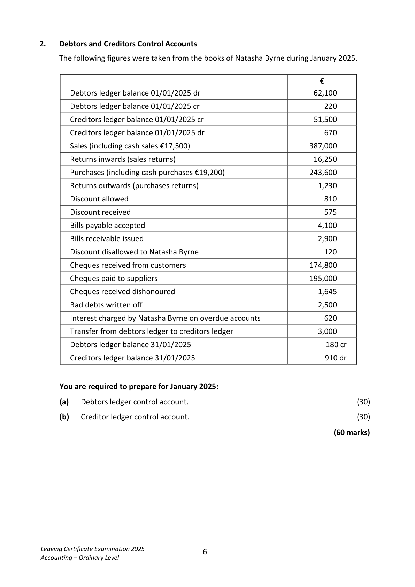
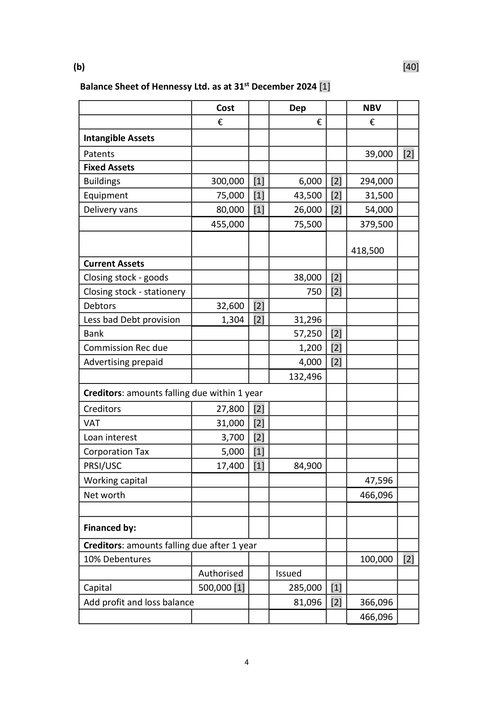
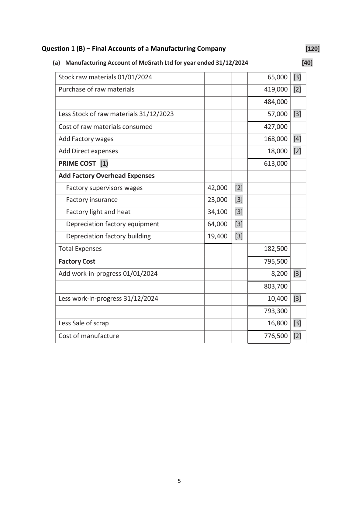
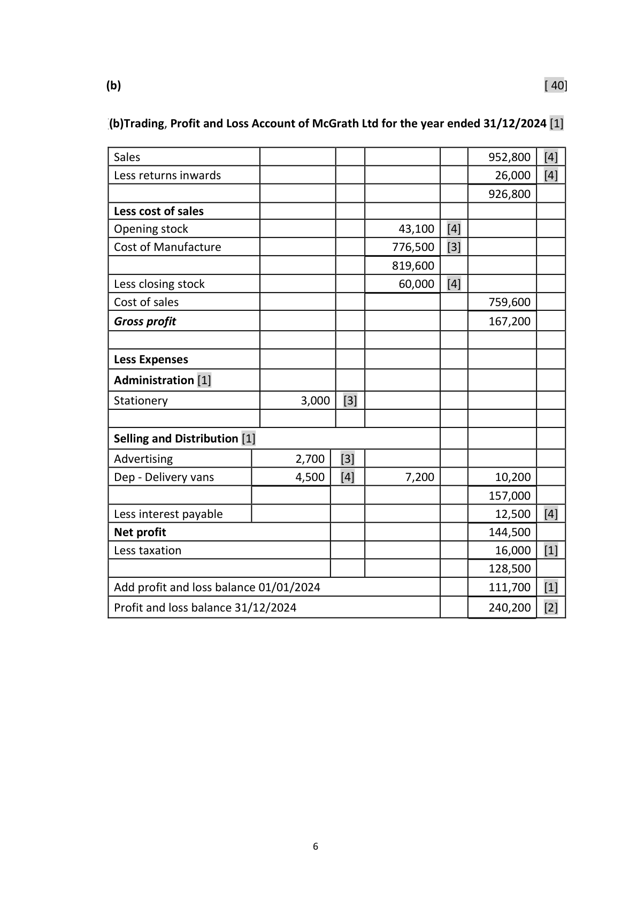
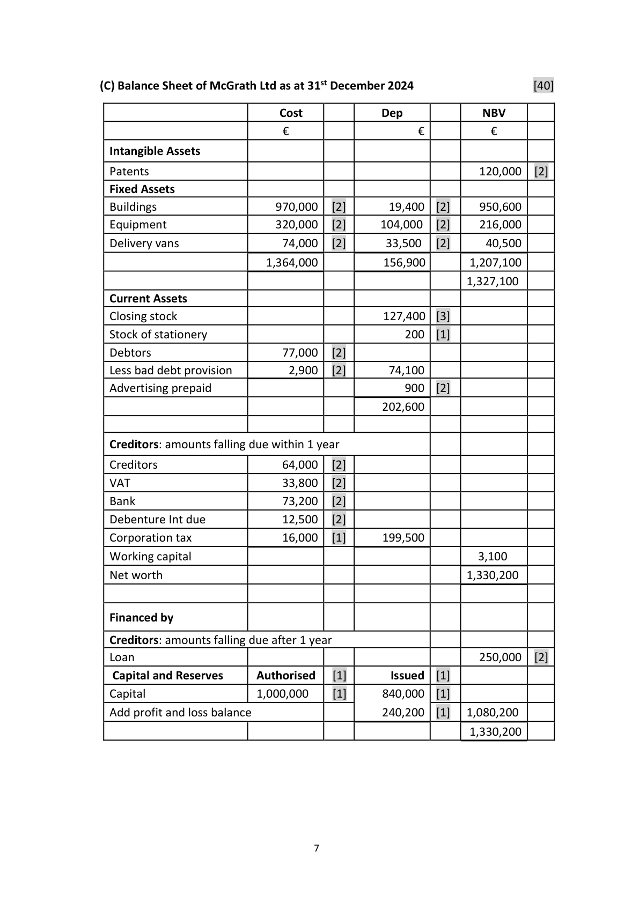
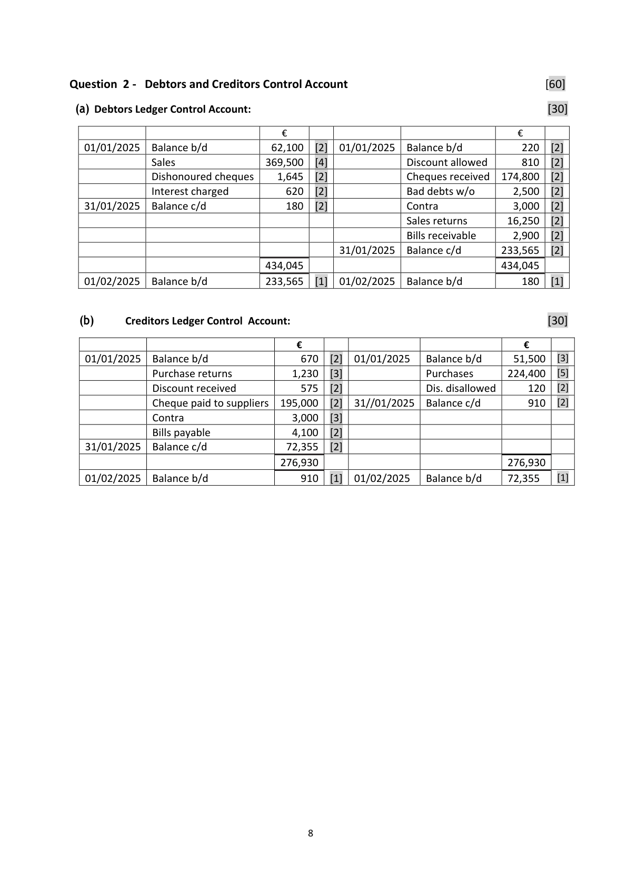

# Question

1.    (A)      Final Accounts of a Company

     The following balances were extracted from the books of Hennessy Ltd as at 31/12/2024:

                                                                 €                   €
      Share capital
      Authorised ‐ 500,000 ordinary shares of €1 each
      Issued       ‐ 285,000 ordinary shares of €1 each                          285,000
       Buildings                                             300,000

      Delivery vans (cost 80,000)                              60,000

       Office equipment                                      75,000

      Accumulated depreciation ‐ office equipment                               36,000

      Patent                                                 39,000

      Debtors                                               32,600

      Provision for bad debts                                                     3,800

       Creditors                                                               27,800

       Directors fees                                          21,000

       Sales                                                                 550,000

      Purchases                                            316,000

      Returns outwards (purchases returns)                                      11,100

      Returns inwards (sales returns)                           16,240

      Stock of goods for resale (01/01/2024)                    29,000

      Stock of stationery (01/01/2024)                          400

     Wages and salaries                                      95,000

     Commission                                                            21,380

      General expenses                                       52,400

      Stationery                                               4,500

       Advertising                                             12,000

      Insurance                                              15,520

     10% Debentures (issued 01/04/2024)                                    100,000

      Debenture interest                                       3,800

      Bank                                                 57,250

     VAT                                                                   31,000

      PRSI/USC                                                             17,400

       Profit and loss balance 01/01/2024                                        46,230

                                                           1,129,710        1,129,710

Leaving Certificate Examination 2025              2
Accounting – Ordinary Level

<!-- PAGE 3 -->
# Page 3

<!-- HAS_VISUAL: true -->
<!-- VISUAL_REASON: page contains vector drawings; page image extracted because text may not fully capture visual content -->

You are given the following additional information:

    (i)   Stock for resale on 31/12/2024 was €38,000.

    (ii)   Stock of stationery on 31/12/2024 was €750.

    (iii)   Advertising was for the year ended 30/04/2025.

    (iv)   Provision for bad debts to be adjusted to 4% of debtors.

   (v)   Commission receivable due on 31/12/2024 was €1,200.

    (vi)  Depreciation is to be provided as follows:

               Buildings         2% of cost

              Delivery vans      10% of book value

               Office equipment   10% of cost.

    (vii)  Provide for debenture interest due on 31/12/2024.

    (viii) Provide for corporation tax €5,000.

   Required:

   (a)   Prepare a trading and profit and loss account for the year ended 31/12/2024.      (80)

   (b)   Prepare a balance sheet as at 31/12/2024.                                          (40)

                                                                           (120 marks)

Leaving Certificate Examination 2025              3
Accounting – Ordinary Level

<!-- PAGE 4 -->
# Page 4

<!-- HAS_VISUAL: true -->
<!-- VISUAL_REASON: page contains vector drawings; page image extracted because text may not fully capture visual content -->

1.    (B)      Final Accounts of a Manufacturing Company

     The following balances were extracted from the books of McGrath Ltd as at 31/12/2024:

                                                           €           €
       Share capital
         Authorised  ‐ 1,000,000 ordinary shares of €1 each
                                                                          840,000
         Issued         ‐ 840,000 ordinary shares of €1 each

        Delivery vans (cost €74,000)                               45,000

        Factory buildings                                       970,000

        Factory equipment (cost €320,000)                       280,000

       Patent                                                120,000

       Stock 01/01/2024

        Raw materials                                        65,000

        Work in progress                                       8,200

           Finished goods                                       43,100

       Purchase of raw materials                               419,000

       Returns inwards (sales returns)                            26,000

        Factory light and heat                                    34,100

        Sale of scrap materials                                                  16,800

        Sales                                                               952,800

        Stationery                                                3,200

        Factory wages                                         210,000

        Direct expenses                                         18,000

        Advertising                                               3,600

      10% Debentures (issued 01/07/2024)                                   250,000

        Creditors                                                             64,000
       Debtors                                                77,000

        Provision for bad debts                                                   2,900

        Factory Insurance                                        23,000

      VAT                                                                  33,800

       Bank                                                                 73,200

         Profit and loss balance 01/01/2024                                      111,700

                                                             2,345,200      2,345,200

   Leaving Certificate Examination 2025              4
   Accounting – Ordinary Level

<!-- PAGE 5 -->
# Page 5

<!-- HAS_VISUAL: true -->
<!-- VISUAL_REASON: page contains vector drawings; page image extracted because text may not fully capture visual content -->

You are given the following additional information:

    (i)    Stock at 31/12/2024:   Raw materials       €57,000

                         Work in progress    €10,400

                                 Finished goods      €60,000

     (ii)   Stock of stationery on 31/12/2024 was €200.

     (iii)   Provision should be made for debenture interest due.

    (iv)   Depreciation is to be provided as follows:

                         Factory buildings    2% of cost

                          Delivery vans       10% of book value

                         Factory equipment   20% of cost.

   (v)   Advertising was for the year ended 31/03/2025.

    (vi)   Factory wages are to be divided 80% for direct wages and 20% for supervisor’s wages.

    (vii)  Provide for corporation tax €16,000.

 Required:

  (a)  Prepare a manufacturing account for the year ended 31/12/2024.                     (40)

  (b)  Prepare a trading and profit and loss account for the year ended 31/12/2024.         (40)

  (c)  Prepare a balance sheet as at 31/12/2024.                                            (40)

                                                                           (120 marks)

Leaving Certificate Examination 2025              5
Accounting – Ordinary Level

<!-- PAGE 6 -->
# Page 6

<!-- HAS_VISUAL: true -->
<!-- VISUAL_REASON: page contains vector drawings; text contains visual keywords: figure; page image extracted because text may not fully capture visual content -->

# Marking Scheme

Question 1 (a) - Final Accounts of a Company                                         [120]

     (a)                                                                            [80]

     Trading, Profit and Loss Account of Hennessy Ltd for the year ended 31/12/2024 [1]
                               €             €              €
     Sales                                                      550,000   [5]
     Less sales returns                                             16,240   [5]
                                                               533,760
     Less cost of sales
    Opening stock                               29,000  [4]
     Purchases                  316,000   [4]
     Less purchases returns        11,100   [3]    304,900

                                               333,900
     Less closing stock                            38,000  [3]
     Cost of sales                                               295,900
     Gross profit                                                237,860

     Less Expenses

     Administration [1]

    Wages and salaries           95,000   [3]
     General expenses            52,400   [3]
     Stationery                    4,150   [4]
     Insurance                   15,520   [4]
     Directors Fees               21,000   [3]
    Dep - Buildings                6,000   [4]
    Dep - Office Equip             7,500   [4]    201,570

     Selling and Distribution [1]

     Advertising                   8,000   [3]
    Dep - Delivery Vans            6,000   [4]     14,000         215,570

                                                                22,290

    Other operating Income

    Commission received                                         22,580   [3]
     Decrease in BDP                                                2,496   [4]

     Operating profit                                              47,366

     Interest payable                                                7,500   [6]
    Net profit                                                   39,866
     Less Corporation Tax                                           5,000  [2]
                                                                34,866
    Add profit and loss balance 01/01/2024                         46,230   [2]

      Profit and loss balance 31/12/2024                             81,096   [4]

                                               3

<!-- PAGE 4 -->
# Page 4

<!-- HAS_VISUAL: true -->
<!-- VISUAL_REASON: page contains vector drawings; page image extracted because text may not fully capture visual content -->

(b)                                                                              [40]

 Balance Sheet of Hennessy Ltd. as at 31st December 2024 [1]

                               Cost          Dep         NBV
                            €                  €         €

  Intangible Assets

  Patents                                                      39,000   [2]
  Fixed Assets
   Buildings                   300,000  [1]        6,000  [2]    294,000
  Equipment                   75,000  [1]      43,500  [2]     31,500
  Delivery vans                 80,000  [1]      26,000  [2]     54,000
                             455,000           75,500        379,500

                                                           418,500
  Current Assets
  Closing stock - goods                           38,000  [2]
  Closing stock - stationery                        750  [2]
  Debtors                      32,600  [2]
  Less bad Debt provision         1,304  [2]      31,296
  Bank                                         57,250  [2]
  Commission Rec due                             1,200  [2]
  Advertising prepaid                              4,000  [2]
                                              132,496

   Creditors: amounts falling due within 1 year

  Creditors                    27,800  [2]
  VAT                         31,000  [2]
  Loan interest                  3,700  [2]
  Corporation Tax                5,000  [1]
  PRSI/USC                    17,400  [1]      84,900
  Working capital                                               47,596
  Net worth                                                  466,096

  Financed by:

   Creditors: amounts falling due after 1 year
  10% Debentures                                            100,000   [2]
                            Authorised        Issued
   Capital                  500,000 [1]         285,000  [1]
  Add profit and loss balance                     81,096  [2]    366,096
                                                             466,096

                                        4

<!-- PAGE 5 -->
# Page 5

<!-- HAS_VISUAL: true -->
<!-- VISUAL_REASON: page contains vector drawings; page image extracted because text may not fully capture visual content -->

Question 1 (B) – Final Accounts of a Manufacturing Company                            [120]

    (a)  Manufacturing Account of McGrath Ltd for year ended 31/12/2024                    [40]

     Stock raw materials 01/01/2024                                   65,000  [3]

     Purchase of raw materials                                      419,000  [2]

                                                                  484,000

     Less Stock of raw materials 31/12/2023                            57,000  [3]

     Cost of raw materials consumed                                 427,000

    Add Factory wages                                             168,000  [4]

    Add Direct expenses                                             18,000  [2]

    PRIME COST  [1)                                              613,000

    Add Factory Overhead Expenses

        Factory supervisors wages                   42,000   [2]

        Factory insurance                           23,000   [3]

        Factory light and heat                       34,100   [3]

        Depreciation factory equipment              64,000   [3]

        Depreciation factory building                 19,400   [3]

      Total Expenses                                                182,500

     Factory Cost                                                  795,500

    Add work-in-progress 01/01/2024                                   8,200  [3]

                                                                  803,700

      Less work-in-progress 31/12/2024                                 10,400  [3]

                                                                  793,300

     Less Sale of scrap                                                16,800  [3]

     Cost of manufacture                                           776,500  [2]

                                            5

<!-- PAGE 6 -->
# Page 6

<!-- HAS_VISUAL: true -->
<!-- VISUAL_REASON: page contains vector drawings; page image extracted because text may not fully capture visual content -->

(b)                                                                                                           [ 40]

((b)Trading, Profit and Loss Account of McGrath Ltd for the year ended 31/12/2024 [1]

  Sales                                                          952,800   [4]
  Less returns inwards                                              26,000   [4]
                                                                926,800
  Less cost of sales
 Opening stock                                   43,100   [4]
  Cost of Manufacture                            776,500   [3]
                                                819,600
  Less closing stock                                 60,000   [4]
  Cost of sales                                                   759,600
  Gross profit                                                    167,200

  Less Expenses

  Administration [1]

  Stationery                       3,000   [3]

  Selling and Distribution [1]

  Advertising                     2,700   [3]
 Dep - Delivery vans              4,500   [4]         7,200          10,200
                                                                157,000
  Less interest payable                                              12,500   [4]
 Net profit                                                     144,500
  Less taxation                                                     16,000   [1]
                                                               128,500
 Add profit and loss balance 01/01/2024                            111,700   [1]

  Profit and loss balance 31/12/2024                                240,200   [2]

                                      6

<!-- PAGE 7 -->
# Page 7

<!-- HAS_VISUAL: true -->
<!-- VISUAL_REASON: page contains vector drawings; page image extracted because text may not fully capture visual content -->

(C) Balance Sheet of McGrath Ltd as at 31st December 2024                       [40]

                               Cost           Dep          NBV
                            €                    €          €

  Intangible Assets

  Patents                                                       120,000   [2]
  Fixed Assets
  Buildings                    970,000   [2]       19,400  [2]     950,600
  Equipment                  320,000   [2]      104,000   [2]     216,000
  Delivery vans                 74,000   [2]       33,500   [2]      40,500
                             1,364,000           156,900        1,207,100
                                                               1,327,100
  Current Assets
  Closing stock                                  127,400  [3]
  Stock of stationery                              200  [1]
  Debtors                      77,000   [2]
  Less bad debt provision          2,900   [2]       74,100
  Advertising prepaid                              900  [2]
                                               202,600

  Creditors: amounts falling due within 1 year

  Creditors                     64,000   [2]
 VAT                         33,800   [2]
 Bank                         73,200   [2]
  Debenture Int due             12,500   [2]
  Corporation tax               16,000   [1]      199,500
  Working capital                                                 3,100
  Net worth                                                    1,330,200

  Financed by

  Creditors: amounts falling due after 1 year
  Loan                                                         250,000   [2]
  Capital and Reserves      Authorised   [1]        Issued  [1]
  Capital                   1,000,000     [1]      840,000  [1]
 Add profit and loss balance                      240,200  [1]   1,080,200
                                                                1,330,200

                                       7

<!-- PAGE 8 -->
# Page 8

<!-- HAS_VISUAL: true -->
<!-- VISUAL_REASON: page contains vector drawings; page image extracted because text may not fully capture visual content -->

# Source References

Exam paper:
- file: intermediate_markdown/exam_papers/ordinary/accounting_ordinary_2025_paper_1_exam.md
- pages: [3, 4, 5, 6]

Marking scheme:
- file: intermediate_markdown/marking_schemes/ordinary/accounting_ordinary_2025_paper_1_marking_scheme.md
- pages: [4, 5, 6, 7, 8]

# Notes

