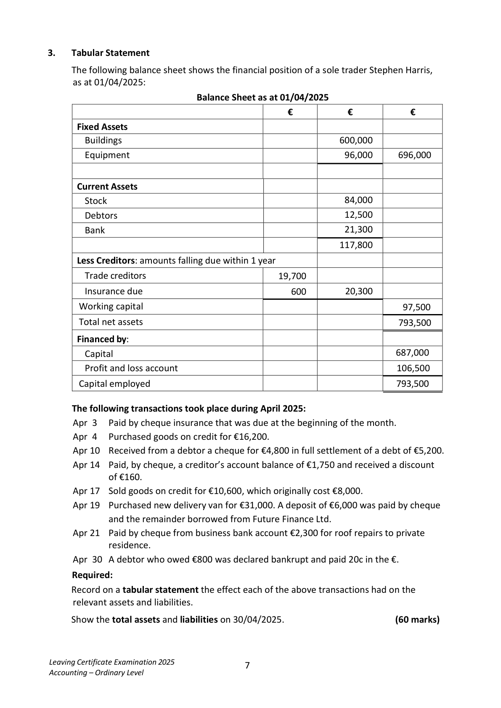
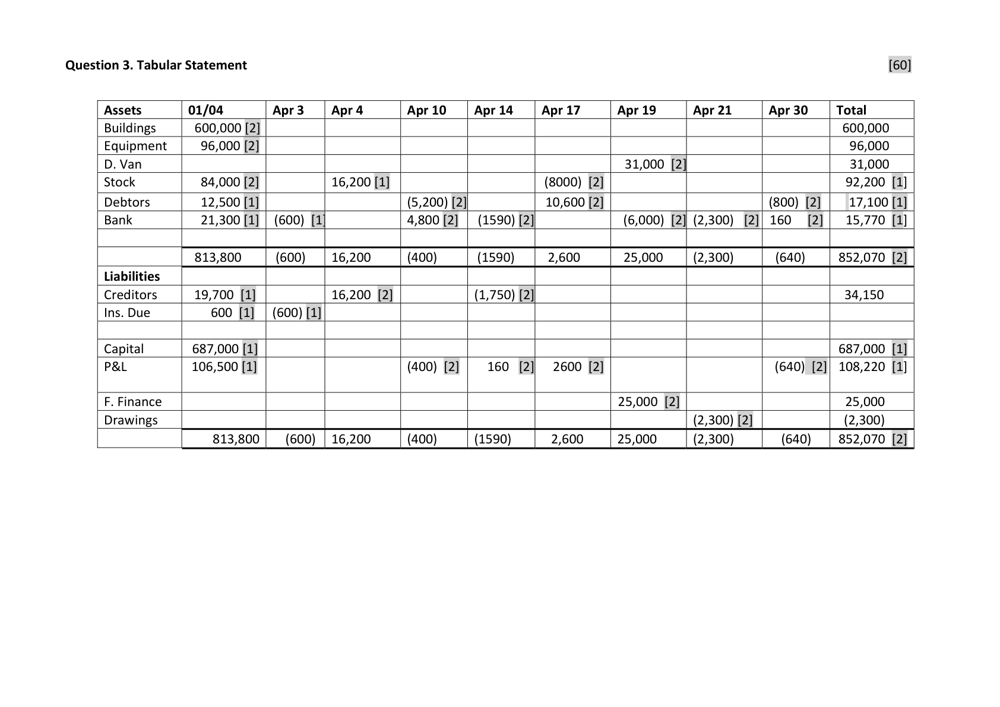
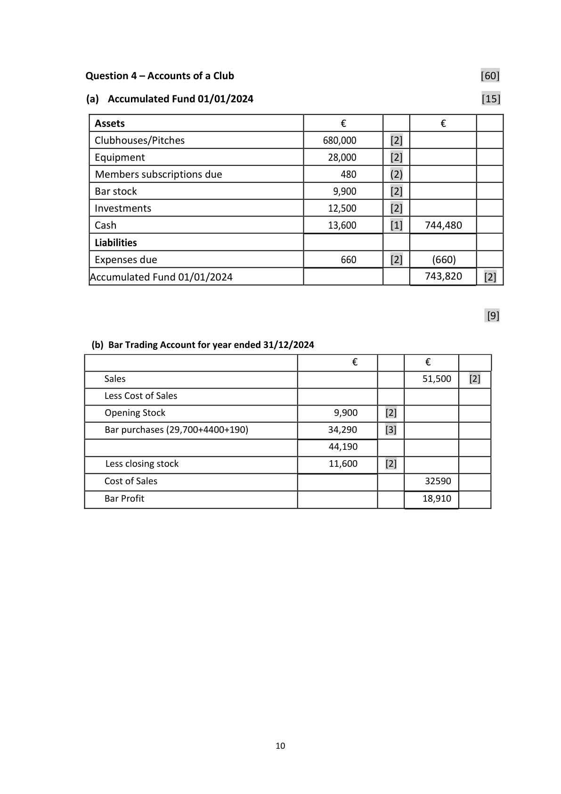

# Question

2.   Debtors and Creditors Control Accounts

     The following figures were taken from the books of Natasha Byrne during January 2025.

                                                                  €
        Debtors ledger balance 01/01/2025 dr                             62,100

        Debtors ledger balance 01/01/2025 cr                             220

         Creditors ledger balance 01/01/2025 cr                            51,500

         Creditors ledger balance 01/01/2025 dr                            670

         Sales (including cash sales €17,500)                              387,000

        Returns inwards (sales returns)                                    16,250

        Purchases (including cash purchases €19,200)                      243,600

        Returns outwards (purchases returns)                               1,230

        Discount allowed                                              810

        Discount received                                              575

           Bills payable accepted                                             4,100

           Bills receivable issued                                              2,900

        Discount disallowed to Natasha Byrne                              120

       Cheques received from customers                               174,800

       Cheques paid to suppliers                                       195,000

       Cheques received dishonoured                                     1,645

       Bad debts written off                                              2,500

         Interest charged by Natasha Byrne on overdue accounts               620

         Transfer from debtors ledger to creditors ledger                      3,000

        Debtors ledger balance 31/01/2025                                180 cr

         Creditors ledger balance 31/01/2025                               910 dr

    You are required to prepare for January 2025:

      (a)   Debtors ledger control account.                                                  (30)

      (b)   Creditor ledger control account.                                                 (30)

                                                                                (60 marks)

Leaving Certificate Examination 2025              6
Accounting – Ordinary Level

<!-- PAGE 7 -->
# Page 7

<!-- HAS_VISUAL: true -->
<!-- VISUAL_REASON: page contains vector drawings; page image extracted because text may not fully capture visual content -->

# Marking Scheme

Question 2 - Debtors and Creditors Control Account                                      [60]

 (a) Debtors Ledger Control Account:                                                          [30]

                                        €                                           €
   01/01/2025  Balance b/d            62,100   [2]  01/01/2025  Balance b/d          220   [2]
                 Sales                 369,500   [4]               Discount allowed      810   [2]
               Dishonoured cheques    1,645   [2]              Cheques received  174,800   [2]
                  Interest charged          620   [2]             Bad debts w/o       2,500   [2]
   31/01/2025  Balance c/d              180   [2]               Contra              3,000   [2]
                                                                       Sales returns       16,250   [2]
                                                                                          Bills receivable       2,900   [2]
                                                31/01/2025  Balance c/d       233,565   [2]
                                    434,045                                    434,045
   01/02/2025  Balance b/d           233,565   [1]  01/02/2025  Balance b/d          180   [1]

  (b)      Creditors Ledger Control Account:                                                  [30]

                                          €                                         €
   01/01/2025  Balance b/d                670   [2]  01/01/2025   Balance b/d      51,500   [3]
               Purchase returns           1,230   [3]                Purchases      224,400   [5]
                Discount received           575   [2]                   Dis. disallowed     120   [2]
              Cheque paid to suppliers  195,000   [2]  31//01/2025  Balance c/d        910   [2]
                Contra                    3,000   [3]
                      Bills payable               4,100   [2]
   31/01/2025  Balance c/d               72,355   [2]
                                       276,930                                   276,930
   01/02/2025  Balance b/d                910   [1]  01/02/2025   Balance b/d     72,355    [1]

                                             8

<!-- PAGE 9 -->
# Page 9

<!-- HAS_VISUAL: true -->
<!-- VISUAL_REASON: page contains vector drawings; page image extracted because text may not fully capture visual content -->

[60]                      [1] [1] [1]     [2]                [1] [1]            [2]
                               600,000  96,000  31,000  92,200   17,100  15,770                         34,150                                       25,000  (2,300)                Total                                                                 852,070                                      687,000  108,220                             852,070

                                                               [2]                             [2] [2]
      30                                                                                                              (640)                                                                    (640)                                 (640)         Apr                           (800) 160

                                 [2]                                                                           [2]
      21
         Apr                                               (2,300)           (2,300)                                                                         (2,300)  (2,300)
                     [2]         [2]                                                                       [2]

      19                                          31,000                     (6,000)          25,000         Apr                                                                                                                     25,000          25,000

                         [2] [2]                                [2]

      17
                                                                    2,600                           2600                    2,600         Apr                        (8000)   10,600
                                 [2]             [2]            [2]
      14
                                                               160
         Apr                                                                 (1590)          (1590)           (1,750)                                                       (1590)
                             [2]
                                 [2]                            [2]
      10
         Apr                                      (5,200) 4,800        (400)                                 (400)                    (400)

                         [1]                     [2]

   4
         Apr                        16,200                          16,200          16,200                                                       16,200
                                 [1]                                                    [1]
   3                                                                                                                                   (600)         Apr                                  (600)        (600)              (600)

             [2] [2]     [2] [1] [1]             [1] [1]
                                                            [1] [1]                             813,800                                                    600                               600,000  96,000         84,000   12,500  21,300           813,800          19,700                    687,000  106,500Statement           01/04
Tabular                                                    Due3.                  Van                                                                                                              Finance                   Assets  Buildings  Equipment D. Stock   Debtors Bank                                 Liabilities  Creditors Ins.           Capital P&L   F.  Drawings
Question

<!-- PAGE 10 -->
# Page 10

<!-- HAS_VISUAL: true -->
<!-- VISUAL_REASON: page contains vector drawings; page image extracted because text may not fully capture visual content -->

# Source References

Exam paper:
- file: intermediate_markdown/exam_papers/ordinary/accounting_ordinary_2025_paper_1_exam.md
- pages: [7]

Marking scheme:
- file: intermediate_markdown/marking_schemes/ordinary/accounting_ordinary_2025_paper_1_marking_scheme.md
- pages: [9, 10]

# Notes

