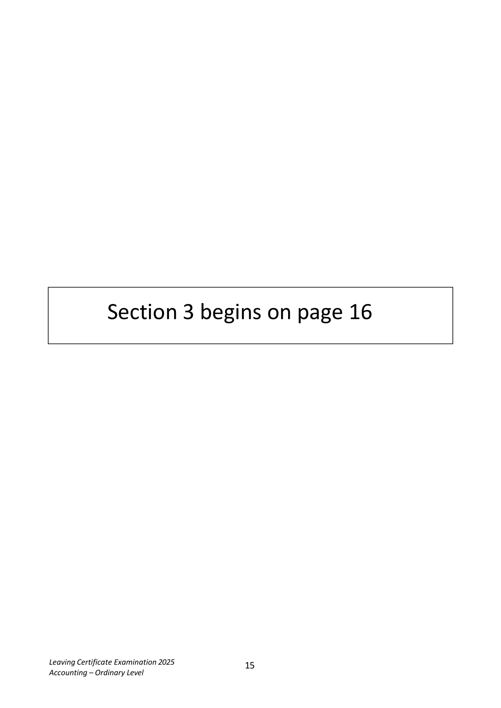
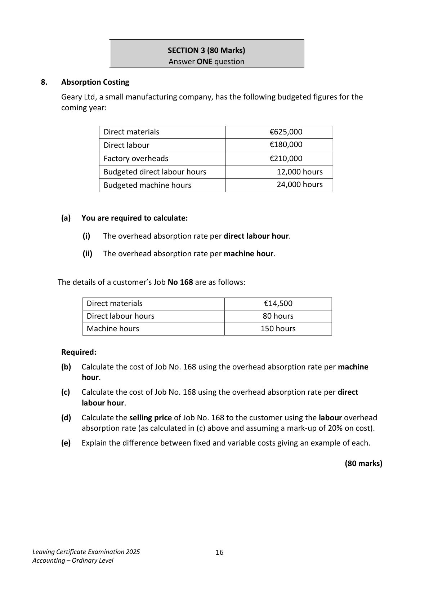
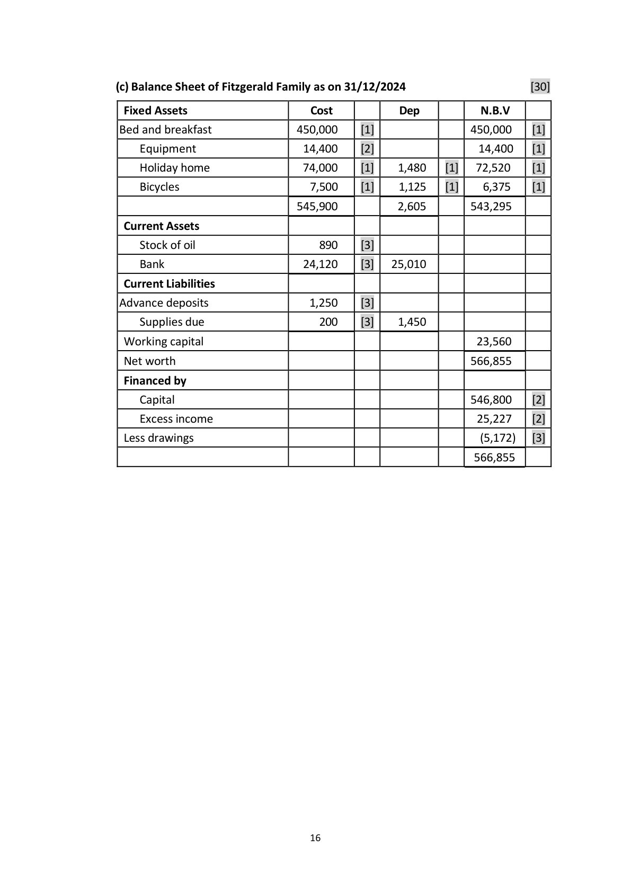
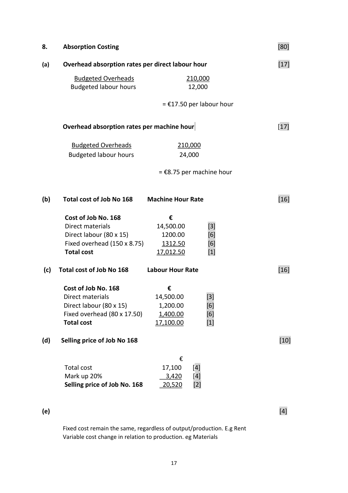

# Question

7.   Accounts of a Service Firm

     The Fitzgerald family are involved in the tourist industry. They run a bed & breakfast,
      holiday home and bike rental business to tourists during the holiday season.

     Included among their assets and liabilities on 01/01/2024 were:

        Bed & Breakfast premises €450,000; holiday home €74,000; bicycles €7,500;
         equipment €8,500; stock of fuel and heating oil €2,600; cash on hand €5,400;
         advance deposits from tourists for holiday home €1,200.

     Required:
       (a)   Prepare a statement of Capital for the Fitzgerald family tourism business on
          01/01/2024.                                                                               (30)

                    Receipts and Payments Account for the year ended 31/12/2024

           Receipts                       €      Payments                        €

          Cash on hand 01/01/2024     5,400    Supplies for bed & breakfast    11,160

           Receipts from guests        43,200    Light, heat and fuel              5,520

          Rent from holiday home     26,500   Drawings                       2,900

           Receipts from bike rental      7,400   Wages                       24,200

                                               Purchase of equipment          5,900

                                                    Advertising and promotion       2,400

                                            Maintenance and repairs        6,300
                                               Balance 31/12/2024            24, 120

                                     82,500                                 82,500

      The following information and instructions should be taken into account at 31/12/2024:

           (i)  Stock of heating oil €890.

            (ii)  There is €200 owing to the local store for supplies.

            (iii) One fifth of the supplies purchased were used by the family.

         (iv) Receipts from guests include booking deposits for 2025 of €1,250.

         (v)  Bicycles are to be depreciated by 15% and holiday home to be depreciated by 2%.

       Required:

         (b)  Prepare an income and expenditure account for the year ended 31/12/2024.     (40)

          (c)  Prepare a balance sheet as at 31/12/2024.                                         (30)

                                                                              (100 marks)

Leaving Certificate Examination 2025              14
Accounting – Ordinary Level

<!-- PAGE 15 -->
# Page 15

<!-- HAS_VISUAL: true -->
<!-- VISUAL_REASON: page contains vector drawings; text extraction is sparse relative to visible page content; page image extracted because text may not fully capture visual content -->

Section 3 begins on page 16

Leaving Certificate Examination 2025              15
Accounting – Ordinary Level

<!-- PAGE 16 -->
# Page 16

<!-- HAS_VISUAL: true -->
<!-- VISUAL_REASON: page contains vector drawings; text contains visual keywords: figure; page image extracted because text may not fully capture visual content -->

SECTION 3 (80 Marks)
                               Answer ONE question

# Marking Scheme

Q7   Service Accounts

       (a) Fitzgerald Family Capital as on 01/01/2024                                    [30]

       Assets                                €               €
      Bed and breakfast premises            450,000        [4]
       Holiday home                          74,000        [4]
        Bicycles                                 7,500        [3]
       Equipment                              8,500        [3]
       Stock of fuel & oil                         2,600        [4]
       Cash                                    5,400        [5]    548,000

         Liabilities
      Advance deposits                        1,200        [3]      1,200
        Capital                                                  546,800     [4]

        (b) Income and Expenditure Account for year ended 31/12/2024                 [40]

      Income
                                                €               €

          Receipts from guests                      41,950       [4]
          Receipts from holiday home               27,700       [4]
         Rent from bicycle hire                      7,400       [4]    77,050

       Expenditure

            Light, heat & fuel                           7,230       [6]
        Wages                                   24,200       [2]
           Supplies                                  9,088       [6]
           Advertising                                2,400       [2]
         Maintenance & repairs                      6,300       [2]
          Depreciation

              Bicycles                                  1,125       [3]
             Holiday homes                          1,480       [3]    51,823

       Excess income over expenditure                                 25,227     [4]

                                        15

<!-- PAGE 16 -->
# Page 16

<!-- HAS_VISUAL: true -->
<!-- VISUAL_REASON: page contains vector drawings; page image extracted because text may not fully capture visual content -->

(c) Balance Sheet of Fitzgerald Family as on 31/12/2024                         [30]

 Fixed Assets                      Cost          Dep          N.B.V
 Bed and breakfast              450,000     [1]                450,000    [1]
    Equipment                  14,400     [2]                  14,400    [1]
    Holiday home                74,000     [1]    1,480    [1]   72,520     [1]
     Bicycles                       7,500     [1]    1,125    [1]    6,375     [1]

                               545,900          2,605        543,295

 Current Assets
    Stock of oil                    890     [3]
    Bank                        24,120     [3]   25,010

 Current Liabilities
 Advance deposits                  1,250     [3]
    Supplies due                  200     [3]    1,450

 Working capital                                               23,560

 Net worth                                                  566,855

 Financed by
     Capital                                                  546,800    [2]
    Excess income                                             25,227    [2]
 Less drawings                                                       (5,172)   [3]

                                                             566,855

                                    16

<!-- PAGE 17 -->
# Page 17

<!-- HAS_VISUAL: true -->
<!-- VISUAL_REASON: page contains vector drawings; page image extracted because text may not fully capture visual content -->

# Source References

Exam paper:
- file: intermediate_markdown/exam_papers/ordinary/accounting_ordinary_2025_paper_1_exam.md
- pages: [15, 16]

Marking scheme:
- file: intermediate_markdown/marking_schemes/ordinary/accounting_ordinary_2025_paper_1_marking_scheme.md
- pages: [16, 17]

# Notes

