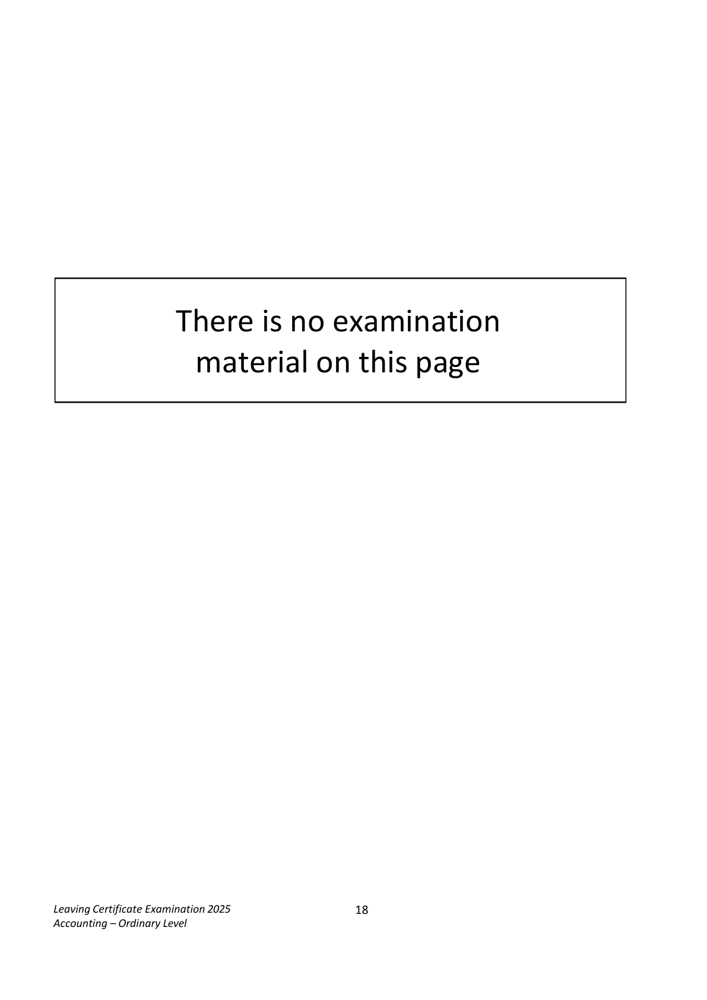
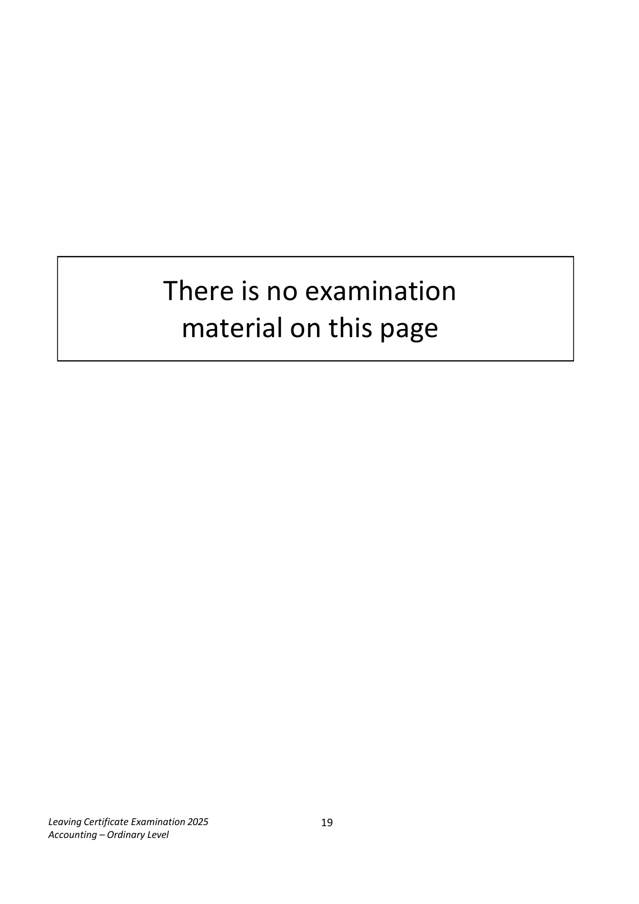
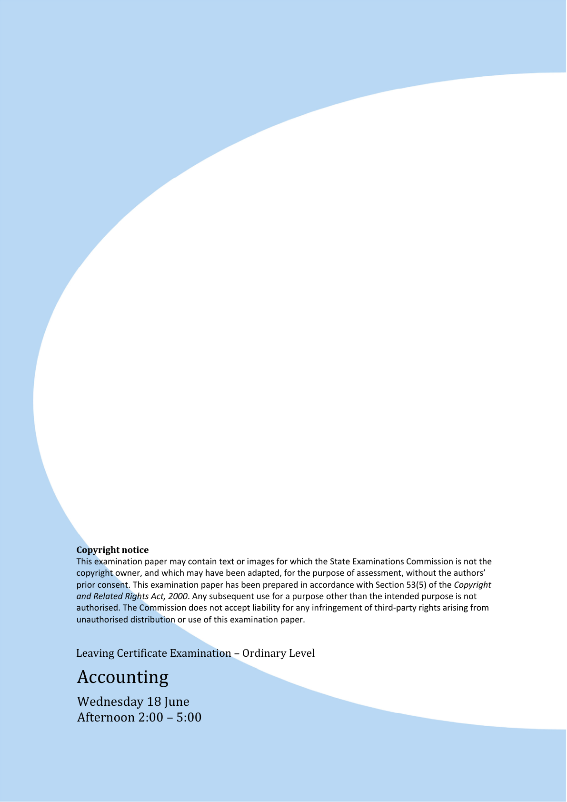
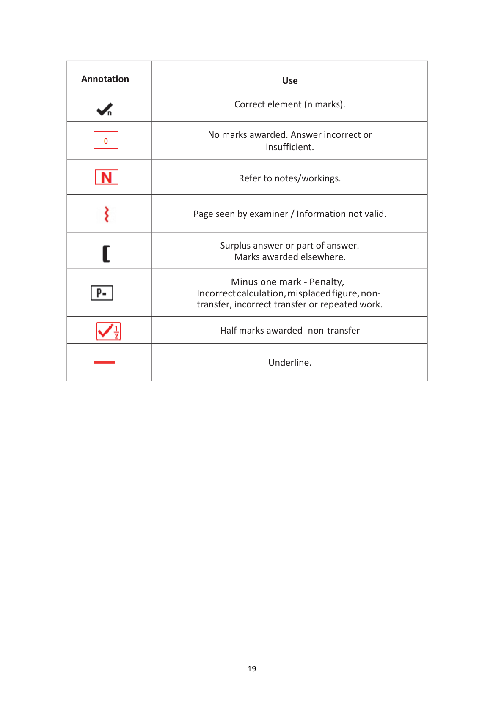

# Question

9.    Product Budgeting

      Dents Ltd manufactures two types of electric toothbrush ‘Star’ and ‘Moon’. The sales of
      each type of toothbrush and other relevant information for the coming year are
      budgeted below:

                                                     Star             Moon
        Budgeted sales in units                   8,800                 9,200
        Expected selling price                   €40                 €30

        Expected stock – Finished Goods            Star             Moon
        Opening stock in units                   240                 320
         Closing stock in units                    180                 200

         Material Content and Costs             Material X             Material Y
          Star                                5 grams             4 grams
      Moon                              4 grams             3 grams
        Expected purchase price per gram          €3                  €5

        Expected Stock - Raw Materials         Material X             Material Y
        Opening stock                      265 grams           400 grams
         Closing stock                       110 grams           320 grams

         Direct Labour time in hours
          Star                                3 hours
      Moon                              4 hours

         Direct labour rate per hour               €16

        Required:

         (a)   Prepare a sales budget in units and in €.

         (b)   Prepare a production budget in units.

          (c)   Prepare a material usage budget in grams.

         (d)   Prepare a material purchases budget in grams and €.

         (e)   Prepare a labour (wages) budget.

           (f)  Why would Dents Ltd prepare a production budget?

                                                                                 (80 marks)

Leaving Certificate Examination 2025                   17
Accounting – Ordinary Level

<!-- PAGE 18 -->
# Page 18

<!-- HAS_VISUAL: true -->
<!-- VISUAL_REASON: page contains vector drawings; page image extracted because text may not fully capture visual content -->

There is no examination
          material on this page

Leaving Certificate Examination 2025                   18
Accounting – Ordinary Level

<!-- PAGE 19 -->
# Page 19

<!-- HAS_VISUAL: true -->
<!-- VISUAL_REASON: page contains vector drawings; page image extracted because text may not fully capture visual content -->

There is no examination
          material on this page

Leaving Certificate Examination 2025                   19
Accounting – Ordinary Level

<!-- PAGE 20 -->
# Page 20

<!-- HAS_VISUAL: true -->
<!-- VISUAL_REASON: page contains embedded images; text contains visual keywords: image; page image extracted because text may not fully capture visual content -->

Copyright notice
         This examination paper may contain text or images for which the State Examinations Commission is not the
        copyright owner, and which may have been adapted, for the purpose of assessment, without the authors’
         prior consent. This examination paper has been prepared in accordance with Section 53(5) of the Copyright
       and Related Rights Act, 2000. Any subsequent use for a purpose other than the intended purpose is not
        authorised. The Commission does not accept liability for any infringement of third‐party rights arising from
        unauthorised distribution or use of this examination paper.

      Leaving Certificate Examination – Ordinary Level
    Accounting
     Wednesday 18 June
     Afternoon 2:00 – 5:00
Leaving Certificate Examination 2025                   20
Accounting – Ordinary Level

# Marking Scheme

9.    Product Budgeting

  (a)  Sales Budget                                                                [18]
                                                    Star        Moon
        Budgeted sales                        8,800  [3]       9,200  [3]
        Budgeted selling price                X €40  [3]       X €30  [3]
                                           352,000  [3]     276,000  [3]
         Total Sales = €352,000 + €276,000 = €628,000

  (b)   Production Budget                                                         [16]

                                                   Star        Moon
        Budgeted sales                        8,800   [2]       9,200  [2]
       Add closing stock                     180   [2]       200  [2]
         Less opening stock                      (240)   [2]        (320)  [2]
        Budgeted production in units           8,740   [2]       9,080  [2]

  (c)   Material Usage Budget                                                    [16]
                           Material X                        Material Y
          Star (8740 x 5)        43,700  [3]  Star (8740 x 4)       34,960  [3]
       Moon (9,080 x 4)     36,320  [3]  Moon(9,080 x 3)     27,240  [3]
                             80,020  [2]                      62,200  [2]

  (d)   Materials Purchases Budget                                                 [16]
                                            Material X        Material Y
        Budgeted usage                       80,020  [2]      62,200  [2]
       Add budgeted closing stock              110  [2]        320  [2]
         Less budgeted opening stock              (265)  [2]        (400)  [2]
        Budgeted production in units           79,865           62,120
        Budgeted purchase price                  x €3  [1]         x €5  [1]
                                          €239,595  [1]    €310,600  [1]

  (e)   Labour Budget                                                             [10]
                                            Sta r          Moon
        Budgeted production                 8,740       [1]     9,080   [1]
       No of hours per unit                     x 3       [1]       x 4   [1]
                                          26,220           36,320
        Labour rate per hour                  x €16        [1]     x €16   [1]
                                         419,520       [1]   581,120   [1]
          Total labour cost                   €1,000,640    [2]

  (f)  A production budget is prepared in order to determine the total number of
       units the company needs to produce (make) for the coming period. The figure
       calculated is needed to find out what materials need to be produced.        [4]

                                           18

<!-- PAGE 19 -->
# Page 19

<!-- HAS_VISUAL: true -->
<!-- VISUAL_REASON: page contains embedded images; page contains vector drawings; text contains visual keywords: figure, line; page image extracted because text may not fully capture visual content -->

Annotation                             Use

                                   Correct element (n marks).

                     No marks awarded. Answer incorrect or
                                                 insufficient.

                                   Refer to notes/workings.

                      Page seen by examiner / Information not valid.

                                Surplus answer or part of answer.
                              Marks awarded elsewhere.

                            Minus one mark - Penalty,
                           Incorrect calculation, misplaced figure, non-
                             transfer, incorrect transfer or repeated work.

                                 Half marks awarded- non-transfer

                                           Underline.

                                       19

<!-- PAGE 20 -->
# Page 20

<!-- HAS_VISUAL: true -->
<!-- VISUAL_REASON: page contains vector drawings; text extraction is sparse relative to visible page content; page image extracted because text may not fully capture visual content -->

<!-- EXTRACTION_ISSUE: very sparse extracted text -->

20

# Source References

Exam paper:
- file: intermediate_markdown/exam_papers/ordinary/accounting_ordinary_2025_paper_1_exam.md
- pages: [18, 19, 20]

Marking scheme:
- file: intermediate_markdown/marking_schemes/ordinary/accounting_ordinary_2025_paper_1_marking_scheme.md
- pages: [19, 20]

# Notes

