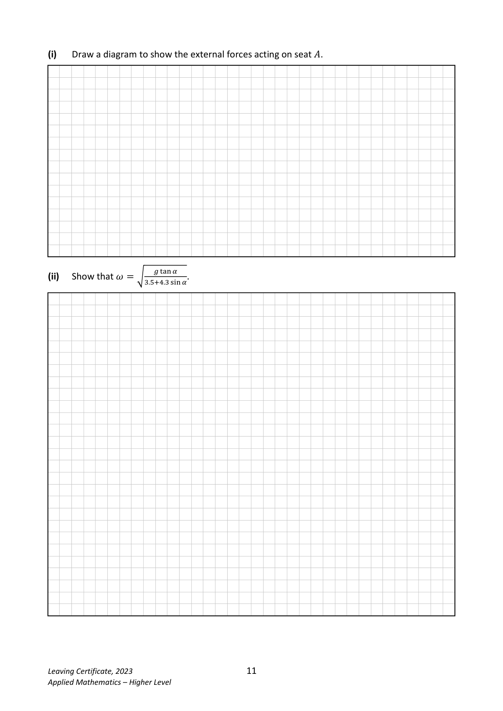
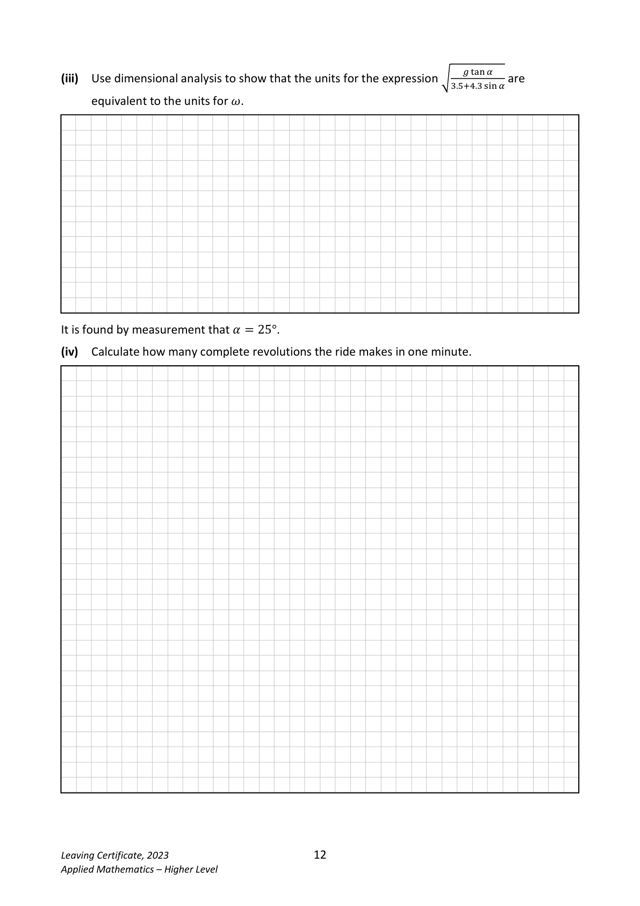
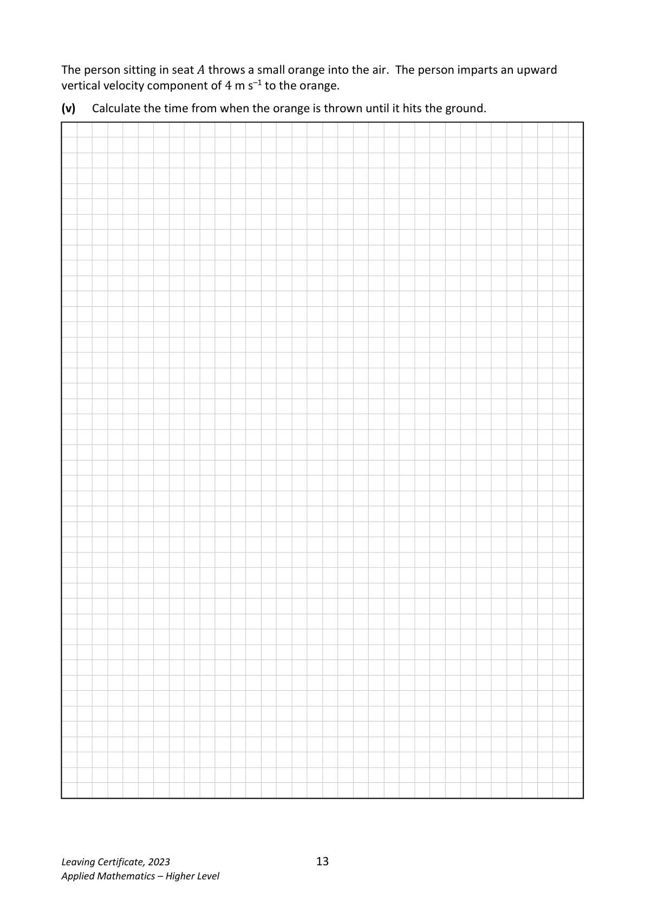
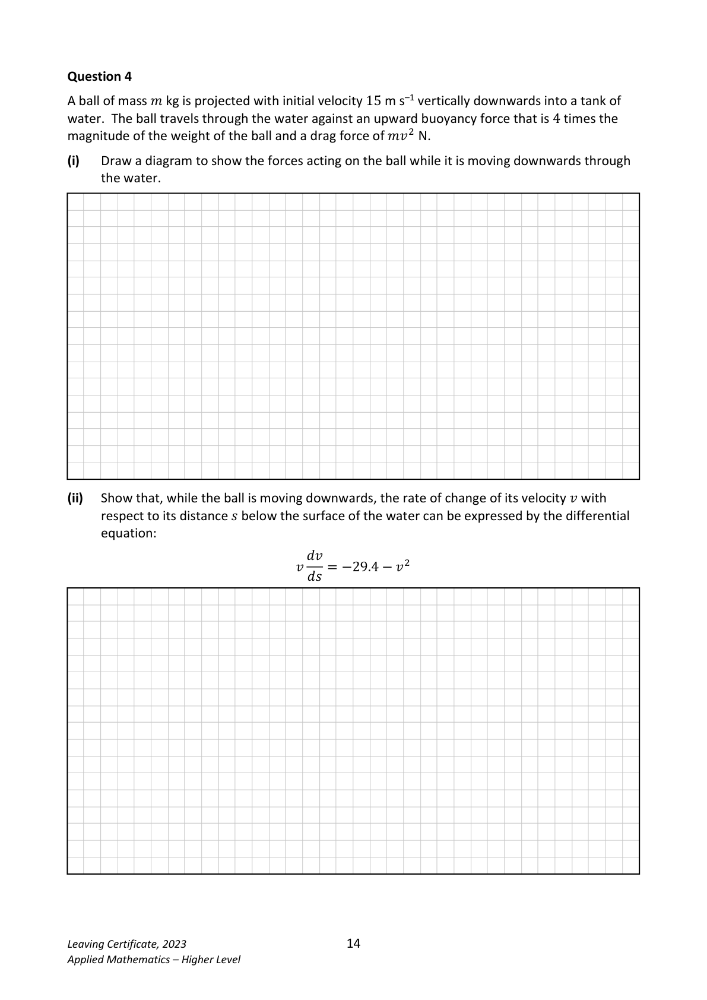
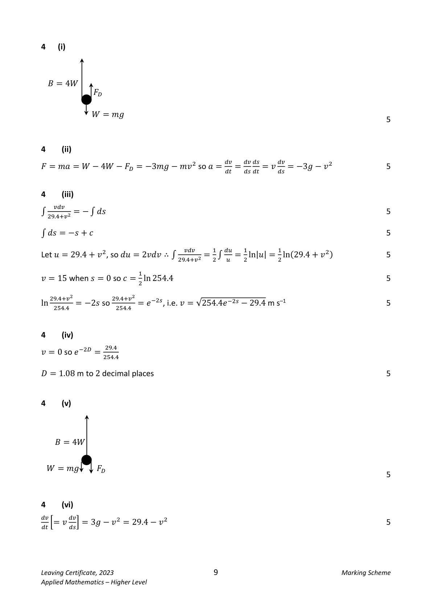

# Question

Question 3

The photograph on the right is of a chain swing
ride in an amusement park. The disk at the top
of the ride is rotating in a horizontal plane.
People sit in seats which are attached freely by
inextensible chains of length 4.3 m to fixed
points on the disk.
The chain attaching seat 𝐴 hangs from point 𝑋
on the ride and makes an angle 𝛼 with the
vertical. 𝑋 is 3.5 m from the axis of rotation,
which is the vertical line 𝑃𝑄, as shown in the
diagram below. The chain is free to swing in or
out relative to 𝑃𝑄.
The ride rotates about 𝑃𝑄 with constant angular velocity 𝜔. Seat 𝐴 moves in a horizontal circular
path which is 6 m above the ground.

                                𝑃

                                                     3.5 m    𝑋

                                                𝛼
                                                                       4.3 m

                       𝜔

                                                       6 m

                             𝑄

Leaving Certificate, 2023                      10
Applied Mathematics – Higher Level

<!-- PAGE 11 -->
# Page 11

<!-- HAS_VISUAL: true -->
<!-- VISUAL_REASON: page contains vector drawings; text contains visual keywords: diagram; page image extracted because text may not fully capture visual content -->

(i)   Draw a diagram to show the external forces acting on seat 𝐴.

                       ௚୲ୟ୬ఈ
(ii)  Show that 𝜔ൌට ଷ.ହାସ.ଷୱ୧୬ఈ.

Leaving Certificate, 2023                      11
Applied Mathematics – Higher Level

<!-- PAGE 12 -->
# Page 12

<!-- HAS_VISUAL: true -->
<!-- VISUAL_REASON: page contains vector drawings; page image extracted because text may not fully capture visual content -->

௚୲ୟ୬ఈ
(iii)  Use dimensional analysis to show that the units for the expression ට          are                                                                                ଷ.ହାସ.ଷୱ୧୬ఈ
      equivalent to the units for 𝜔.

It is found by measurement that 𝛼ൌ25°.

(iv)  Calculate how many complete revolutions the ride makes in one minute.

Leaving Certificate, 2023                      12
Applied Mathematics – Higher Level

<!-- PAGE 13 -->
# Page 13

<!-- HAS_VISUAL: true -->
<!-- VISUAL_REASON: page contains vector drawings; page image extracted because text may not fully capture visual content -->

The person sitting in seat 𝐴 throws a small orange into the air. The person imparts an upward
vertical velocity component of 4 m s–1 to the orange.

(v)   Calculate the time from when the orange is thrown until it hits the ground.

Leaving Certificate, 2023                      13
Applied Mathematics – Higher Level

<!-- PAGE 14 -->
# Page 14

<!-- HAS_VISUAL: true -->
<!-- VISUAL_REASON: page contains vector drawings; text contains visual keywords: diagram; page image extracted because text may not fully capture visual content -->

# Marking Scheme

3      (i)

    𝑇𝑇

    𝑊𝑊= 𝑚𝑚𝑚𝑚
                                                                              5

3       (ii)
𝑇𝑇sin 𝛼𝛼= 𝑚𝑚𝑚𝑚𝜔𝜔2

𝑟𝑟= 3.5 + 4.3 sin 𝛼𝛼

𝑇𝑇cos 𝛼𝛼= 𝑚𝑚𝑚𝑚                                                                                       5, 5

                     (3.5+4.3 sin 𝛼𝛼)𝜔𝜔2                 𝑔𝑔tan 𝛼𝛼
dividing: tan 𝛼𝛼=                        , i.e. 𝜔𝜔= ට                                           5                                          𝑔𝑔                     3.5+4.3 sin 𝛼𝛼

3       (iii)

ටm s−2 = √s−2 = s−1 which are the units for 𝜔𝜔                                         5  m

3      (iv)

when 𝛼𝛼= 25°, 𝜔𝜔= ට   𝑔𝑔tan 25°  = 0.927 (rad) s–1                                    5                          3.5+4.3sin 25°

       2𝜋𝜋
𝑇𝑇′ = 𝜔𝜔= 6.78 s                                                                 5

60
 = 8.85 = 9 rotations in one minute, to the nearest whole number (or 8 complete revolutions) 5𝑇𝑇′

3     (v)

          1
𝑠𝑠= 𝑢𝑢𝑢𝑢+   𝑎𝑎𝑡𝑡2 so 4.9𝑡𝑡2 −4𝑡𝑡−6 = 0                                                5          2

i.e. 𝑡𝑡= 1.59 s to 2 decimal places, 𝑡𝑡> 0                                              5

Leaving Certificate, 2023                       8                                   Marking Scheme
Applied Mathematics – Higher Level

<!-- PAGE 9 -->
# Page 9

<!-- HAS_VISUAL: true -->
<!-- VISUAL_REASON: page contains embedded images; page contains vector drawings; page image extracted because text may not fully capture visual content -->

# Source References

Exam paper:
- file: intermediate_markdown/exam_papers/higher/applied_maths_higher_2023_paper_1_exam.md
- pages: [10, 11, 12, 13, 14]

Marking scheme:
- file: intermediate_markdown/marking_schemes/higher/applied_maths_higher_2023_paper_1_marking_scheme.md
- pages: [8, 9]

# Notes

